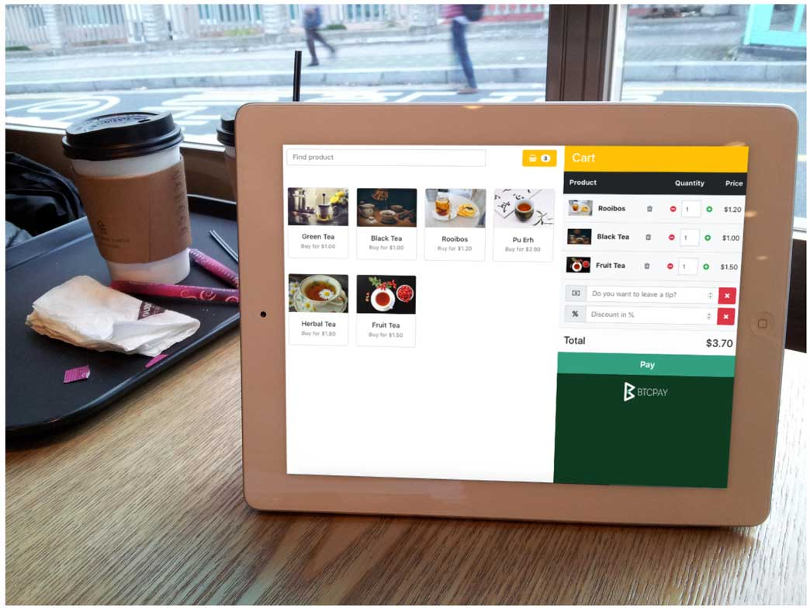

# BTCPay Server Apps
The primary purpose of BTCPay Server is to remove dependencies on trusted third-parties. The Apps are built in applications that obsolete central-authorities and allow users an easy way to extend the [use case](UseCase.md) of the software. Users can self-host all sorts of customizable applications that work out of the box.

To create an app, go to Apps > Create a new app. Apps are store-dependent, which means that each app needs to be connected to a store.

## Point of Sale App
The web-based PoS app allows users with brick and mortar stores to readily accept cryptocurrencies without fees or a third-party, directly to their wallet. The PoS can be displayed easily on tablets or any other devices which support web browsing. Users can easily create a homescreen shortcut for a quick access to the web-app.

Adding new products is easy. The app has a shopping cart feature, tips, product inventory, custom payment options and more.

Point of sale app can also be used for receiving donations or even as a small e-shop, depending on the customizations applied.

## Crowdfunding App

Crowdfunding is an application which you can launch from BTCPay Server interface that allows you to create a self-hosted funding campaign, similar to Kickstarter or Indiegogo. Unlike traditional crowdfunding platforms, the creator of the campaign is the owner of the platform. Funds go directly to the creator’s wallet without any fees.

If you would like to provide digital or physical prodcuts to the backers of your crowdfunding campaign, you can [integrate WooCommerce store into it](FAQ/FAQ-Apps.md#how-to-integrate-woocommerce-store-into-a-btcpay-crowdfund-app). You can also set limits on contribution perks using the inventory feature.

## Payment Button
Easily-embeddable HTML and highly-customizable payment buttons allow users to receive tips and donations. Online stores can also integrate payment buttons. When a site visitor clicks on the button, BTCPay displays the invoice.

## Lightning Network Apps (Lapps)
[Lapps](https://blockstream.com/2018/03/29/blockstreams-week-of-lapps-ends/) are applications built on top of the [Lightning Charge](https://blockstream.com/2018/01/16/lightning-charge/), a complimentary package that allows users and developers to easier use and develop on top of c-lightning. If you decided to use c-lightning, you could easily connect your BTCPay to any of the Lapps.

BTCPay exposes all the necessary information required to connect your internal BTCPay c-lightning node to a Lightning Network App.  Go to Server Settings > Services > Lightning charge server > See information > Credentials.

Below are videos that showcase how to connect some of the lapps to your BTCPay.

