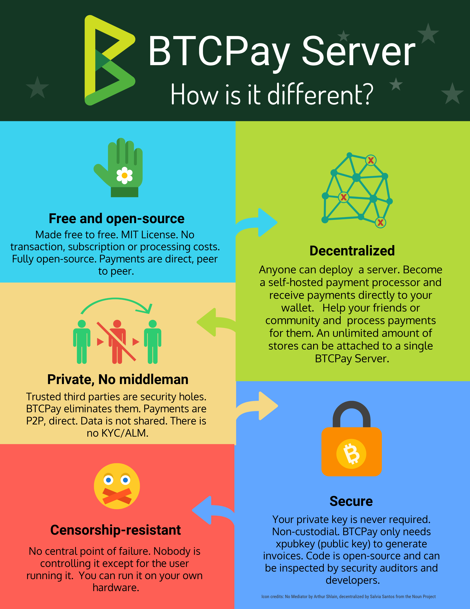

# BTCPay Vs Others

Most new merchants will likely only consider the price of the service. Since BTCPay is free, that may have led you here and if so, welcome.

BTCPay is a code, not a company. There is no third-party between a merchant and a customer. Merchant is always in full control of the funds. There are no processing or subscription fees. BTCPay Server is free to use and completely open-source, so developers or security auditors can always inspect the quality of the code.

We want users to understand not only BTCPay, but also how payments can be processed on behalf of a merchant. In order to help users understand trade-offs when using various cryptocurrency payment processing methods. We don't know which payment processors provide which services. That will need to be part of your own research. The following list is a good place to start:

* [Features](#Features)
* [Cost](#Cost)
* [Security](#Security)
* [Privacy](#Privacy)
* [Decentralized](#Decentralized)
* [Fiat](#Fiat)

----

## Features

Every payment processor has features, here are some BTCPay features:

* **Free** - No merchant processing fees.
* **Bitcoin** - Accepting Bitcoin is the first step.
* **Altcoins** - Accept cryptocurrency alternatives to Bitcoin.
* **Lightning** - Rapid Bitcoin microtransactions using the Lightning Network.
* **Integrations** - Wordpress & WooCommerce, Drupal, Magneto, Prestashop and custom integrations.
* **Point Of Sale** - POS Interfaces for physical stores.
* **Crowdfunding** - Set donation goals and raise funding. 
* **Payment Buttons** - HTML embeddable donation and pay buttons.
* **Unlimited Stores** - Merchants can process payments for their own stores, or for others.
* **Translations** - Customers can pay in 20 different languages.

----

## Cost

It's important to note that payments made using the Bitcoin Network *always* require a transaction (miner) fee for it to be included in the blockchain. The Bitcoin Network determines if the transaction is authorized and when it is confirmed.

BTCPay creates direct payment invoices for merchants to provide to their customers. It also monitors the blockchain and stores the confirmation status of each payment or donation. To do this BTCPay requires a server which merchants can purchase a VPS (less than $10/mo) or use someone else's BTCPay instance to host your account (free or paid options).

If you deploy BTCPayServer using a VPS, the following types of fees are **never charged**:

* Merchant fees
* Subscription fees
* Transfer fees
* Software fees

----

## Security

First rule of Bitcoin is always keep your private keys *private*. Using a secure wallet is recommended for new merchants as the only provider (creator) of private keys. If there is a chance that someone else (such as a website) knows, stores, or provides your private keys to you, it's generally accepted that they are not actually private.

Secondly, there is another area of security to consider on the applications layer where you have two main options:

* **Option 1**: Most payment processors (including BTCPay) use the [BIP 21][1] standard.
* **Option 2**: Others use variations of the [BIP 70][2] standard.

     * **Note**: [BIP 70 has recently been depreciated in Bitcoin Core][3].
     * Many wallets do not allow payments to BIP 70 invoice urls.
     * Need help converting obsolete BIP 70 invoice urls to a BIP 21 invoice url? No problem, we can help with that too.  Here's our [BIP 70 invoice url converter][4].

----

## Privacy

BTCPay will never ask a merchant for any personal identification.

Typically when converting to or from fiat on behalf of a merchant, payment processors are required to collect personal information for Know Your Customer (KYC) and Anti-money laundering (AML) banking requirements. This may include personal information such as passport ID, phone number, address, bank account, etc.

Fortunately, the Bitcoin Network does not use or collect these types of personal information, and therefore neither does BTCPay. How BTCPay ensures privacy:

* No middleman involved.
* Information is shared between customer and seller only.
* Self-hosted users [run a full node][5].
* No address re-use.

----

## Decentralized

Many payment processors claim to have no middleman. Saying the funds go directly to your wallet or instant settlement. However if the processor claims any of the following, they are likely operating as a **middleman**:

* Waiting time for a merchant to receive payment is longer than sufficient blockchain confirmation.
* The payment processor combines customer payments before sending to the merchant's wallet.
* If there are any kind of limits on transaction volume for the merchant.
* If the payment processor can decline, reject or alter a payment after being sent from a customer's wallet.
* If the payment processor has terms and conditions stating they can hold or freeze your account.
* Fees for using the payment processor are automatically taken out from the customer's payment to the merchant.

Payment processors perform some middleman actions by using a **custodial wallet**. A payment processor can use an internal custodial wallet for altering customer payments before routing them to merchants. This is how they can collect fees, hold payments for verification and processing, etc. This type of wallet is an intermediary between the merchant wallet and the customer wallet. It's the middleman wallet.

The payment processor may also provide a custodial wallet for the merchant to use. As mentioned above, this is advised against because your private keys are not safe. If they claim to not save your private keys after giving them to you, it's likely you will not know the truth until it's too late. Centralized services may seem like an easier solution for the merchant. Unfortunately the trade-off is sacrifices in privacy, security and self-sovereignty which is normally obtained using the Bitcoin Network.

----

That's why BTCPay was created. To help merchants remove third party dependencies and simply use the Bitcoin Network freely and securely. Merchants have a copy of the BTCPay software which runs on their own server or VPS of their choice and validates their own payments using their own node. It's a self-hosted Peer-to-Peer payment processor. The trade-off in this case is some technical understanding is required for initial setup.

As the BTCPay community continues to grow, more deployment methods, use cases and tutorials are continually being added to make it easier for non-technical users. BTCPay is completely open source. Anyone can join the community to suggest or create improvements, features, guides, etc. Feedback is always welcome.

----

## Fiat

Currently, BTCPay is a processor **without fiat conversion** capability. As a merchant, this may be a difficult if business costs require fiat. Not providing fiat conversion allows BTCPay merchants to avoid KYC and AML identification verification. This also allows BTCPay to be free and available for anyone to use.

However, a fiat conversion feature is on the roadmap for BTCPay. Since merchants are always the owners of their private keys, they can always freely convert their coins manually, but for now there's no instant-fiat conversion.

----

## Can't find this information for other payment processors?

* It's probably a feature not a bug!
* All of this information should be available to merchants.
* Check out: [howtoacceptcrypto.com][6] comparison chart.
* If you have more questions about BTCPay, read our [Official Documentation][7].

[1]: https://github.com/bitcoin/bips/blob/master/bip-0021.mediawiki
[2]: https://github.com/bitcoin/bips/blob/master/bip-0070.mediawiki
[3]: https://github.com/bitcoin/bitcoin/pull/14451
[4]: https://mainnet.demo.btcpayserver.org/translate
[5]: https://en.bitcoin.it/wiki/Why_Your_Business_Should_Use_a_Full_Node_to_Accept_Bitcoin
[6]: https://howtoacceptcrypto.com/chart/
[7]: https://docs.btcpayserver.org/
