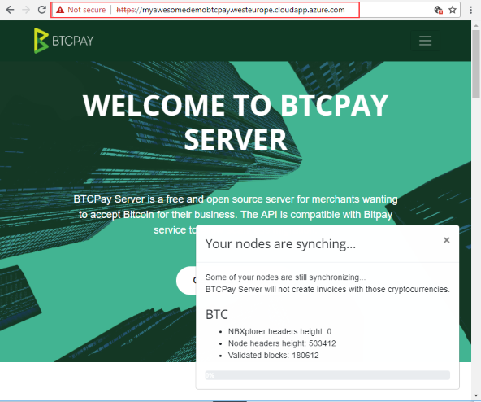
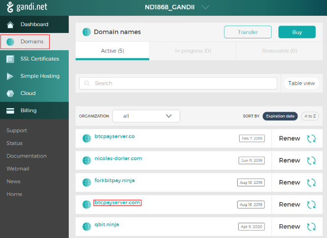
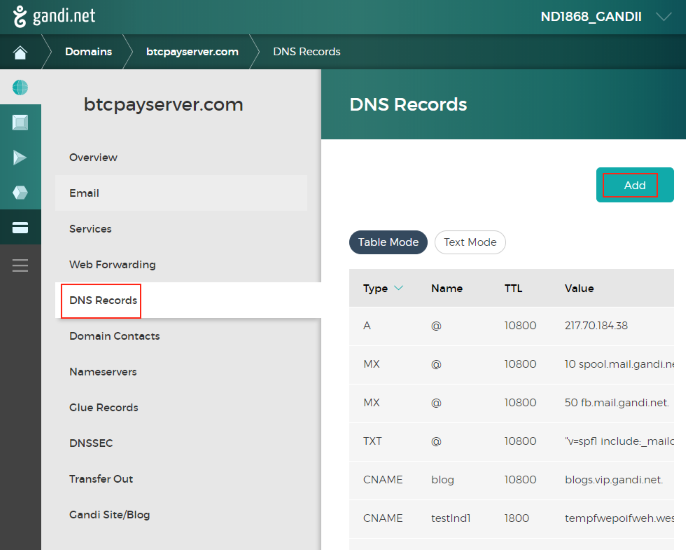
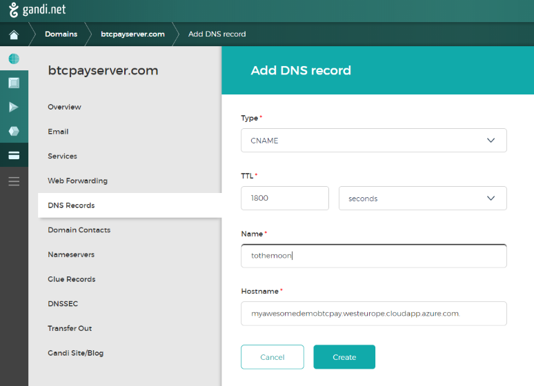
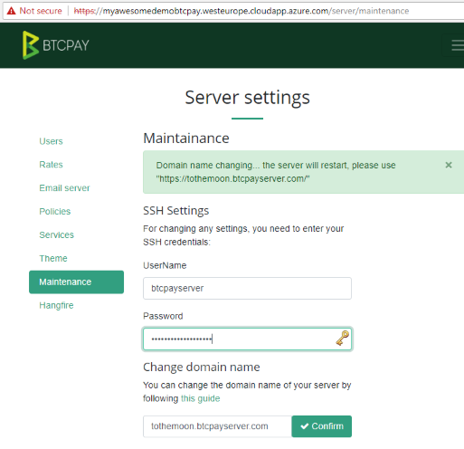
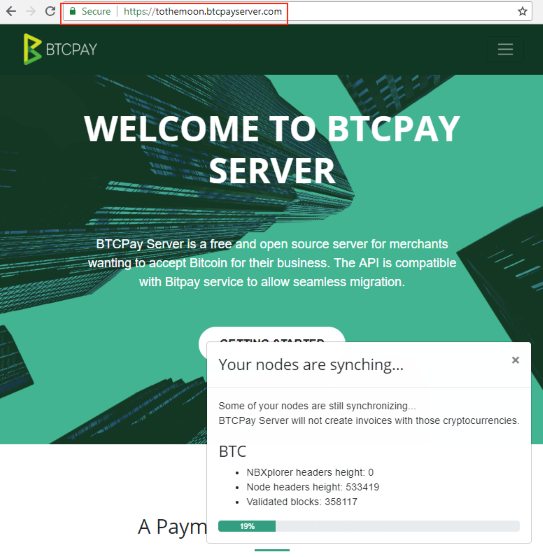

# How to change the domain name of your BTCPay Server

This article assume you know the following information:

* The SSH username and password of your server
* That you used either [Azure](https://github.com/btcpayserver/btcpayserver-azure) deployment or [BTCPay Docker](https://github.com/btcpayserver/btcpayserver-docker) deployment.

Let's assume I used `Azure` deployment, on which I get an invalid certificate:



To get a valid certificate, I need to change my server address from `https://myawesomedemobtcpay.westeurope.cloudapp.azure.com/` to `https://tothemoon.btcpayserver.com/`.

## Pre-requisite

### Setting up your DNS record
First I bought my domain name `btcpayserver.com` to a registar. (I use [gandi.net](https://gandi.net/) because they are awesome)

Once I got the domain name, I can access it in the `Domains` menu:



So I click on my new domain `btcpayserver.com`, then go to the `DNS Record` menu, then I click `Add`.



Here I want to make sure `tothemoon.btcpayserver.com` will resolve to the same IP address as `myawesomedemobtcpay.westeurope.cloudapp.azure.com`. We call this a `CNAME record`:

So I fill out 
```
Type: "CNAME", 
Name: "tothemoon", 
Hostname: "myawesomedemobtcpay.westeurope.cloudapp.azure.com." DO NOT FORGET THE '.'
```


Then I click `Create`. Note that if you want to point to an IP address instead, you would use a type `A` record.

Congratulation! Now let's 

## From your BTCPay Server

First, I go to `https://myawesomedemobtcpay.westeurope.cloudapp.azure.com/server/maintenance`.
I must be logged as an administrator, which is typically the first account created on the server.

I enter my SSH `Username` (by default on azure, `btcpayserver`) and `Password` I chose during the Azure Wizard setup.

Then I enter my domain name `tothemoon.btcpayserver.com`, and click confirm.



I wait a bit and go to `https://tothemoon.btcpayserver.com/`, Success!



## From command line

I connect to my server via:

```bash
ssh btcpayserver@myawesomedemobtcpay.westeurope.cloudapp.azure.com
```
I enter the `Password` I chose during the Azure Wizard setup.

```bash
sudo su -
changedomain.sh tothemoon.btcpayserver.com
```

Success!
