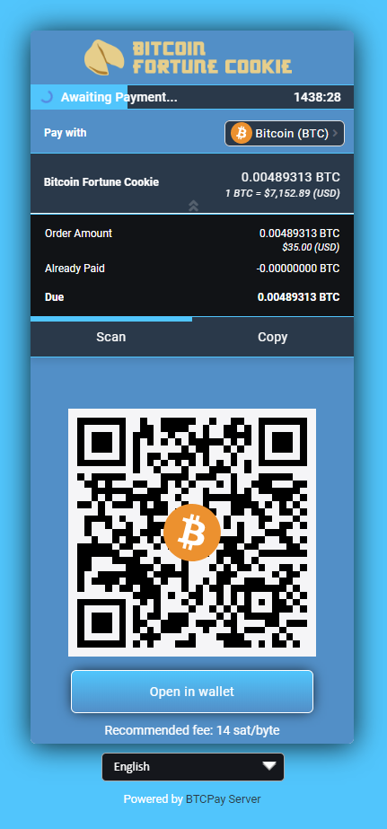

### [Bitcoin Fortune Cookie](https://bitcoinfortunecookie.com/)

\
_**Made by:** [@artdesignbySF](https://twitter.com/artdesignbySF) / <artdesignbySF@protonmail.com>_

CSS file:
```css
/*  ===========================CREDITS=========================== */
/*  Custom BTCpay Server CSS template made by @artdesignbySF.   */
/*  PLEASE CONSIDER DONATING BITCOIN IF YOU FIND          */
/*  THIS FILE USEFULL: 3LBQbv72rdSrLmFF66p9gMPDuPMcKL7UL1     */
/*  Follow @artdesignbySF on Twitter                */
/*  Contact via: artdesignbySF@protonmail.com           */
/*  =========================END CREDITS========================= */

/*  =========================DISCLAIMER========================== */
/*  Might not be the most efficient or correct way of implementing  */
/*  CSS. I am not responsable for breaking your website if things */
/*  go wrong. PEACE / LOVE / BITCOIN                */
/*  =======================END DISCLAIMER======================== */

/*======BACKGROUND COLOR======*/
html {
    background-color: #00c3ff !important;   /*===BACKGROUND COLOR===*/
}

.modal.page {
    background-color: #00c3ff;  /*===BACKGROUND COLOR===*/
}
/*=============================*/

/*=======HEADER SETTINGS=======*/
.top-header {
    background-color: #408cca;  /*===HEADER BACKGROUND COLOR===*/
  border-radius:6px;  /*===ROUNDED CORNER SETTINGS===*/
}

.top-header .timer-row__progress-bar {
  border-top: 1px solid #00c3ff;
    border-bottom: 1px solid #00c3ff;
    background: #00c3ff;    /*===PROGRESS BAR COLOR===*/
}

.top-header .timer-row {
    border-top: 1px solid #00c3ff;  /*===COLORED LINE ABOVE PROGRESS BAR===*/
  border-bottom: 1px solid #00c3ff; /*===COLORED LINE ABOVE PROGRESS BAR===*/
    background: #27384b;  /*===PROGRESS BAR BACKGROUND COLOR===*/
}

.header__icon__img {
  display: block;
  width:;   /*===HEADER DIMENSIONS===*/
  height:;  /*===HEADER DIMENSIONS===*/
  margin-left: 50%;   /*===HEADER POSITION CORRECTION===*/
  margin-top: auto;   /*===HEADER POSITION CORRECTION===*/
}
/*============================*/

/*=====PAY WITH / AMOUNTS=====*/
.line-items {
    background-color: #111316;  /*===BACKGROUND COLOR===*/
    color: #fff !important;   /*===TEXT COLOR===*/
  padding-top: 15px;
    padding-bottom: 10px;
    border-top: 1px solid #00c3ff !important;
  border-bottom: 0px solid #00c3ff;
}

.buyerTotalLine {
    border-top: 1px solid #00c3ff;
    background-color: #27384b;
    color: #fff;
  padding-top: 15px;
    padding-bottom: 12px;
}
/*==========================*/

/*=======PAYMENT TABS=======*/
.payment-tabs__slider {
  background: #00c3ff;  /*===SLIDER COLOR===*/
}

.payment-tabs {
    background-color: #27384b;  /*===BACKGROUND COLOR===*/
  color: #fff;
    border-top: 1px solid #00c3ff;  /*===COLORED LINE ABOVE PAYMENT TABS===*/
  border-bottom: 1px solid #00c3ff; /*===COLORED LINE BELOW PAYMENT TABS===*/
}
/*===========================*/

/*===OPEN IN WALLET BUTTON===*/
.action-button {
    color: #fff !important;
    background-image: linear-gradient(to bottom, #00c3ff, #408cca);   /*===BUTTON BACKGROUND COLOR GRADIENT===*/
  border-color:#fff;  /*===BUTTON BORDER COLOR===*/
  box-shadow: 0px 0px 15px -3px #000000;  /*===DROP SHADOW SETTINGS===*/
  border-radius: 6px;   /*===ROUNDED CORNER SETTINGS===*/
}

.action-button:hover {
    background-image: linear-gradient(to top, #00c3ff, #408cca);  /*===HOVER BUTTON BACKGROUND COLOR GRADIENT===*/
  border-color:#fff; /*===BUTTON BORDER COLOR===*/
}
/*============================*/

/*===BOLT/NODE INFO BUTTONS===*/
.btnGroupLnd {
    box-shadow: 0px 0px 15px -3px #000000;  /*===DROP SHADOW SETTINGS===*/
  background-image: linear-gradient(to right, #00c3ff, #408cca);  /*===BUTTON BACKGROUND COLOR GRADIENT===*/
  background-color:#00c3ff; /*===BUTTON BACKGROUND COLOR (IF NO GRADIENT IS WANTED DELETE LINE ABOVE THIS)===*/
  border-color:#fff;  /*===BUTTON BORDER COLOR===*/
  border-radius: 6px; /*===ROUNDED CORNER SETTINGS===*/
}

.btnGroupLnd button {
  background-image: linear-gradient(to right, #00c3ff, #408cca); /*===BUTTON BACKGROUND COLOR GRADIENT===*/
  background-color:#00c3ff; /*===BUTTON BACKGROUND COLOR (IF NO GRADIENT IS WANTED DELETE LINE ABOVE THIS)===*/
  border-color: #fff; /*===BUTTON BORDER COLOR===*/
}

.btnGroupLnd button.active {
  background-image: linear-gradient(to right, #00c3ff, #408cca);  /*===ACTIVE BUTTON BACKGROUND COLOR GRADIENT===*/
  background-color:#00c3ff; /*===BUTTON BACKGROUND COLOR (IF NO GRADIENT IS WANTED DELETE LINE ABOVE THIS)===*/
  border-color: #fff;   /*===BUTTON BORDER COLOR===*/
}
/*===========================*/

/*=====CURRENCY DROPDOWN=====*/
.payment__currencies {
  border-radius:6px;  /*===ROUNDED CORNER SETTINGS===*/
  background-color: #27384b; /*===BACKGROUND COLOR DROPDOWN MENU===*/
}

.payment__currencies:hover {
  background: #00c3ff; /*===MENU HOVER HIGHLIGHT COLOR===*/
}

.currency-selection {
    background-color: #408cca;  /*===BACKGROUND COLOR===*/
    border-bottom: 0px solid #00c3ff;
    color: #fff;  /*===TEXT COLOR===*/
    padding-top: 15px;
    padding-bottom: 10px;
    height: auto;
}

.vex.vex-theme-btcpay .vex-content  {
  padding: 1px;
  border-radius:0px; /*===ROUNDED CORNER SETTINGS===*/
  box-shadow: 0px 0px 15px -3px #000000; /*===DROP SHADOW SETTINGS===*/
}

.vexmenu  {
  background-color:#00c3ff; /*===BACKGROUND COLOR===*/
}

.vexmenuitem:hover {
  background: #fff; /*===MENU BACKGROUND COLOR===*/
}
/*===========================*/

/*===QR AND QR BACKGROUND===*/
.invoice {
    background-color: #408cca;  /*===MENU BACKGROUND COLOR===*/
  border-radius: 6px; /*===ROUNDED CORNER SETTINGS===*/
} 

.payment-box {
  height:420px; /*===SIZE IMPORTANT BECAUSE HEIGHT LIGHTNING QR CODE + OUTLINE===*/
}

.payment__scan {
  width:276px;
  height:276px;
  margin-left:auto; 
  margin-right:auto;
  margin-bottom:5px;
  margin-top:0px;
  border: 10px solid #f5f5f7; /*===QR CODE BORDER SIZE/COLOR (LEAVE AS IS FOR QUICK SCANNING)===*/
}

.recommended-fee {
  margin-top:15px;
}

.expired__body {
    color: #fff;
}
/*==========================*/

/*======COLOR OF LINKS======*/
a {
  color: #27384b !important;  /*===LINK COLOR===*/
}
/*==========================*/

/*==="COLOR OF SOME TEXTS===*/
span {
  color:#fff; /*===TEXT COLOR===*/
}
/*=========================*/

/*=====LANGUAGE SELECT=====*/
#prettydropdown-DefaultLang ul {
  color: #FFF !important; /*  ===TEXT COLOR=== */
  background-color: #15171c !important;   /*===BACKGROUND COLOR===*/
}
/*===========================*/

/*====INSTRUCTIONAL TEXTS====*/
.manual__step-one__header {
    color: #fff;  /*===TEXT COLOR===*/
  opacity: 1;
}
.content-faded, .manual__step-one__instructions, .manual__step-two__instructions {
    color: #fff;  /*===TEXT COLOR===*/
  opacity: 1;
}
/*===========================*/

/*====COPY INFO BOX/TEXTS====*/
.copyBox {
  background-color:#27384b; 
  border-color:#00c3ff;
}

.copyAmountText {
  color: #fff;  /*===TEXT COLOR===*/
}

.copySectionBox label {
  color: #fff;  /*===TEXT COLOR===*/
  opacity: 1;
}

.separatorGem {
  background:#408cca; /*===GEM ICON COLOR===*/
}
/*===========================*/

/*====PAYMENT SUCCES PAGE====*/
/*
.success-block {
  background-image: linear-gradient(to bottom, #fbff0000, #fff700f2); /*===GRADIENT BACKGROUND===*//*
}
*/
.success-message {
  color: #fff; /* ===TEXT COLOR=== */
}
/*===========================*/

/*  ===========================CREDITS=========================== */
/*  Custom BTCpay Server CSS template made by @artdesignbySF.   */
/*  PLEASE CONSIDER DONATING BITCOIN IF YOU FIND          */
/*  THIS FILE USEFULL: 3LBQbv72rdSrLmFF66p9gMPDuPMcKL7UL1     */
/*  Follow @artdesignbySF on Twitter                */
/*  Contact via: artdesignbySF@protonmail.com           */
/*  =========================END CREDITS========================= */

/*  =========================DISCLAIMER========================== */
/*  Might not be the most efficient or correct way of implementing  */
/*  CSS. I am not responsable for breaking your website if things */
/*  go wrong. PEACE / LOVE / BITCOIN                */
/*  =======================END DISCLAIMER======================== */
````
