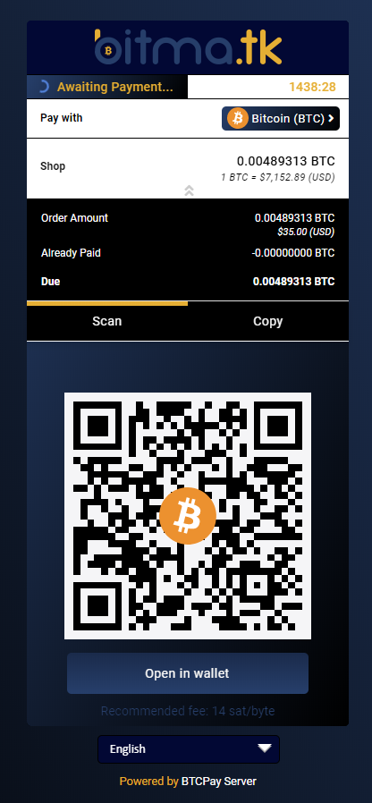

### [Bitma.tk](https://bitma.tk/)

\
_**Made by:** [@artdesignbySF](https://twitter.com/artdesignbySF) / <artdesignbySF@protonmail.com>_

CSS file:
```css
/*  ===========================CREDITS=========================== */
/*  Custom BTCpay Server CSS template made by @artdesignbySF.   */
/*  PLEASE CONSIDER DONATING BITCOIN IF YOU FIND          */
/*  THIS FILE USEFULL: 3LBQbv72rdSrLmFF66p9gMPDuPMcKL7UL1     */
/*  Follow @artdesignbySF on Twitter                */
/*  Contact via: artdesignbySF@protonmail.com           */
/*  =========================END CREDITS========================= */

/*  =========================DISCLAIMER========================== */
/*  Might not be the most efficient or correct way of implementing  */
/*  CSS. I am not responsable for breaking your website if things */
/*  go wrong. PEACE / LOVE / BITCOIN                */
/*  =======================END DISCLAIMER======================== */

/*======BACKGROUND COLOR======*/
html {
    background-color: #000000;
}

.modal.page {
  background-image: linear-gradient(60deg, #000000, #203D6D);
}
/*=============================*/

/*=======OUTLINE SETTINGS=======*/
.modal-content.long{
  border-radius: 5px; /*===ROUNDED CORNERS===*/
  box-shadow: 0px 0px 0px 0px #000000;  /*===OUTSIDE SHADOW===*/
  outline:0px solid #000000;
  background-color:#000000;
}
/*=============================*/

/*=======HEADER SETTINGS=======*/
.top-header {
    background-color: #000535;  /*===HEADER BACKGROUND GRADIENT, CAN BE CHANGED TO SINGLE COLOR. UPLOAD (TRANSPARANT) PNG WITH HEADER LOGO WITH FOLLOWING DIMENTSIONS 720X120PX ===*/
  border-radius: 5px; /*===ROUNDED CORNER SETTINGS===*/
}

.top-header .timer-row__progress-bar {
    background:  linear-gradient(120deg, #203D6D, #000000);   /*===PROGRESS BAR COLOR===*/
  height:26px;
}

.top-header .timer-row {
    border-top: 1px solid #000000;  /*===COLORED LINE ABOVE PROGRESS BAR===*/
  border-bottom: 1px solid #000000; /*===COLORED LINE ABOVE PROGRESS BAR===*/
  background-color: #fff; /*===PROGRESS BAR BACKGROUND COLOR===*/
}

.header__icon__img {
  display: block;
  width:360px;  /*===HEADER DIMENSIONS===*/
  height:60px;  /*===HEADER DIMENSIONS===*/
  margin-left:-10px;  /*===HEADER POSITION CORRECTION===*/
  margin-top:-10px;   /*===HEADER POSITION CORRECTION===*/
  background-color: #fff;
  border-radius: 5px 5px 0px 0px;
}
/*============================*/

/*=====PAY WITH / AMOUNTS=====*/
.line-items {
  background-color: #000000;  /*===BACKGROUND COLOR===*/
    color: #000000 !important;    /*===TEXT COLOR===*/
  padding-top: 15px;
    padding-bottom: 10px;
  border-top: 1px solid #000000;
}

.buyerTotalLine {
    border-top: 1px solid #000000;
  background-color: #fff;
    color: #000000;
  padding-top: 12px;
    padding-bottom: 12px;
}
/*==========================*/

/*=======PAYMENT TABS=======*/
.payment-tabs__slider {
  background-image: linear-gradient(120deg, #EEB21C, #EEB21C);  /*===SLIDER COLOR===*/
  height: 5px;
}

.payment-tabs {
    background: #000000; /*===BACKGROUND COLOR===*/
    border-bottom: 1px solid #fff;  /*===COLORED LINE ABOVE PAYMENT TABS===*/
}

.payment-tabs__tab:hover { 
  background-image: linear-gradient(45deg, #16294C, #203D6D); /*===TAB BACKGROUND ON HOVER===*/
}

.payment-tabs__tab:hover > span {
  color:#EEB21C; /*===TEXT BACKGROUND ON HOVER===*/
}
/*===========================*/

/*===OPEN IN WALLET BUTTON===*/
.action-button {
  background-image: linear-gradient(#16294C, #203D6D);    /*===BUTTON BACKGROUND COLOR GRADIENT===*/
  box-shadow: 0px 0px 0px 0px #000000;  /*===DROP SHADOW SETTINGS===*/
  border-radius: 5px;   /*===ROUNDED CORNER SETTINGS===*/
  border: 0px;
}

.action-button:hover {
  background-image: linear-gradient(#203D6D, #16294C);    /*===HOVER BUTTON BACKGROUND COLOR GRADIENT===*/
/*  border-color:#000000; /*===BUTTON BORDER COLOR===*/
  color: #000000;
}

.action-button:hover > span {
  color:#EEB21C;
  }
/*============================*/

/*===BOLT/NODE INFO BUTTONS===*/
.btnGroupLnd {
    box-shadow: 0px 0px 0px 0px #000000;  /*===DROP SHADOW SETTINGS===*/
  background-image: linear-gradient(#203D6D, #16294C);  /*===BUTTON BACKGROUND COLOR GRADIENT===*/
  background-color:#000000; /*===BUTTON BACKGROUND COLOR (IF NO GRADIENT IS WANTED DELETE LINE ABOVE THIS)===*/
  border-color:#eeeeee; /*===BUTTON BORDER COLOR===*/
  border-radius: 0px 0px 0px 0px;/*===ROUNDED CORNER SETTINGS===*/
}

.btnGroupLnd button {
background-image: linear-gradient(#16294C, #203D6D); /*===BUTTON BACKGROUND COLOR GRADIENT===*/
  background-color:#000000; /*===BUTTON BACKGROUND COLOR (IF NO GRADIENT IS WANTED DELETE LINE ABOVE THIS)===*/
  border-color: #eeeeee; /*===BUTTON BORDER COLOR===*/
  border-radius: 0px 0px 0px 0px; /*===ROUNDED CORNER SETTINGS===*/
}

.btnGroupLnd button.active {
background-image: linear-gradient(#16294C, #203D6D);  /*===ACTIVE BUTTON BACKGROUND COLOR GRADIENT===*/
  background-color:#000000; /*===BUTTON BACKGROUND COLOR (IF NO GRADIENT IS WANTED DELETE LINE ABOVE THIS)===*/
  border-color: #eeeeee;    /*===BUTTON BORDER COLOR===*/
  border-radius: 0px 0px 0px 0px; /*===ROUNDED CORNER SETTINGS===*/
}
/*===========================*/

/*=====CURRENCY DROPDOWN=====*/
.payment__currencies {
  border-radius: 5px; /*===ROUNDED CORNER SETTINGS===*/
}

.payment__currencies_noborder {
  margin-left:auto; 
  margin-right:15; 
  white-space: nowrap;
  color:#fff;
  background-image: linear-gradient(120deg, #203D6D, #000000);
  border-radius: 5px;
  padding-right:15px;
}

.payment__currencies_noborder:hover {
  color:#000000;
  background-image: linear-gradient(120deg, #203D6D, #000000);
}

.currency-selection { /*===NOT THE DROP DOWN MENU===*/
    background: #fff; /*===BACKGROUND COLOR===*/
    border: 0px solid #000000;
    color: #000000; /*===TEXT COLOR===*/
    padding-top: 10px;
    padding-bottom: 10px;
    height: auto;
}

.vex.vex-theme-btcpay .vex-content  {
  background:#000000;
  padding: 0px;
  border-radius: 5px; /*===ROUNDED CORNER SETTINGS===*/
  outline: 1px solid #fff;
  box-shadow: 0px 0px 10px 0px #000000; /*===DROP SHADOW SETTINGS===*/
}

.vexmenuitem  {
  background-color: linear-gradient(120deg, #000000, #203D6D);
}

.vex-content:hover {
  border: 0px;
}

.vexmenuitem:hover {
  color: #fff;  /*===MENU TEXT COLOR===*/
  background-image: linear-gradient(120deg, #000000, #203D6D);  /*===MENU BACKGROUND COLOR===*/
}

.vexmenuitem > a span {
  color: #fff;  /*===MENU TEXT COLOR===*/
  text-shadow: 0px 0px 0px #000000;
}

.vexmenuitem:hover > a span {
  color: #000000; /*===MENU TEXT COLOR===*/
  text-shadow: 0px 0px 0px #000000;
}

.payment__currencies {
  background-image: linear-gradient(120deg, #203D6D, #000000);
  border:0px;
}

.payment__currencies:hover {
  background-image: linear-gradient(120deg, #000000, #203D6D);   /*===MENU HOVER HIGHLIGHT COLOR===*/
  border:0px;
}

.payment__currencies:hover > span {
  color: #EEB21C; /*===TEXT HOVER HIGHLIGHT COLOR===*/
  border:0px;
}
/*===========================*/

/*===QR AND QR BACKGROUND===*/
.content{
  border-radius: 5px; /*===ROUNDED CORNER SETTINGS===*/
  background-color: #000000;
  } 

.invoice {
  background-image: linear-gradient(120deg, #203D6D, #000000);  /*===MENU BACKGROUND COLOR===*/
  border-radius: 5px; /*===ROUNDED CORNER SETTINGS===*/
} 

.payment-box {
  height:425px; /*===SIZE IMPORTANT BECAUSE HEIGHT LIGHTNING QR CODE + OUTLINE===*/
  outline:10px;
}

.payment__scan {
  width:276px;
  height:276px;
  margin-left:auto; 
  margin-right:auto;
  margin-bottom:5px;
  margin-top:0px;
  border: 10px solid #f5f5f7; /*===QR CODE BORDER SIZE/COLOR (LEAVE AS IS FOR QUICK SCANNING)===*/
}

.recommended-fee {
  margin-top:10px;
  padding-top:3px;
  height:25px;
}

.expired__body {
    color: #000000;
}
/*==========================*/

/*======COLOR OF LINKS======*/
a {
  color: #fff !important;   /*===LINK COLOR===*/
  text-shadow: 0px 0px 0px #000000;
}
a:hover {
  color: #EEB21C !important;  /*===LINK COLOR===*/
  text-shadow: 0px 0px 0px #000000;
}
/*==========================*/

/*==="COLOR OF SOME TEXTS===*/
span {
  color:#fff; /*===TEXT COLOR===*/
  text-shadow: 0px 0px 0px #000000;
}

.payment__currencies_noborder > span {
  color:#fff;
}

.payment__currencies > span {
  color: #fff; /*===MENU HOVER HIGHLIGHT COLOR===*/
}

.timer-row__time-left {
  color: #EEB21C;
}

.timer-row__message > span {
  color: #EEB21C;
}

.single-item-order__right__btc-price  > span {
  color:#000000;
}

.single-item-order__right__ex-rate  > span {
  color:#000000;
}

.line-items__item__value {
  color:#fff;
}

.line-items__item__label {
  color:#fff;
}

.line-items__item__label > span {
  color:#fff;
}

.recommended-fee > span {
  color:#203D6D;
}

.copyAmountText.copy-cursor._copySpan {
  color:#fff;
}

.form-text.small.text-muted > span {
  color:#EEB21C;
}
/*=========================*/

/*=====LANGUAGE SELECT=====*/
#prettydropdown-DefaultLang ul {
  color: #fff; /* ===TEXT COLOR=== */
  border-color: #000000;
  background-color: #000535;  /*===BACKGROUND COLOR===*/
  outline: 1px;
  border-radius: 5px;
  box-shadow: 0px 0px 0px 0px #000000;  /*===OUTSIDE SHADOW===*/
}

.checked: {
  color:#000000;
}
/*===========================*/

/*====INSTRUCTIONAL TEXTS====*/
.manual__step-one__header {
    color: #fff;  /*===TEXT COLOR===*/
  opacity: 1;
}
.content-faded, .manual__step-one__instructions, .manual__step-two__instructions {
    color: #fff;  /*===TEXT COLOR===*/
  opacity: 1;
}
/*===========================*/

/*====COPY INFO BOX/TEXTS====*/
.copyBox {
  background-image: linear-gradient(30deg, #000000, #203D6D);
}

.copyAmountText {
  color: #000000; /*===TEXT COLOR===*/
}

.copySectionBox label {
  color: #EEB21C; /*===TEXT COLOR===*/
  opacity: 1;
}

.separatorGem {
  background:#fff;  /*===GEM ICON COLOR===*/
}
/*===========================*/

/*====PAYMENT SUCCES / EXPIRED PAGE====*/
/*
.success-block {
  background-image: linear-gradient(to top, #20a9e0, #f5f5f7); /*===GRADIENT BACKGROUND===*//*
  height:275px;
}
*/
.success-message {
  color: #fff;  /*  ===TEXT COLOR=== */
}

.expired__body {
  color: #fff;  /*  ===TEXT COLOR=== */  
}
/*===========================*/

/*====FA ICONS====*/
.fa.fa-angle-double-down{
  Color:#000000;
}
.fa-angle-double-up {
    Color:#000000;
}
/*===========================*/

/*  ===========================CREDITS=========================== */
/*  Custom BTCpay Server CSS template made by @artdesignbySF.   */
/*  PLEASE CONSIDER DONATING BITCOIN IF YOU FIND          */
/*  THIS FILE USEFULL: 3LBQbv72rdSrLmFF66p9gMPDuPMcKL7UL1     */
/*  Follow @artdesignbySF on Twitter                */
/*  Contact via: artdesignbySF@protonmail.com           */
/*  =========================END CREDITS========================= */

/*  =========================DISCLAIMER========================== */
/*  Might not be the most efficient or correct way of implementing  */
/*  CSS. I am not responsable for breaking your website if things */
/*  go wrong. PEACE / LOVE / BITCOIN                */
/*  =======================END DISCLAIMER======================== */
```
