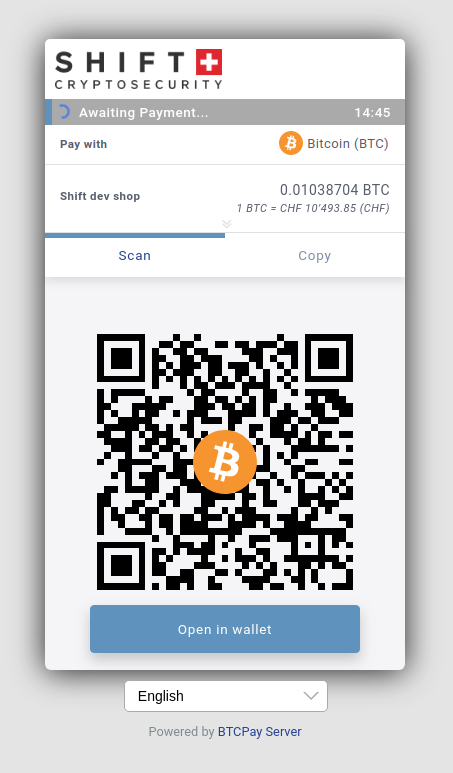

### [Shiftcrypto](https://shiftcrypto.ch/)



CSS file:
```css

.top-header {background-color: #fff;}
.top-header .timer-row__progress-bar {background:#5E94BF;}
.top-header .timer-row {background: #AAAAAA;}
.close-icon {color:#000;}
.payment-tabs__slider {background: #5E94BF;     }
.separatorGem {background: #5E94BF;}
.action-button {color: #fff; background-color: #5E94BF;border-color: #5E94BF;}
.action-button:hover {background-color: #7faacc;}
.action-button:focus, .action-button.focus {color: #fff;background-color: #5E94BF;
    border-color: #5E94BF;}
.action-button:active, .action-button.active, .open>.action-button.dropdown-toggle {    color: #fff;    background-color: #5E94BF;    border-color: #5E94BF;}
.action-button:active:hover, .action-button:active:focus, .action-button:active.focus, .action-button.active:hover, .action-button.active:focus, .action-button.active.focus, .open>.action-button.dropdown-toggle:hover, .open>.action-button.dropdown-toggle:focus, .open>.action-button.dropdown-toggle.focus {    color: #fff;    background-color: #5E94BF;    border-color: #5E94BF;}
.btnGroupLnd button {border: solid 1px #5E94BF;}
.btnGroupLnd button.active {background-color: #5E94BF; border-color: #5E94BF;}
.btnGroupLnd button:hover {background-color:#7faacc;}
.btnGroupLnd button.active:hover {background-color:#5E94BF;}
```