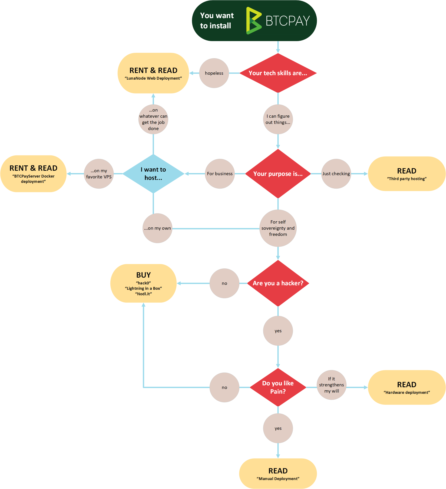

# BTCPay Server Deployment

There are several different deployment methods available, all using the same BTCPay Server software. Because BTCPay is a free and open-source cryptocurrency payment processor, we support diversity in deployment methods for users. Different solutions work best for [different use cases](UseCase.md). 

Business deployment methods can vary by setup, maintenance, support, price, etc. You can run BTCPay as a self-hosted solution on your own server, or use a third-party host. The self-hosted solution allows you not only to attach an unlimited number of stores and use the [Lightning Network](LightningNetwork.md) but also become a payment processor for others.

BTCPay is a non-custodial invoicing system which eliminates the involvement of a third-party when managing funds. Payments with BTCPay go directly to your wallet. Your private keys are never uploaded to the server. Meaning 3rd Party BTCPay hosts do not control user funds, they are simply hosting your instance of the BTCPay software for you.

Developer deployments are not recommended for production environments and require the user to have technical knowledge related to the build.

## What are my options?

* [LunaNode Web Deployment](LunaNodeWebDeployment.md) *
* [Azure Deployment](AzureDeployment.md) *
* [Docker Deployment](DockerDeployment.md)
* [Google Cloud Deployment](GoogleCloudDeployment.md) *
* [Hardware Deployment](HardwareDeployment.md) *
* [Third-Party Hosting](ThirdPartyHosting.md)
* [Manual Deployment](ManualDeployment.md)

(*): Those deployments are using the Docker Deployment under the hood.

## To chose one that will best suit your needs, consider the following:

 

|Web Solutions                             |1.                            |2.          |Why?          |     
| ---------------------------------------- |:----------------------------:|:----------:|:------------:|
|Business (Fast Setup)                  |[3rd Party   BTCPay Hosts](ThirdPartyHosting.md)  |[LunaNode   Web-Wizard](LunaNodeWebDeployment.md)* |- Low Difficulty - BTCPayServer Support (1) - Lightning Network (2)     |
|Cost / Month                                     | Free                    | $10 |BTC Accepted  |

**LunaNode Web-Wizard is a VPS solution, deployable from an easy-web interface.**

 

|VPS Solutions                 |1.               |2.          |3.       |4.       |5.       |Why?     |
| ---------------------------- |:---------------:|:----------:|:-------:|:-------:|:-------:|:-------:|
|Business (Self Setup)      |[LunaNode](https://medium.com/@BtcpayServer/hosting-btcpayserver-on-lunanode-bf9ef5fff75b)|[Digital Ocean](https://medium.com/@molthoff/running-btcpay-on-digital-ocean-for-10-month-how-to-add-other-coins-7a497339fb2f)|[Amazon AWS EC2](https://wiki.ion.radar.tech/tutorials/nodes/btcpay-+-aws-ec2)|[Microsoft Azure](AzureDeployment.md)    |[Google Cloud](GoogleCloudDeployment.md) |- Moderate Difficulty - Docker Compose - Lightning Network    |
|Cost / Month          |$10 | $10 | $35 | $60 | $70  |BTC Accepted (1)|

*- BTCPay can also be deployed on any VPS that meets the [minimal requirements](FAQ/FAQ-Deployment.md#what-are-the-minimal-requirements-for-btcpay).* 
*- VPS providers that use OpenVZ are not supported.*

 

|Hardware Solutions                    |1.                        |2.        |Why?      |   
| ------------------------------------ |:------------------------:|:--------:|:--------:|
|Business (Hardware Setup)          |   [Lightning in a Box](https://lightninginabox.co/)  | [Nodl.it](https://www.nodl.it/) |- Ready Out Of The Box - Prices Vary By Service - Lightning Network |
|                                      |                            |            |BTC Accepted|

 

|Developer Solutions                     |                     |                   |              |    
| -------------------------------------- |:-------------------:|:-----------------:|:------------:|
|Developer (Testing Setup)            |Manual Install       |Manual Build       |Hardware Build|
|**Not Recommended For New Users**    |[Install From Command Line](http://blog.sipsorcery.com/?p=1052)|[Build Without Docker Image](ManualDeployment.md) |[ARM32v7](https://hub.docker.com/r/btcpayserver/btcpayserver/tags/) [Raspberry Pi](RaspberryPiDeployment.md) [Fast Sync](https://github.com/btcpayserver/btcpayserver-docker/tree/master/contrib/FastSync) [BTCPayBox](HardwareDeployment.md) |

