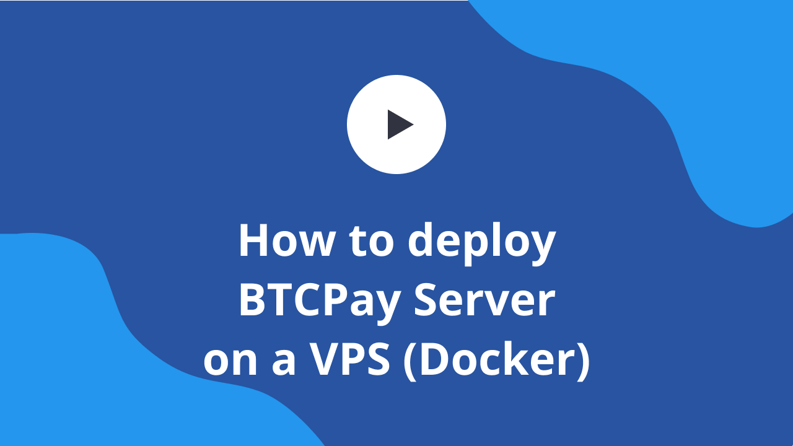

# Docker deployment

[The minimal manual setup](ManualDeployment.md) is not good enough for production environment (no reverse proxy, no HTTPS), and is a bit complicated to deploy.

The ideal architecture is `Docker-Compose`-driven, and looks similar to:

Video below guides you step by step on how to set up BTCPay Server on a VPS with Docker.

Please visit [btcpayserver/btcpayserver-docker](https://github.com/btcpayserver/btcpayserver-docker) to see this production deployment and how it works.