# Electrum Wallet and ElectrumX with BTCPay Server - Introduction

This document has two "sections" which are independent (i.e. users can do section 1. OR 2. or both sections 1. AND 2 depending on their needs):
**Section 1.** How to connect Electrum Wallet on your desktop and use it with BTCPay Server (easy, all BTCPay versions)
**Section 2.** How you can go the extra mile to fully secure your bitcoin privacy and connect your Electrum Wallet to your very own ElectrumX Server (intermediate, only docker version of BTCPay Server)

**Note:** the [docker version of BTCPay Server](https://github.com/btcpayserver/btcpayserver-docker) (since Nov 7th 2019, version 1.0.3.137) supports full integration with [ElectrumX](https://electrumx.readthedocs.io/en/latest/features.html) is the most widely implemented software used for Electrum public servers that your local Electrum wallet relies upon to get all the details of, or broadcast transactions to the bitcoin blockchain.  Skip to Section 2 below, to read more on what this all means, and how to set it up on your BTCPay stack.

# Section 1. How to connect Electrum Wallet to BTCPay Server

**Word of caution** Using Electrum wallet (without following Section 2 of this document!) relies on Electrum servers that are controlled by third-parties. Information, like public addresses, balances and the transacted amount can potentially be leaked. To protect against such leaks, you can setup your own [ElectrumX Server](https://electrumx.readthedocs.io/en/latest/features.html) within BTCPay server in Section 2 of this document, or otherwise setting up [Electrum Personal Server - EPS](https://github.com/chris-belcher/electrum-personal-server), which is technically advanced task not covered in this document.  You can read about the differences between EPS and ElectrumX [here](https://www.reddit.com/r/Electrum/comments/7xb0lz/whats_the_difference_between_electrumx_server_and/). 

In short, for full privacy with BTCPay Server and your Electrum Wallet, also make sure to setup and use your own ElectrumX Server outlined in Section 2 below (Alternatively, you can also use [BTCPay Wallet](Wallet.md) with a compatible hardware wallet or [Wasabi](WasabiWallet.md)).

If you understood the risks of using Electrum Wallet without ElectrumX and still want to proceed with using public Electrum servers with your Electrum wallet, follow the instructions below.

1. Create a Store in BTCPay Server
2. [Download](https://electrum.org/#download) and install Electrum Wallet

## Electrum Wallet Setup

After the installation, open Electrum Wallet by clicking on the icon on your desktop.

### Quick Setup

1. Create a new Electrum Wallet
2. In Electrum, Wallet > Wallet Information - copy the **Master Public Key**.
3. In BTCPay Server, Store Settings > General > Derivation Scheme - Paste the Extended Public Key
4. Go to Receive tab in Electrum.
5. Compare the addresses in Electrum and BTCPay Server, they should match. 
6. Confirm the address match in BTCPay.

## Step by Step

The following setup guides you through setting up an entirely new Bech32(SegWit) Wallet in Electrum. If you already have a wallet skip to the Extended Public Key copying.

Firstly, give your wallet a name, for example, `BTCPay Server Wallet` and click `Next`.

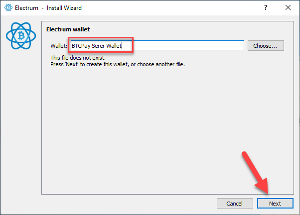

Choose `Standard wallet` and proceed by clicking the `Next`button.

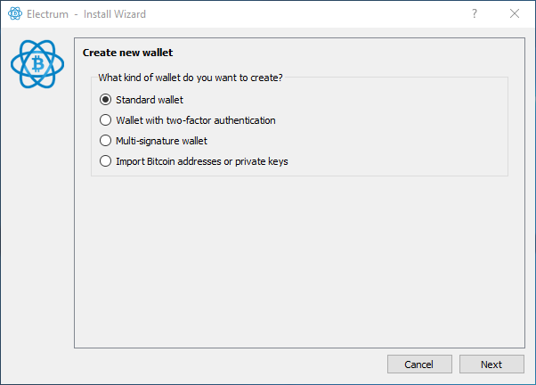

Since we're creating a brand-new wallet,choose  `Create a new seed` and `Next`

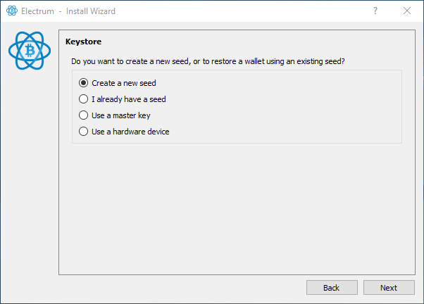

From the multiple choice menu, select `SegWit` and `Next`

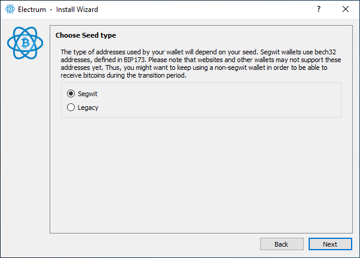

**IMPORTANT NOTE:** Write down your recovery words in the order you see them on the screen. Write them down a piece of paper and store it somewhere secure. Take your time and triple check each word. Do not store your seed in a digital format (photograph, text document). Whoever has the access to your seed can access your funds. Confirm that the seed has been properly backed up by re-entering it in the same order. Once the seed is validated, proceed to the next step.

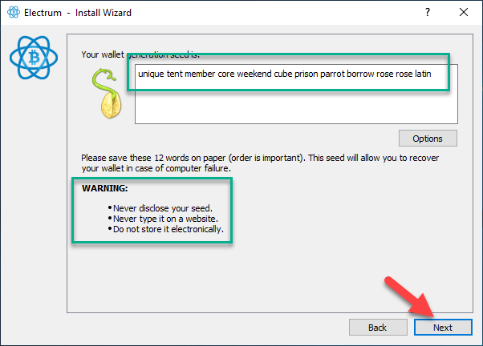

It's highly recommended that you encrypt your wallet. Select a password that you can easily remember and mark make sure `Encrypt Wallet File` is marked. Proceed by clicking `Next`.

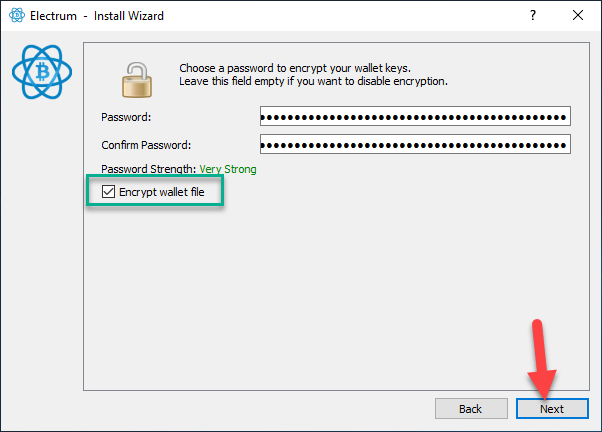

When the wallet loads (it may take few moments), in the top menu, click on the `Wallet` and then`Information` .

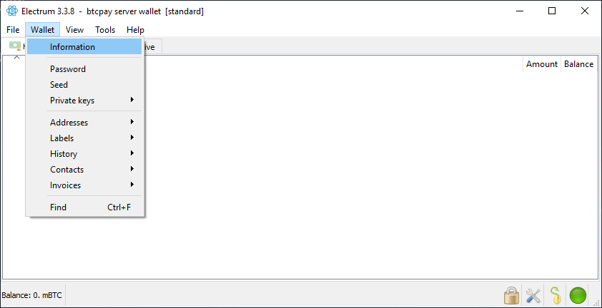

Select and **copy** the `Master Public Key`. This is the **public** key from which BTCPay will derive addresses.

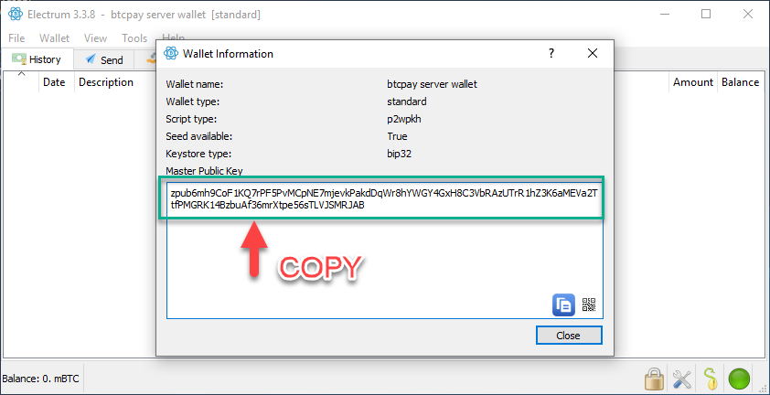

Return to your BTCPay Server. Click on the `Stores` in the header menu and scroll until you see `Derivation Scheme` section. Click on the `Modify` link.

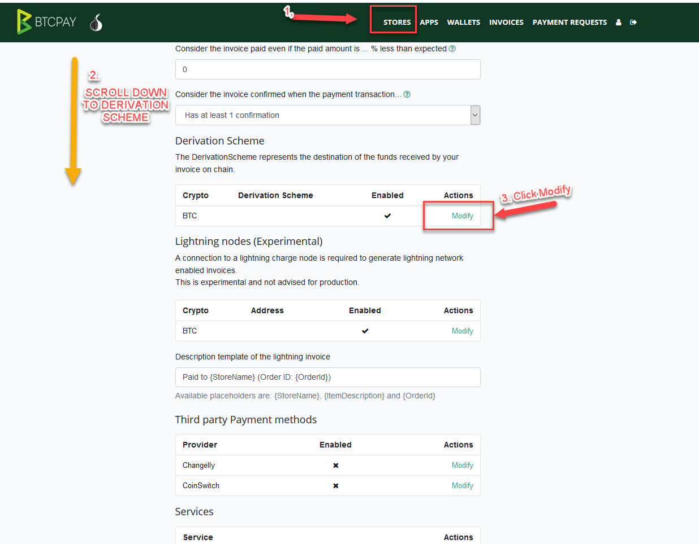

Paste the `Master Public Key` into derivation scheme field as it is, without adding anything else. Make sure that `Enabled` checkbox is ticked and click `Continue`.


Return to the Electrum Wallet. Go to `Receive tab` which shows your wallet receiving address.

Compare the address you see in Electrum Wallet to Addresses shown in BTCPay Server. If there's a match, `continue`. If there is no match, copy the address from Electrum and paste it into `Hint Address Form`. If you still can't get the matching, double-check that you're actually pasting `Master Public Key`.


### Configuring the Gap Limit in Electrum

 In the top menu, click on the `View` and then`Show Console` .

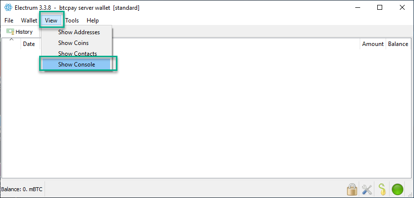

Enter following commands in Electrum console and press `enter`on your keyboard.

```
 wallet.change_gap_limit(100)
 wallet.storage.write()  
```

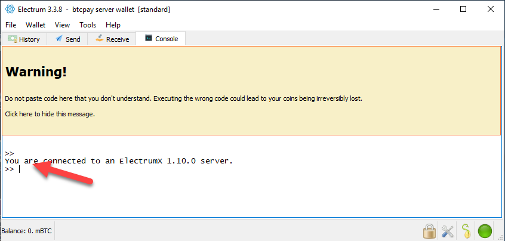

Restart your Electrum and verify that the newly set gap limit is correct by entering in the console:

```
wallet.gap_limit
```

There's no good answer to how much you should set the gap limit to.  Most merchants set 100-200. If you're a big merchants with high  transaction volume, you can try with even higher gap limit.

For more details about the [Gap Limit, check the FAQ](FAQ/FAQ-Wallet.md#missing-payments-in-my-software-or-hardware-wallet).

Electrum and BTCPay Server are now connected. Any payments received to your BTCPay will be visible in Electrum, where you can further spend them.


# Section 2. How to integrate ElectrumX into your BTCPay Server and connect your Electrum Wallet to it for your complete privacy
### (only available in BTCPay docker version)

Before we proceed, it is important to understand how your Electrum wallet on your PC/Mac functions so well/fast, without having its own bitcoin full node.  In actual fact, Electrum Wallet relies on a community effort to maintain a bunch of servers all around the world with a bitcoin full node that do this job for you! They are called Electrum Servers, and you can be a part of that community to make that network even stronger, lets see how.

When you click the little traffic light at the bottom of your Electrum Wallet here:


You will see this screen with a list of all the available Electrum servers that your wallet can connect to, normally with "Select Server Automatically" already checked:


While there is nothing wrong with "Select Server Automatically" per se, every transaction that you make/browse/broadcast in your Electrum Wallet will be using someone else's server to do it all.  Don't take this point as a threat, that is exactly what the Electrum server network is there to do and indeed how most users will safely use their wallet.  The people running those ElectrumX public servers are just like us, bitcoin enthusiasts who want to help adoption by playing their part.  If you are not (yet) into becoming your own completely sovereign and private bitcoin "bank" there is no need for you to read further, because everything is hunky-dory.

But, let's say you DON'T want to rely on or trust anyone else with your detailed blockchain queries and transactions.  After all, sending the entirety of your online wallet activity (including your IP address, receive/send addresses, amounts etc) through another server as your "proxy" to the blockchain might give you the heebie-jeebies.  If this is you, read on!

## Section 2.1 Enable Your Own ElectrumX Server (fully integrated with your BTCPay Server's full bitcoin node)

### Prerequisites (mandatory):

1. You are using or will use the [Docker version of BTCPay Server](https://github.com/btcpayserver/btcpayserver-docker)
2. You do NOT [prune your full bitcoin node](https://docs.btcpayserver.org/faq-and-common-issues/faq-synchronization#can-i-skip-the-synchronization) in BTCPay Server (i.e. you have synched and stored from genesis block, and you do not use the opt-save-storage [Environment Variable](https://docs.btcpayserver.org/faq-and-common-issues/faq-deployment#how-can-i-modify-deactivate-environment-variables))
3. You have at least 400GB of drive space on the drive where your docker volumes are stored (as at the writing of this documentation on 8th Nov 2019, my BTCPay Server volumes diretory uses in total is 333G with full node and ElectrumX enabled and obviously it will grow further with time).


### How will enabling ElectrumX affect my current BTCPay implementation?:

Fundamentally, setting up ElectrumX in BTCPay server is simple, and will not affect the rest of your implementation.  The only pre-requisites are as above.  Then, ElectrumX is enabled by a docker fragment, which is now by standard available in BTCPay Server.  When ElectrumX is enabled using the frangemt XXXXXX, it will change your bitcoin core config out of the box, to enable -txindex=1 in your bitcoin full node, which is required for Electrum Wallet to be able to get transaction data for any transaction in the blockchain.  Also, if you have been running your client for a while but haven't had txindex=1 set, then it might take a few hours to build the index. If you want to rebuild, launch with the -reindex option (warning: this reindex option may take a VERY long time, and is not enabled out of the box as you likely dont need it).
