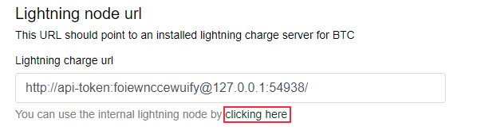
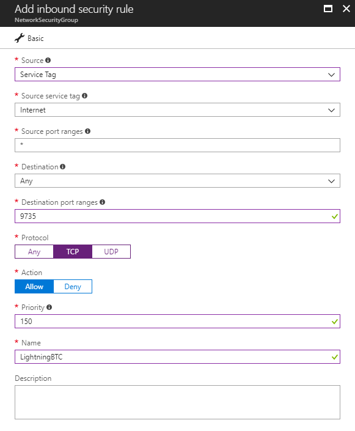

# FAQ

See also [The Merchants Guide to accepting Bitcoin directly with no intermediates through BTCPay](https://www.reddit.com/r/Bitcoin/comments/81h1oy/the_merchants_guide_to_accepting_bitcoin_directly/).

## What is BTCPay Server?

BTCPay Server is a free and open-source cryptocurrency payment processor which allows you to receive payments in Bitcoin (on-chain and via the Lightning Network) and altcoins directly, with no fees, transaction cost or a middleman.

BTCPay is a non-custodial invoicing system which eliminates the involvement of a third-party. Payments with BTCPay go directly to your wallet, which increases the privacy and security. Your private keys are never uploaded to the server. There is no address re-use since each invoice generates a new address deriving from your xpubkey.

## BTCPay vs other processors?

The most significant advantage of BTCPay over other processors is that it is entirely free and open-source, non-custodial software, created by the community. While most of the other processors hold your Bitcoins, BTCPay allows you to receive payments P2P, directly to your software or hardware wallet. Furthermore, BTCPay will enable you to become a processor yourself, so that you can offer different packages and help spread the adoption locally or globally.

BTCPay is a self-hosted software. This means that you are your own payment processor. There are no subscriptions, no transaction fees. While most of the other processors hold your Bitcoins, BTCPay allows you to receive payments P2P, directly to your software or hardware wallet. There's no third-party involvement which significantly increases the censorship-resistance, privacy, and security. With BTCPay, you are your own bank.

Furthermore, BTCPay allows you to become a processor yourself so that you can offer different packages and help spread the adoption locally or globally.

## Why are everyone so excited about BTCPay?

The community is excited about BTCPay and often recommends it to merchants or content creators because it offers a direct way for store-owners and charities to receive Bitcoin payments, which significantly improves the privacy of the customers/donors. BTCPay provides a censorship-resistant way of accepting bitcoin. The fact that the software is free and open-source gives a great opportunity for developers to build things and integrations on top of BTCPay.

## How much it costs to run BTCPay Server?

BTCPay is a free software. You can run it as a self-hosted solution on your own local server, or use a hosting provider, which is what a majority of users do. Additionally, you can use a third-party BTCPay host and attach your store to it.

For a self-hosted option, the price depends on a hosting provider of your choice. Be sure to choose the VPS which meets the minimal requirements.

The low-priced VPS servers which community tested with the BTCPay start at around [9$/month](https://medium.com/@BtcpayServer/hosting-btcpayserver-on-lunanode-bf9ef5fff75b).

The Microsoft Azure servers are slightly [easier to deploy](https://github.com/btcpayserver/btcpayserver-doc/blob/master/AzureDeployment.md), but that comfort comes with a higher price-tag of roughly 65$/month. The price for the Azure servers can be reduced to approximately 25$/month after the initial sync with [penny-pinching](https://github.com/btcpayserver/btcpayserver-doc/blob/master/AzurePennyPinching.md).

### Why do I need a VPS? Can't I just run BTCPay on my home computer?

Just like you can host a website locally, you can do it with BTCPay. Please be aware that your PC would have to meet the minimal requirements and also run 24/7 if you don't want interruptions. While local hosting is good for testing, for production it's really not a viable solution.

### Can the cost of running BTCPay on Microsoft Azure be reduced?

Yes. Currently, the one-click deployment requires Azure Virtual Machine, but if you’re a programmer or understand VM’s you can deploy one on a different VM. Furthermore, the changes in the Bitcoin Core 0.16.0 (BIP159) make it possible to run the full node in the pruned mode to save more disk space.

Also, once the full node is synchronized to the network, you can downgrade the machine on Azure to take a less expensive one.

Please check out [How to penny-pinch your Azure deployment](AzurePennyPinching.md).

## What are the minimal requirements to run BTCPay?

If you would like to run Bitcoin and Lightning Network nodes, the minimal requirements are :
- 2GB Ram
- 80 GB of storage (with pruning enabled)
- Docker

## How to install BTCPay Server?

There are several videos and article online which you can check out:

- [How to install BTCPay on Azure - guide](https://github.com/btcpayserver/btcpayserver-doc/blob/master/AzureDeployment.md)
- [How to install BTCPay on Azure - video](https://www.youtube.com/watch?v=Bxs95BdEMHY)
- [How to install BTCPay on LunaNode VPS - article](https://medium.com/@BtcpayServer/hosting-btcpayserver-on-lunanode-bf9ef5fff75b)
- [How to install BTCPay on LunaNode VPS - video](https://youtu.be/PZXwacAai9E)
- [See all deployments](https://github.com/btcpayserver/btcpayserver-doc#deployment)
- [BTCPay YouTube channel](https://www.youtube.com/channel/UCpG9WL6TJuoNfFVkaDMp9ug/videos)
- [Assorted playlist of all BTCPay YouTube videos](https://www.youtube.com/playlist?list=PL7b9Wt9shK2r-WXS6ysG4tafVQRu80biZ)

### How to use WooCommerce store with BTCPay?

- [BTCPay and WooCommerce](https://www.youtube.com/watch?v=tTH3nLoyTcw)
- [BTCPay WordPress plugin installation](https://www.youtube.com/watch?v=6QcTWHRKZag)
- [Connecting your store to a third-party BTCPay host](https://www.youtube.com/watch?v=IT2K8It3S3o)
- [Connect your wallet to BTCPay](https://www.youtube.com/watch?v=xX6LyQej0NQ)
- [Test your store checkout when you finish with the setup](https://www.youtube.com/watch?v=Fi3pYpzGmmo)

### How to use BTCPay with Drupal?

- [BTCPay and Drupal installation and configuration](https://github.com/btcpayserver/commerce_btcpay#installation-and-configuration) 
- [Drupal Commerce BTCPay module installation walkthrough](https://youtu.be/XBZwyC2v48s)

### How to use BTCPay with Prestashop?

- [BTCPay and Prestashop - getting started guide](https://github.com/btcpayserver/prestashop-plugin#description)
- [Using the BTCPay plugin for Prestashop](https://github.com/adapp-tech/prestashop-plugin/blob/master/GUIDE.md#using-the-btcpay-plugin-for-prestashop)

## Why can't I just give my Bitcoin address to a buyer?

Re-using the address for receiving payments is a privacy issue. Providing a different address manually to each customer is not an optimal solution. Imagine having to send an e-mail that wants to pay you with cryptocurrency.

BTCPay solves the address re-use and automates the checkout process. The software is a complete, automated invoicing system. It integrates into your checkout process and customers can pay you in Bitcoin or altcoins in few clicks.

After the payment, the software notifies your store that the order has been paid/completed. Depending on the e-commerce software you're using, it can also change the order status. You worry about getting items shipped, leave the invoicing and payment processing to BTCPay.

## Does BTCPay need my private key?

Absolutely not. The fact that BTCPay Server never needs access to your master private key for on-chain transactions is a huge security advantage. Even if your server gets hacked, your funds from the on-chain transactions are always safe. Securing your on-chain funds, comes down to [securing your wallet](https://btcinformation.org/en/secure-your-wallet).

If you have a lightning node, BTCPay technically has access to the keys (macarons) of your LN.

### Address re-use - How BTCPay creates a different address?

BTCPay generates a different address for each invoice. The address is derived from your [xpubkey](https://bitcointalk.org/index.php?topic=2828777.0). Your private keys are never uploaded or required by BTCPay. The software only needs your extended public key. You can create your private key in your software or hardware wallet and import the public key (xpub) into BTCPay so that it can derive addresses from it. Meanwhile, you should stick to the best practices for protecting your private key.

## What e-commerce integrations are available?

Currently, BTCPay has integrations with the following e-commerce platforms:

- WordPress / WooCommerce
- Magneto
- Drupal
- Prestashop
- Custom integration

If you're a developer, you can develop your own integration, by following the [custom integration instructions](https://github.com/btcpayserver/btcpayserver-doc/blob/master/CustomIntegration.md).

## Do I need to have an online store to accept cryptocurrencies?

You can use BTCPay even if you don't have an e-commerce store. You can launch your BTCpay and be the payment processor for your friends or local market. Another use-case is to accept donations through the POS (Point of Sale) app or payment buttons which can be copy-pasted as HTML snippets into any website.

If you do not have a store, but want to create one, read [How to Create an Online Store & Accept Bitcoin – Step By Step Guide](https://bitcoinshirt.co/how-to-create-store-accept-bitcoin/) which will teach you how to build a store from scratch and install BTCPay.

## Which cryptocurrencies are supported in BTCPay?

BTCPay natively supports:

- Bitcoin (BTC)
- Bitcoin Gold (BTG)
- Dash (DASH)
- Dogecoin (DOGE)
- Feathercoin (FTC)
- Groestlcoin (GRS)
- Litecoin (LTC)
- Monacoin (MONA)
- Polis (POLIS)
- Viacoin (VIA)

## Does BTCPay Server support crypto to fiat conversion?

At this time, it is not possible to instantly convert your payments into fiat through BTCPay. This feature is planned for the future, but there is no ETA.

## Where can I get help and support?

BTCPay is an open-source project. It is not a company; there is no e-mail, live-chat or phone support. The software relies on a network of contributors and users to provide support.

If you encountered an issue or have a feature request, please [open an issue on GitHub](https://github.com/btcpayserver/btcpayserver/issues). For more general questions, join our [community on Slack](http://slack.forkbitpay.ninja/). Certain community members offer [premium (paid) support](https://github.com/btcpayserver/btcpayserver-doc/blob/master/Support.md).

## How can I contribute to BTCPay?

There are many ways in which you can contribute to an open-source project like BTCPay.

The easiest way is to use the software, provide feedback and report any bugs or issues you or your customers encounter. If you're a developer, you can help us develop and improve the software by contributing on the GitHub. Translating BTCPay into your native language, helping us with documentation writing are ways in which you can help us out, even if you're not a developer or tech-savvy. We appreciate every contributor to the project. You're awesome.

## Does BTCPay Support Lightning Network?

Yes. BTCPay was the first payment processor to embrace and offer the second-layer Bitcoin solution. You can run either LND or c-lightning implementations of the Lightning Network.

## What is a "network cost"?

Network cost is a feature in BTCPay which protects merchants from a customer who pays the invoice partially. When an invoice is paid from many outputs, the fee for a merchant to move those funds will be higher.

For example, your customer created an invoice for 20$ and paid 20 x 1$. You as a merchant now have a larger transaction which increases the mining cost should you decide to move those funds. BTCPay applies a network cost after the first transaction, to cover for merchants expense.

The network cost in BTCPay is not the same thing as the mining fee. Your customer would still need to pay for the miner's fee.

The network cost is an optional feature. It's enabled by default, but it's entirely up to a merchant to enable or disable it. Your customers will be able to see this "network cost" at the checkout when they expand the invoice information.

While it protects dust transactions, it can also reflect negatively and your customers might have additional questions and may lead them into thinking you're overcharging them.

Please think twice about how this may affect your business and make sure to communicate it to your customers properly inside your store Terms of Service or by other methods.

## Why is my ledger not detected by BTCPay Server?

Check that you are running the ledger app with a version equals or above 1.2.4.
 
If the problem persists, contact the owner of the BTCPay Server: The reverse proxy of the BTCPay server hosting BTCPay might not support Websocket.

To confirm this is the issue, create a new invoice and go on its checkout page, you can also go on your store's "Wallet" page.
You should then you will see this error in the javascript console.

```
WebSocket connection to ‘wss://pay.example.com/i/4yhCmpWxJcHfVG3rV4EmEu/status/ws’ failed: Error during WebSocket handshake: Unexpected response code: 404
```

To fix the situation, if your reverse proxy is nginx, make sure that the following is included at the top of `/etc/nginx/conf.d/default.conf`.

```
# If we receive Upgrade, set Connection to "upgrade"; otherwise, delete any
# Connection header that may have been passed to this server
map $http_upgrade $proxy_connection {
  default upgrade;
  '' close;
}
proxy_set_header Upgrade $http_upgrade;
proxy_set_header Connection $proxy_connection;
```

Then restart nginx.

```
/etc/init.d/nginx reload
```

## I previously installed BTCPayServer without the integrated lightning support, can I migrate?

The integrated lightning support is only useful for scenario where you are at the same time the host and the merchant of BTCPay Server.

When logged as admin of your server you will then have a nice link to connect to plug your lightning node to BTCPay Server.



You can then click on `Test Connection` in this page to see if you successfully configured your lightning node.

Depending on how you deployed BTCPayServer you might have different step to do:

### Case 1: You manually installed

If you installed BTCPayServer manually without docker or Azure, then you only need to start run [CLightning](https://hub.docker.com/r/nicolasdorier/clightning/) with the correct network parameter.

Assuming you are running as root, CLightning will allow call to its API via a unix socket on `/root/.lightning/lightning-rpc`

Once this is done, make sure you start BTCPayServer with

```
-btclightning=/root/.lightning/lightning-rpc
```

If you are using CLightning for Litecoin, use the parameter `-ltclightning` instead.

Then, make sure the port lightning network ports `9735` (BTC) and `9736` (LTC) are open on your firewalls.

### Case2: You are using docker (without Azure)

In this case, you only have to change the docker-compose you are using.
If before you were using `docker-compose -f "$(pwd)/Production/docker-compose.btc-ltc.yml" up -d` (as documented [here](https://github.com/btcpayserver/btcpayserver-docker#for-docker-noobs)), then you need to change to `docker-compose -f "$(pwd)/Production/docker-compose.btc-ltc-clightning.yml" up -d`.

Then, make sure the port lightning network ports `9735` (BTC) and `9736` (LTC) are open on your firewalls.

### Case3: You are using Azure

Log as root:

```
sudo su -
```

Run

```
cd $DOWNLOAD_ROOT
wget -O - https://raw.githubusercontent.com/btcpayserver/btcpayserver-azure/master/btcpay-update.sh > btcpay-update.sh
btcpay-update.sh
```

Modify the file `/etc/profile.d/btcpay-env.sh`:

You should have something like:

```
export BTCPAY_DOCKER_COMPOSE="/var/lib/waagent/custom-script/download/0/btcpayserver-docker/Production/docker-compose.btc-ltc.yml"
```

Modify by adding `-clightning` at the end:

```
export BTCPAY_DOCKER_COMPOSE="/var/lib/waagent/custom-script/download/0/btcpayserver-docker/Production/docker-compose.btc-ltc-clightning.yml"
```
Update your environment variables in current session by running:

```
. /etc/profile.d/btcpay-env.sh
```

Then restart your server:

```
btcpay-restart.sh
```

Then, connect to your [Microsoft Azure Portal](https://portal.azure.com/),
Go to the resource group of your install, and add a new security rule in the Network Security Group inside it. (See [this example](https://docs.microsoft.com/en-us/azure/virtual-network/virtual-networks-create-nsg-arm-pportal#create-rules-in-an-existing-nsg))

If your resource group do not have a Network Security Group, you can skip this step. The Network Security Group has been introduced in new Azure installs.

Add a Security Inbound Rules:

Rule 1:

* Name: LightningBTC
* Priority: 150
* Source: Internet
* Destination: Any
* Port: 9735
* Protocol: TCP

Rule 2:

* Name: LightningLTC
* Priority: 151
* Source: Internet
* Destination: Any
* Port: 9736
* Protocol: TCP

Here is how it should look like:



## I get "WARNING: The LIGHTNING_ALIAS variable is not set. Defaulting to a blank string" when starting container

You can ignore this.
If you want to set an alias for your lightning node, open the env file:

```
sudo su -
vim $BTCPAY_ENV_FILE
```

And add or modify the `LIGHTNING_ALIAS` entry to `LIGHTNING_ALIAS=myawesomenode`.

## I lost the password of my admin account, can I fix the situation?

Yes, you need to edit your database. Register new user, says "newadmin@example.com":

Assuming you use docker:

```bash
# In root
sudo su -
# Connect to your postgres container
docker exec -ti $(docker ps -a -q -f "name=postgres_1") bash
# Switch to postgres user
su postgres
# Run psql
psql
# Connect to db
\c btcpayservermainnet
INSERT INTO "AspNetUserRoles" Values ( (SELECT "Id" FROM "AspNetUsers" WHERE "Email"='newadmin@example.com'), (SELECT "Id" FROM "AspNetRoles" WHERE "NormalizedName"='SERVERADMIN'));
```

Now you can access with `newadmin@example.com` as admin.

## Warning `The BTCPAY_SSHKEYFILE variable is not set` when running docker

You may see such error message when you run your docker-compose (either via `btcpay-up.sh` or `btcpay-setup.sh`):

```bash
WARNING: The BTCPAY_SSHKEYFILE variable is not set. Defaulting to a blank string.
WARNING: The BTCPAY_SSHTRUSTEDFINGERPRINTS variable is not set. Defaulting to a blank string.
```

This mean that your BTCPay Server does not have access to SSH to your VM.
BTCPay Server asks for SSH access to your Virtual Machine when you want to perform actions as admin `Server Settings/Maintenance`. (Like updating BTCPay Server or changing the domain name)

If you did not setup the SSH keys, then BTCPay will prompt you for SSH information when trying to run those actions.

If you decide you want to give access SSH to BTCPay Server, run:

```bash
# Log as root
sudo su -

# Add SSH access to a key generated for btcpay
ssh-keygen -t rsa -f /root/.ssh/id_rsa_btcpay -q -P ""
echo "# Key used by BTCPay Server" >> /root/.ssh/authorized_keys
cat /root/.ssh/id_rsa_btcpay.pub >> /root/.ssh/authorized_keys

# Change your settings to pass the key to btcpay
BTCPAY_HOST_SSHKEYFILE=/root/.ssh/id_rsa_btcpay
cd $BTCPAY_BASE_DIRECTORY/btcpayserver-docker
. ./btcpay-setup.sh -i
```
## Invalid Status Code:301 when pairing the store with BTCPay.

Please make sure to enter the URL of the host you're trying to pair with correctly, including the HTTP(s) part. For example https://myhost.com

## Invalid derivation scheme

If you're getting this error, this means that you have not connected your wallet to BTCPay. In Store>Settings> Derivation Scheme. Depending on the cryptocurrencies you added, on the right-hand side click modify and set up your derivation scheme correctly. [This video](https://www.youtube.com/watch?v=xX6LyQej0NQ) covers how to set derivation scheme manually (with Electrum or any other wallet) and automatically with a hardware wallet - Nano S.

## LND connection issues after an update

Authentication tends to fail on LND after an update, symptoms are:

* In store settings, when testing the connection to your node you get `Error while connecting to the API (The HTTP status code of the response was not expected (500).)`
* In Zap wallet, `Unable to connect to host: cannot retrieve macaroon: cannot get macaroon: root key with id 0 doesn’t exist`

In such case, you need to delete the macaroon of lnd and restart it.

If you are using docker deployment, please connect with SSH to your VM and the following command:

```bash
sudo su -
docker exec btcpayserver_lnd_bitcoin rm /data/admin.macaroon
docker exec btcpayserver_lnd_bitcoin rm /data/invoice.macaroon
docker exec btcpayserver_lnd_bitcoin rm /data/readonly.macaroon
docker exec btcpayserver_lnd_bitcoin rm /data/data/macaroons.db
docker exec btcpayserver_lnd_bitcoin rm /data/data/chain/bitcoin/mainnet/invoice.macaroon
docker exec btcpayserver_lnd_bitcoin rm /data/data/chain/bitcoin/mainnet/macaroons.db
docker exec btcpayserver_lnd_bitcoin rm /data/data/chain/bitcoin/mainnet/readonly.macaroon
docker restart btcpayserver_lnd_bitcoin
```

Because this will invalidate the previous macaroons, you need to manually reconnect with Zap with `Server Settings / Services / LND-gRPC`.
