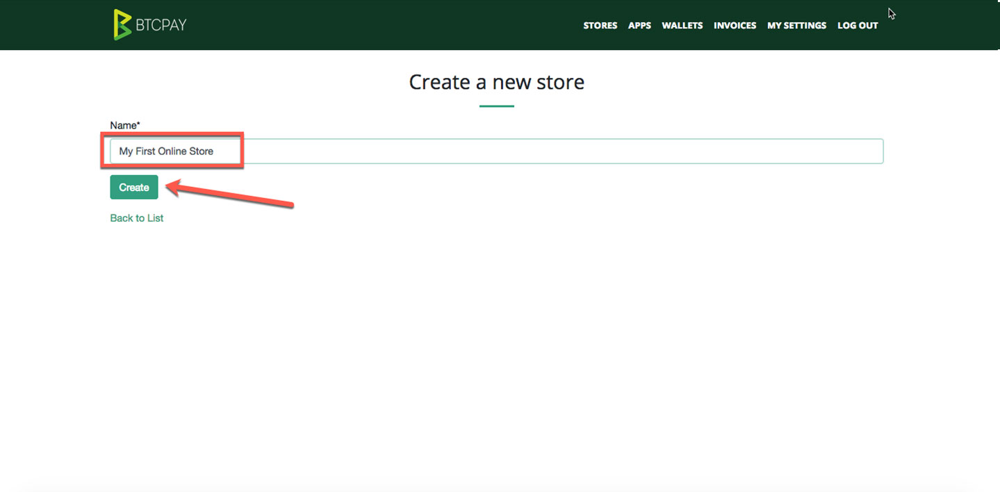

# GettingStarted.md

After deployment, your BTCPay Server needs to sync the blockchain. Depending on your machine configuration, bandwith and the amount of altcoins you added, this process usually takes between 1-7 days. 

There's nothing you can do to bypass it. It may seem boring, but it's critical step of running your own full node and not having to trust or relay to anyone.

You will see the pop-up message showing the sync progress. When your node is fully synced, the pop-up will disappear.

## Account Registration

 

The <strong>first created account</strong> on your newly-created BTCPay Server is automatically an <strong>admin</strong>. You can register your admin account even if your node is not fully synced. 

To register, just visit your BTCPay Server URL and click on the "Register" in the upper menu. Input your password and e-mail and click "Register" button. You will automatically be logged in. If you're using a third-party host, you may be asked to verify your e-mail address.

## Creating BTCPay Store

When logged in, go to > <strong>Stores</strong> in the upper navigation menu and <strong>create a new store</strong>. You can create unlimited number of stores on BTCPay Server.

 

 

## Customizing your BTCPay Store Settings

Store > Settings provide basis control over individual store settings. Modify the confirmations, invoice expiry and more. If you don't understand these options yet, leave to default.

### Connecting BTCPay Store to your wallet

The process of connecting a wallet and your BTCPay server is the same for both third-party or self-hosted solution. Your private keys are never uploaded nor required by the BTCPay Server. You’re only uploading the xpubkey, never private key.

There are two ways in which you can connect your BTCPay to your wallet:

1. Automatic with Ledger Nano S hardware wallet
2. Manual with any wallet supporting xpubkey (Electrum recommended)

Watch the video below or read [this article](https://bitcoinshirt.co/how-to-create-store-accept-bitcoin/8/#Connecting-BTCPay-with-your-wallet) for step by step instructions.

  

## Creating the Point of Sale App

BTCPay has a POS app which you can use to receive payments from your customers directly. You can also use the POS app to receive donations.

### Customizing POS App

## Creating the Payment Button

## Connecting your BTCPay store to your e-commerce platform

