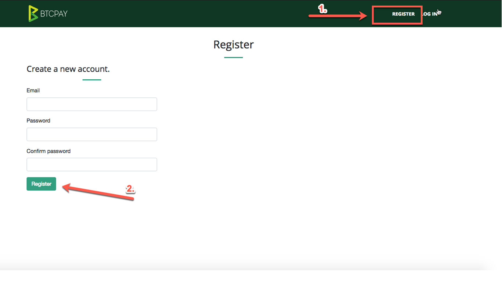
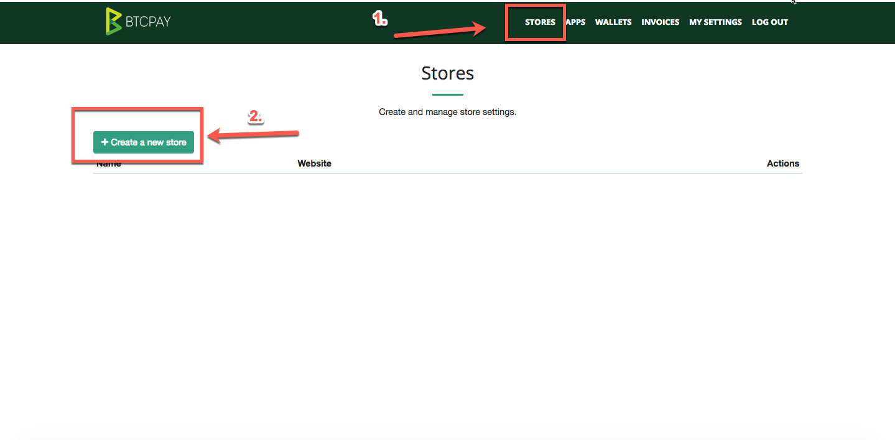

# Getting Started with BTCPay Server

After deployment, your BTCPay Server needs to sync the blockchain. Depending on your machine configuration, bandwidth and the number of altcoins you added, this process usually takes between 1-7 days.

There's nothing you can do to bypass it. It may seem tedious, but it's a critical step of running your own full node and not having to trust or rely on anyone. Your node will not only download 200GB of data (less if you're using a pruned node) but also validate all the rules of the consensus. You can find more information about the importance of blockchain synchronization in [this video](https://www.youtube.com/watch?v=OrYDehC-8TU).

You will see the pop-up message showing the sync progress. When your node fully syncs, the pop-up disappears.

## Account Registration

The <strong>first created account</strong> on your newly-created BTCPay Server is automatically an <strong>admin</strong>. You should register your admin account even if your node is not fully synced. 

To register, visit your BTCPay Server URL and click on the "Register" in the upper menu. Input your password and e-mail and click "Register" button. You will automatically be logged in. If you're using a third-party host, you may be asked to verify your e-mail address to register.

To allow other users to access your server, you need to enable registration in Server Settings > Policies. Server admins, should also [configure SMTP settings](FAQ/FAQ-ServerSettings.md#how-to-configure-smtp-settings-in-btcpay) to allow password reset via the e-mail for themselves and other users.

## Creating BTCPay Store

When logged in, go to > <strong>Stores</strong> in the upper navigation menu and <strong>create a new store</strong>. You can create an unlimited number of stores on BTCPay Server.

## Customizing your BTCPay Store Settings

Store > Settings provide basis control over individual store settings. Modify the confirmations, invoice expiry and more. 

### Connecting BTCPay Store to your wallet

The process of connecting a wallet and your BTCPay server is the same for both third-party or self-hosted solution. Your private keys are never uploaded nor required by the BTCPay Server. You’re only uploading the xpubkey, never private key.

There are two ways in which you can connect your BTCPay to your wallet:

1. Automatic with Ledger Nano S hardware wallet
2. Manual with any wallet supporting xpubkey (Electrum recommended)

Watch the video below or read [this article](https://bitcoinshirt.co/how-to-create-store-accept-bitcoin/8/#Connecting-BTCPay-with-your-wallet) for step by step instructions.

If you're using altcoins, be sure to repeat the process for each of the alternative coins. Each coin has its own wallet and derivation scheme.

## Creating the Point of Sale App

BTCPay has a PoS app which you can use to receive payments from your customers directly or to receive donations. To create the POS app, you need to have a store created in BTCPay.

1. Go to > Apps
2. Create a new App
3. Add a name of your app
4. Customize your PoS by adding your own items with prices, photos, and a description.
5. Click "Submit query".
6. Click "View" to preview your PoS (Your customers can access the PoS through that link).

You can change the appearance of your Point of Sale app by following [theme customization guide](Theme.md).

## Creating the Pay Button

Pay buttons are great when you have a fixed amount for a product or a donation. You can easily embed the button into HTML. When the customer or a visitor clicks on the button, BTCPay displays a checkout page and an invoice for them.

1. Go to > Store > Settings > Pay Button
2. Allow anyone to create invoices
3. Customize your button
4. Copy the generated form and embed it on your website.

You can also take a look at [this video](https://www.youtube.com/watch?v=MIWGvl6_WzI) which explains how to create a payment button and embed it to your website.

## Connecting your BTCPay store to your e-commerce platform

Depending on the CMS you're using, you can easily connect BTCPay to your online store. Currently, BTCPay offers following integrations :

* [Drupal](Drupal.md)
* [WooCommerce](WooCommerce.md)
* [Magneto](https://github.com/btcpayserver/magento-plugin)
* [PrestaShop](https://github.com/btcpayserver/prestashop-plugin)
* [Custom integration](CustomIntegration.md)
