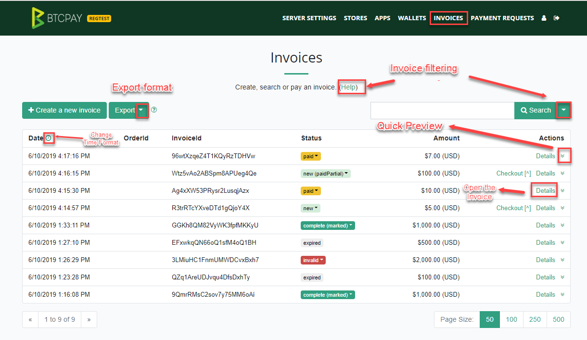

## Managing Invoices

## Invoice Statuses

Table below lists and describes common invoice statuses in BTCPay and suggests common actions. Actions are just recommendations. It's up to users to define best course of action for their use-case and business.

| Invoice Status         | Description                                                  | Action                                                       |
| ---------------------- | ------------------------------------------------------------ | ------------------------------------------------------------ |
| New                    | Not paid, invoice timer still has not expired                | None                                                         |
| Expired                | Not paid, invoice timer expired                              | None                                                         |
| Paid                   | Paid, but has not received sufficient amount of confirmations specified in the Store Settings | Wait for confirmations (The invoice should become - complete) |
| Completed              | Paid, completed, received sufficient amount of confirmations | Fulfil the order                                             |
| Expired (paidPartial)* | Paid, but not in full amount and expired                     | Contact buyer to arrange a refund or ask for them to pay their due. Optionally mark invoice as completed |
| Paid (Paid Over)       | Paid more than the invoice amount, but has not received sufficient amount of confirmations specified in the Store Settings | Wait for confirmations. The invoice should become - Complete (Paid Over). Then, |
| Complete (Paid Over)   | Paid more than the invoice amount, completed, received sufficient amount of confirmations | Contact buyer to arrange a refund for the extra amount, or optionally wait for buyer to contact you |
| Invalid**              | Paid, but failed to receive sufficient amount of confirmations within the time specified in store settings | Check the transaction on a blockchain explorer, if it received sufficient confirmations, mark as complete |

* *Paid Partial invoice usually happens when a buyer pays the invoice from the exchange wallet  which takes a fee for their service and deducts it from a total. In some cases, it happens when buyer enters an  incorrect amount in their wallet.
* **Invalid - If you're receiving a lot of invalid invoices in your store, you may want to [adjust invalid invoice time in store settings](FAQ/FAQ-Stores.md#payment-invalid-if-transactions-fails-to-confirm--minutes-after-invoice-expiration).
* ***Note: Invoices paid via the [Lightning Network](LightningNetwork.md) will immediately go to complete state, as their confirmation is instant.