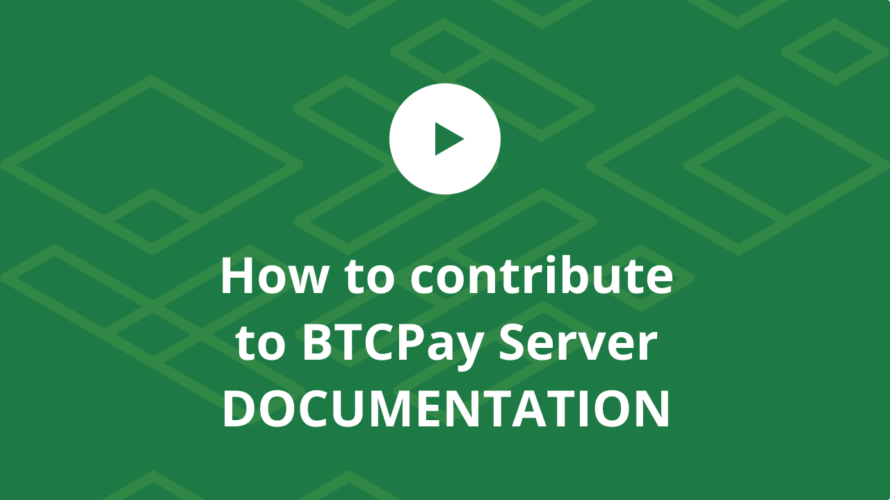

# BTCPay Server Documentation

[](https://github.com/btcpayserver/btcpayserver-doc/actions?query=workflow%3A%22Node+CI%22)

## Introduction

BTCPay Server is an open-source, self-hosted payment processor for Bitcoin and other cryptocurrencies.

If you have trouble using BTCPay Server, consider joining the [communities listed on the official website](https://btcpayserver.org/#communityCTA) to get help from community members.

Only file a [Github issue](https://github.com/btcpayserver/btcpayserver/issues) for technical issues you can't resolve through other channels or feature requests you've validated with other members of community.

Please check out our [official website](https://btcpayserver.org/), our [complete documentation](https://github.com/btcpayserver/btcpayserver-doc) and [FAQ](https://github.com/btcpayserver/btcpayserver-doc/tree/master/FAQ#btcpay-frequently-asked-questions-and-common-issues) for more details.

## Contributing

Pull requests are welcome and appreciated. To contribute to BTCPay Server, first check the [contributing guidelines](docs/Contribute.md).

If you're beginner, take a look at the step by step guide on how to contribute to BTCPay Server documentation below.

[](https://www.youtube.com/watch?v=bSDROcdSSWw "How BTCPay Server Works")

### Build the Documentation Locally

In order to build the website locally, you'll need [Node.js](https://nodejs.org/) >= 12.16 (or basically the latest LTS version).

The setup is straight forward:

```bash
# Link external doc repos
./setup-deps.sh

# Install dependencies
npm install

# Serve locally (by default on port 8080)
npm start
```

### Text Highlights

There are [three types of text highlights](https://vuepress.vuejs.org/guide/markdown.html#custom-containers) that can be used to display different colored boxes.

A green box displaying a friendly tip:

```md
:::tip
foo
:::
```

A yellow box with a cautious warning:

```md
:::warning
foo
:::
```

A red box with a clear danger, you can also add a title `foo` to any container:

```md
:::danger foo
bar
:::
```

### Embedding YouTube videos

To add a YouTube video with a preview, you can so so by linking to it like this:

```md
[](https://www.youtube.com/watch?v=tFbfyneDj88 "BTCPay Server Crowdfunding")
```

Note that the link item need to be a preview image (either from YouTube or a custom one) to result in an embedded video.

### External documentation repos

The build documentation site combines a bunch of docs living in different repositories.

Before the build we check out the other repositories, copy their docs into the right places and link them just as the docs in this repo.

The process for that is defined in the [setup-deps.sh](./setup-deps.sh) script.

## Supporters

The BTCPay Server Project is proudly supported by these entities through the [BTCPay Server Foundation](https://foundation.btcpayserver.org/).


If you'd like to support the project, please visit the [donation page](https://btcpayserver.org/donate/).
