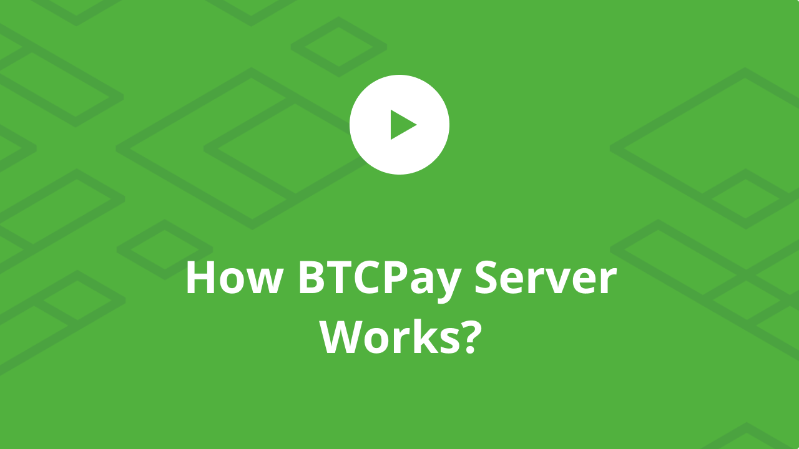

# BTCPay Server Documentation

## Introduction

BTCPay Server is an open-source, self-hosted payment processor for Bitcoin and other cryptocurrencies.

If you have trouble using BTCPay Server, consider joining the [communities listed on the official website](https://btcpayserver.org/#communityCTA) to get help from community members.

Only file a [Github issue](https://github.com/btcpayserver/btcpayserver/issues) for technical issues you can't resolve through other channels or feature requests you've validated with other members of community.

Please check out our [official website](https://btcpayserver.org/), our [complete documentation](https://github.com/btcpayserver/btcpayserver-doc) and [FAQ](https://github.com/btcpayserver/btcpayserver-doc/tree/master/FAQ#btcpay-frequently-asked-questions-and-common-issues) for more details.

## Features

* Direct, peer-to-peer Bitcoin payments
* No transaction fees (other than the [network fee](https://en.bitcoin.it/wiki/Miner_fees))
* No processing fees
* No middleman
* No KYC
* Non-custodial (complete control over the private key)
* Enhanced privacy
* Enhanced security
* Self-hosted
* SegWit support
* Lightning Network support (LND, c-lightning, Eclair and Ptarmigan)
* Tor support
* Opt-in [altcoin](docs/Altcoins.md) integrations
* Full compatibility with BitPay's API (easy migration)
* Process payments for others
* Easy-embeddable payment buttons
* Point of sale app
* Crowdfunding app
* Payment Requests
* Internal, full-node reliant wallet with [hardware wallet integration](docs/Vault.md)
* [Payjoin Support](docs/Payjoin.md)

## How it works

### In a nutshell

In layman's terms, BTCPay Server is a self-hosted and automated invoicing system. At checkout, the customer is presented with an invoice. Each generated invoice, has a unique address tied to it, so there is no address re-use. BTCPay Server follows status of the invoice throughout the blockchain and informs a merchant when the order can be fulfilled.

### How is it different

BTCPay Server is code, not a company. There is no third-party between a merchant and a customer. Merchant is always in full control of the funds. There are no processing or subscription fees. BTCPay Server is free to use and completely open-source.

Developers or security auditors can always inspect the quality of the code, and anybody can contribute and help with software improvements.

### How it keeps funds secure

Payments via BTCPay Server are direct, peer to peer. The merchant receives coins directly to their wallet, with no intermediary. Securing funds comes down to the merchant securing their own private keys, which is standard for most cryptocurrency wallets.

There is an [internal wallet](docs/Wallet.md) inside BTCPay Server that merchants can use to view and spend funds received by their customers. The funds from that wallet can only be spent, if a transaction is signed with the merchant's compatible hardware wallet or a private key. This allows merchants to have complete control of funds received.

### How it keeps data private

The data is shared only between two parties - the buyer and a seller. Other payment processors collect and share user data with other parties, making it very hard to comply with privacy law regulations like GDPR. Each invoice in BTCPay Server has a different receiving address, so there is no [address re-use](https://en.bitcoin.it/wiki/Address_reuse) which improves privacy significantly.

### How it resists censorship

* Self-hosted
* Can be run everywhere, from low-powered device like Raspberry Pi at home to enterprise-grade servers
* No third-party
* Can easily be re-deployed

BTCPay Server does not have a central point of failure since nobody is controlling it except for the user running it. If run on the cloud server, the hosting providers can potentially censor users by suspending hosting accounts or disabling access to virtual machines.

This is always a risk for anyone using a hosting provider. Since no private keys are stored on the server, a censored individual can easily re-deploy the server with another host. Your coins are always inside your wallet.

If an invoice is paid while your BTCPay Server is down, the software will automatically determine and notify the merchant of offline invoice payments when your server is back up. If a hosting provider suspends the server, and there was no proper backup, server settings and invoice data may be lost, but on-chain payments are always in your wallet. For ultimate censorship-resistance, users should run [BTCPay on their own hardware](docs/HardwareDeployment.md). The software can even be run on a single-board computer, like [Raspberry Pi](docs/RaspberryPiDeployment.md) from the comfort of your home.

### Beyond payment processing

BTCPay Server is often misconceived as being the payment processor used by the merchants only. In reality, the [use-cases](docs/UseCase.md) are limitless.

BTCPay is a tech-stack that glues lots of complex components into an easy-to-use and coherent interface. The software can be used by self-sovereign individuals as a way to run a full node at home with a full-node reliant wallet.

Developers can build the entire businesses and projects on top of the stack.

Enterprises can use it as scalable and secure back-end of their infrastructure without ever having to put a trust in a third-party. BTCPay Server is a [toolbox](https://www.facebook.com/kriptomedia/videos/vl.418099655731067/2898112140218815) with lots of tools you can use, it's up to you how you want to use it.

### Community articles

* [The Ultimate Guide to BTCPay - The free and open-source Bitcoin Payment processor](https://www.reddit.com/r/Bitcoin/comments/8f1eqf/the_ultimate_guide_to_btcpay_the_free_and/)
* [The Ultimate List of BTCPay Server Hosts and Merchants](https://bitcoinshirt.co/btcpay-stores/)
* [BTCPay Server official youtube channel](https://www.youtube.com/channel/UCpG9WL6TJuoNfFVkaDMp9ug)
* [BTCPay Server Manual Install](http://blog.sipsorcery.com/?p=1052)
* [How to Setup BTC and Lightning Payment Gateway with BTCPayServer on Linux (Manual Install)](https://freedomnode.com/blog/114/how-to-setup-btc-and-lightning-payment-gateway-with-btcpayserver-on-linux-manual-install)
* [BTCPay Server Setup Using Digital Ocean](https://medium.com/@molthoff/running-btcpay-on-digital-ocean-for-10-month-how-to-add-other-coins-7a497339fb2f)
* [BTCPay Server Setup Using AWS EC2](https://wiki.ion.radar.tech/tutorials/nodes/btcpay-+-aws-ec2)

For list of articles, podcasts and video presentations about BTCPay, please see our [media repository](https://github.com/btcpayserver/btcpayserver-media/tree/master/Publications).

### Contributing

Pull requests are welcome and appreciated. To contribute to BTCPay Server, first check the [contributing guidelines](Contribute.md).

If you're beginner, take a look at the step by step guide on how to contribute to BTCPay Server documentation below.

### Supporters

The BTCPay Server Project is proudly supported by these entities through the [BTCPay Server Foundation](https://foundation.btcpayserver.org/).

If you'd like to support the project, please visit the [donation page](https://btcpayserver.org/donate/).
