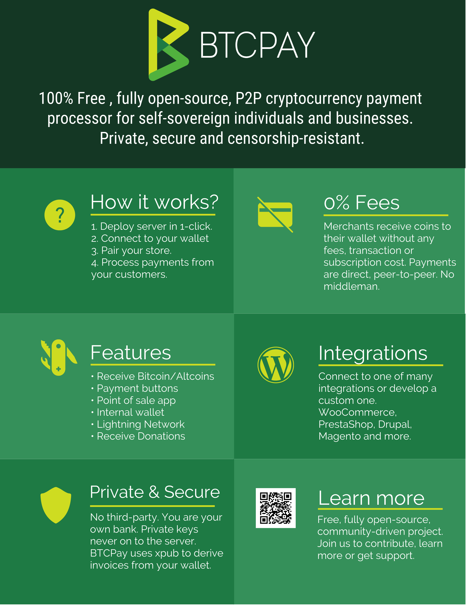

# BTCPayServer Documentation

## Introduction

BTCPayServer is an open-source, self-hosted payment processor for Bitcoin and other cryptocurrencies.

If you have any issues with BTCPay, please file a [Github issue](https://github.com/btcpayserver/btcpayserver/issues).
If you have more general questions, please come on [Slack](http://slack.btcpayserver.org/) or check our [Wiki Page](https://nbitstack.com/c/btcpayserver) for common problems.

## Features
* Direct, peer-to-peer Bitcoin and altcoin payments
* No transaction fees (other than those for the crypto networks)
* No processing fees
* No middleman
* No KYC
* User has complete control over private keys
* Enhanced privacy
* Enhanced security
* Self-hosted
* SegWit support
* Lightning Network support (LND and c-lightning)
* Altcoin support
* Full compatibility with BitPay API (easy migration)
* Process payments for others
* Easy-embeddable Payment buttons
* Point of sale app

## How it works
### In a nutshell
In layman words, BTCPay Server is a self-hosted and automated invoicing system. When checking out, the customer is presented with an invoice. Each time, a different address is tied to a particular invoice, so there is no address re-use. BTCPay follows the status of the invoice through the blockchain and informs a merchant when he can fulfill the order safely.
### How is it different
BTCPay is a code, not a company. There is no third-party between a merchant and a customer. Merchant is always in full control of the funds. There are no processing or subscription fees. BTCPay Server is free to use and completely open-source, so developers or security auditors can always inspect the quality of the code.
### How it keeps funds secure
Payments via BTCPay are direct, peer to peer. The merchant receives the coins directly to their wallet, with no intermediate. Securing funds comes down to the merchant securing their own private keys, which is standard for most cryptocurrency wallets. There is an internal wallet inside BTCPay that merchants can use to view funds received by paid invoices. The funds from that wallet can only be spent, if a transaction is signed with the merchant's compatible hardware wallet. This allows merchants to have complete control of funds received.
### How it keeps data private
The data is shared only between two parties - the buyer and a seller. Other payment processors share and collect user data with other parties, making it very hard to comply with privacy law regulations like GDPR. Each invoice in BTCPay has a different receiving address, which means there is no address re-use which improves privacy significantly.
### How it resists censorship
* Self-hosted
* Can be run on a hardware
* No third-party
* Can easily be re-deployed

BTCPay does not have a central point of failure since nobody is controlling it except for the user running it. If run on the cloud server, the hosting providers can potentially censor users by suspending hosting accounts or disabling access to virtual machines. This is always a risk for anyone using a hosting provider. Since no private keys are stored on the server, a censored individual can easily re-deploy the server with another host. Your coins are always inside your wallet. 
If an invoice is paid while your BTCPay server is down, the software will automatically determine and notify the merchant of offline invoice payments when your server is back up. If a hosting provider suspends the server, and there was no proper backup, server settings and invoice data may be lost, but on-chain payments are always in your wallet. For ultimate censorship-resistance, users should run [BTCPay on their own hardware](HardwareDeployment.md).
## Documentation

## BTCPay Basics

* [Use Case](UseCase.md)
* [Walkthrough](Walkthrough.md)
* [Getting Started](GettingStarted.md)
* [BTCPay vs other processors](BTCPayVsOthers.md)
* [Try it Out](TryItOut.md)
    
## Deployment

* [Choosing a Deployment Method](Deployment.md)
* [Web Deployment](LunaNodeWebDeployment.md)
* [Azure Deployment](AzureDeployment.md)
    * [Reducing Cost on Azure](AzurePennyPinching.md)
    * [Changing Domain](ChangeDomain.md)
* [Docker Deployment](DockerDeployment.md)
* [Google Cloud Deployment](GoogleCloudDeployment.md)
* [Manual Deployment](ManualDeployment.md)
* [Hardware Deployment](HardwareDeployment.md)
* [Raspberry Pi Deployment](RaspberryPiDeployment.md)
* [Third-Party Hosting](ThirdPartyHosting.md)

### Features

* [Internal Wallet](Wallet.md)
* [Apps](Apps.md)
* [Lightning Network](LightningNetwork.md)
* [Accounting](Accounting.md)

### Integrations

* [WooCommerce](WooCommerce.md)
    * [WooCommerce Xadrez's Guide](Xadrez.md)
* [Drupal](Drupal.md)
* [Magento](Magento.md)
* [PrestaShop](PrestaShop.md)
* [Custom Integration](CustomIntegration.md)

### Development

* [Architecture](Architecture.md)
* [Developing Locally](LocalDevelopment.md)
* [How to add an Altcoin](Altcoins.md)
* [Customize Bootstrap theme](Theme.md)

### FAQ and common issues

* [FAQ Table of Contents](FAQ/readme.md)
* [General FAQ](FAQ/FAQ-General.md)
* [Deployment FAQ](FAQ/FAQ-Deployment.md)
* [Synchronization FAQ](FAQ/FAQ-Synchronization.md)
* [Integrations FAQ](FAQ/FAQ-Integrations.md)
* [Server Settings FAQ](FAQ/FAQ-ServerSettings.md)
* [Stores FAQ](FAQ/FAQ-Stores.md)
* [Wallet FAQ](FAQ/FAQ-Wallet.md)
* [Apps FAQ](FAQ/FAQ-Apps.md)
* [Lightning Network FAQ](FAQ/FAQ-LightningNetwork.md)
* [Altcoins FAQ](FAQ/FAQ-Altcoin.md)

### Support and Community

* [Troubleshooting an issue](Troubleshooting.md)
* [Support](Support.md)
* [Contribute](Contribute.md)
* [Translate](Translate.md)
* [Community](Community.md)

### Community articles

* [The Ultimate Guide to BTCPay - The free and open-source Bitcoin Payment processor](https://www.reddit.com/r/Bitcoin/comments/8f1eqf/the_ultimate_guide_to_btcpay_the_free_and/)
* [The Ultimate List of BTCPay Server Hosts and Merchants](https://bitcoinshirt.co/btcpay-stores/)
* [Xadrez - Guide to run an open source based e-store that accepts Litecoin, Bitcoin and fiat](Xadrez.md)
* [Third party hosted BTCPay servers - If you are looking for help with BTCPay Server](ThirdPartyHosting.md)
* [BTCPay Server official youtube channel](https://www.youtube.com/channel/UCpG9WL6TJuoNfFVkaDMp9ug)
* [BTCPay Server Manual Install](http://blog.sipsorcery.com/?p=1052)
* [How to Setup BTC and Lightning Payment Gateway with BTCPayServer on Linux (Manual Install)](https://freedomnode.com/blog/114/how-to-setup-btc-and-lightning-payment-gateway-with-btcpayserver-on-linux-manual-install)
