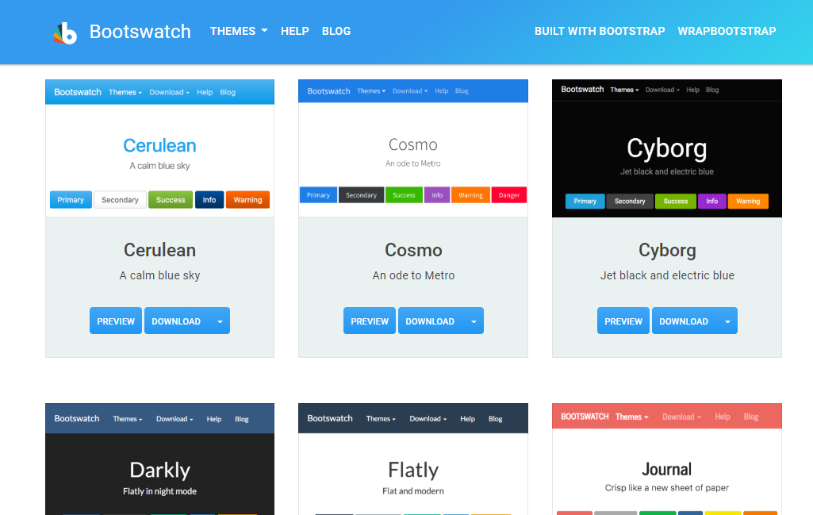
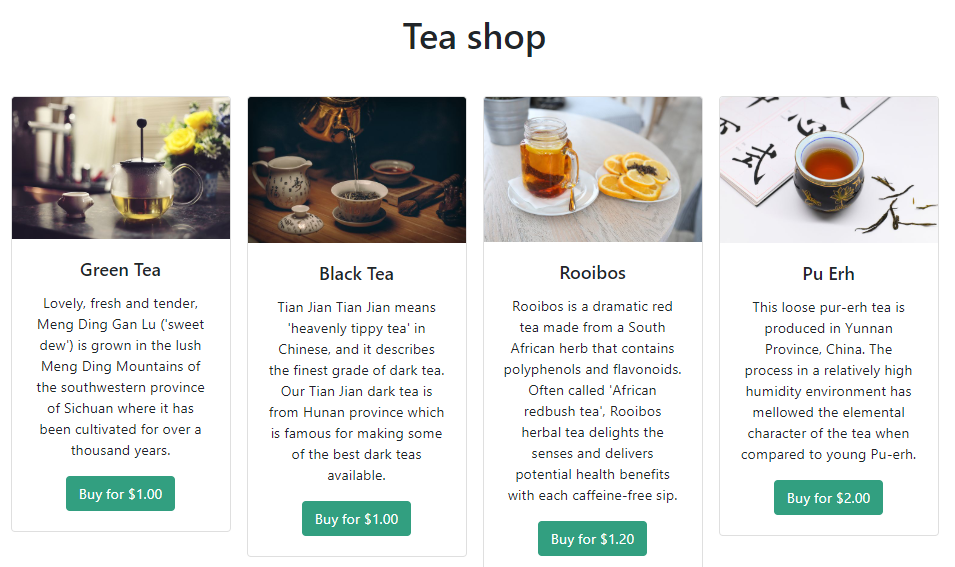
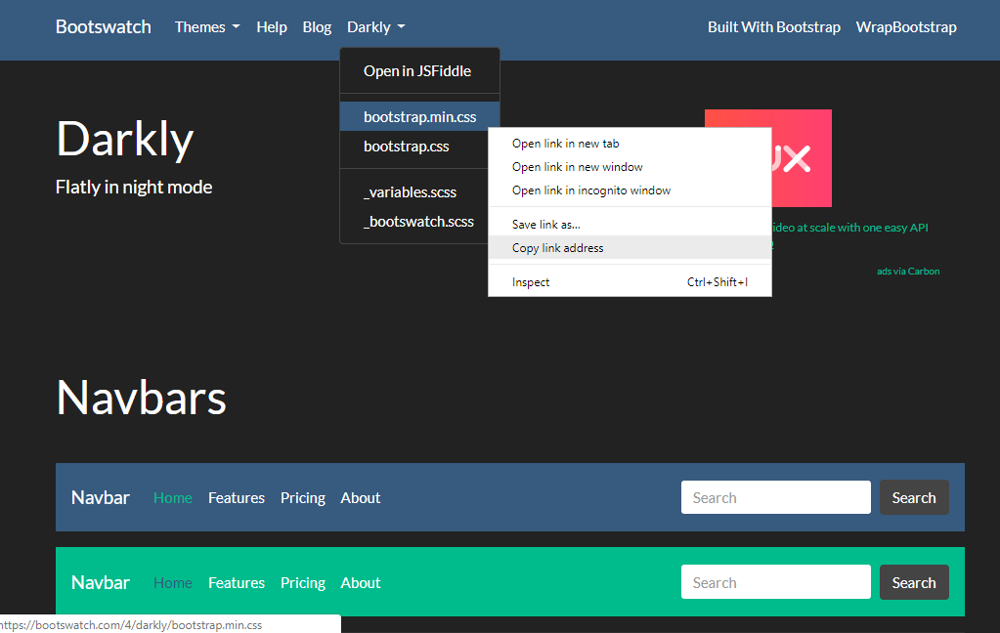
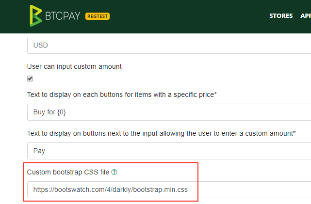
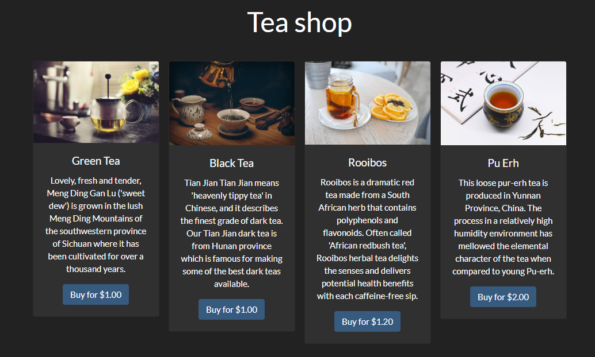
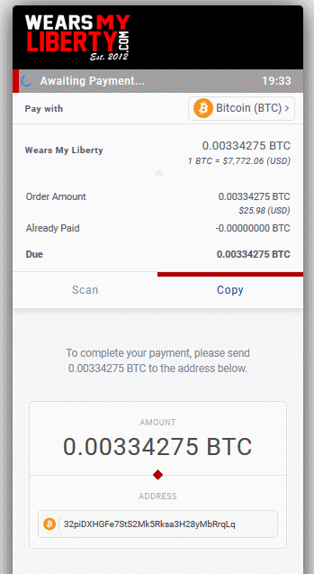
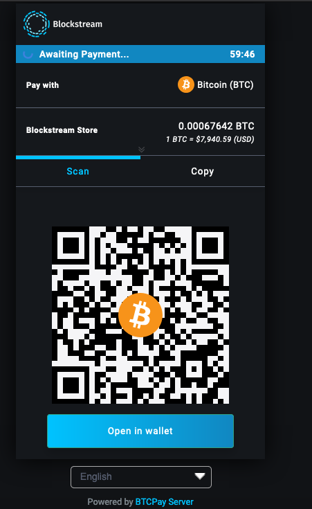

# Theming

## Bootstrap themes

BTCPay Server is built on Bootstrap, this gives you access to lot's of custom theme maintained by the community.
Browse [Bootswatch](https://bootswatch.com/) to find some themes.



Let's see how we can take advantage of it.

1. Create a new store
2. Setup a derivation scheme for BTC for this store
3. Create a new Point of Sale app attached to this store (in the Apps menu)

You will see that the default design for such point of sale is:



If you want to change this theme, find a theme on [Bootswatch](https://bootswatch.com/) which interest you, for example, [Darkly](https://bootswatch.com/darkly/).

You can copy the link to the theme:



Now, go into the settings of your store and paste the link to customize the bootstrap theme:



And enjoy a new theme!



## Checkout page theme

It is possible to entirely customize the checkout experience of your customer with your brand.

Go to your Store Settings, Checkout Experience, Link to a custom CSS stylesheet. Create your custom theme using these examples below:

Server admins can upload their .css file to [File Storage](FAQ-ServerSettings.md#how-to-upload-files-to-btcpay) to create a CSS stylesheet link.

### Wear my liberty

Design:



CSS file:
```css
.modal.page {background-color: #efefef;}
.top-header .header {height: 80px;}
.header__icon__img {height:60px;}
.top-header .timer-row {padding: 4px 14px; position: relative; transition: background 1s ease;}
.top-header {max-height: 120px; transition: all .2s ease-out;}
.top-header {background-color: #000;}
.top-header .timer-row__progress-bar {background:#ce0000;}
.top-header .timer-row {background: #a0a0a0;}
.payment-tabs__slider {background: #aa0303;	}
.separatorGem {background: #aa0303;}
.action-button {color: #fff; background-color: #aa0303;border-color: #700000;}
.action-button:hover {background-color: #ef8022;}
.action-button:focus, .action-button.focus {color: #fff;background-color: #aa0303;
    border-color: #aa0303;}
.action-button:active, .action-button.active, .open>.action-button.dropdown-toggle {    color: #fff;    background-color: #3aa821;    border-color: #aa0303;}
.action-button:active:hover, .action-button:active:focus, .action-button:active.focus, .action-button.active:hover, .action-button.active:focus, .action-button.active.focus, .open>.action-button.dropdown-toggle:hover, .open>.action-button.dropdown-toggle:focus, .open>.action-button.dropdown-toggle.focus {    color: #fff;    background-color: #3aa821;    border-color: #aa0303;}
```

Logo:


### Coincards


CSS file:
```css
.top-header {background-color: #fff;}
.top-header .timer-row__progress-bar {background:#ef8022;}
.top-header .timer-row {background: #ffc313;}
.close-icon {color:#000;}
.payment-tabs__slider {background: #ef8022;     }
.separatorGem {background: #ef8022;}
.action-button {color: #fff; background-color: #ef8022;border-color: #ef8022;}
.action-button:hover {background-color: #ffc313;}
.action-button:focus, .action-button.focus {color: #fff;background-color: #ef8022;
    border-color: #ef8022;}
.action-button:active, .action-button.active, .open>.action-button.dropdown-toggle {    color: #fff;    background-color: #ef8022;    border-color: #ef8022;}
.action-button:active:hover, .action-button:active:focus, .action-button:active.focus, .action-button.active:hover, .action-button.active:focus, .action-button.active.focus, .open>.action-button.dropdown-toggle:hover, .open>.action-button.dropdown-toggle:focus, .open>.action-button.dropdown-toggle.focus {    color: #fff;    background-color: #ef8022;    border-color: #ef8022;}
.btnGroupLnd button {border: solid 1px #ef8022;}
.btnGroupLnd button.active {background-color: #ef8022; border-color: #ef8022;}
.btnGroupLnd button:hover {background-color:#ffc313;}
.btnGroupLnd button.active:hover {background-color:#ef8022;}
```
Logo:


### Blockstream



CSS file:
```css
html {
  background-color: #111316 !important;
}

.modal.page {
  background-color: #111316;
}

.top-header {
  background-color: #15181c;
}

.top-header .timer-row__progress-bar {
  background: #00c3ff;
}

.top-header .timer-row {
  background: #1187c1;
}

.payment-tabs__slider {
  background: #00c3ff;
}

.action-button {
  color: #fff !important;
  background-image: linear-gradient(to right, #00c3ff, #1187c1);
}

.action-button:active {
  background-image: linear-gradient(to right, #00c3ff, #1187c1);
}

.invoice {
  background-color: #15181c;
}

.expired__body {
  color: #fff;
}

.currency-selection {
  background-color: #15181c;
  border-bottom: 1px solid #565d6e;
  color: #fff;
  padding-top: 15px;
  padding-bottom: 15px;
  height: auto;
}

.line-items {
  background-color: #111316;
  color: #565d6e !important;
  border-top: 1px solid #565d6e !important;
}

.buyerTotalLine {
  border-top: 1px solid #202224;
  background-color: #15181c;
  color: #fff;
}

.payment-tabs {
  background-color: #15181c;
  color: #fff;
  border-top: 1px solid #565d6e;
  border-bottom: 1px solid #565d6e;
}

.payment-tabs__tab .active {
  color: #00c3ff;
}

.payment-tabs__tab.active {
  color: #00c3ff;
}

a {
  color: #00c3ff !important;
}

canvas {
  border: 5px solid #fff;
}

#prettydropdown-DefaultLang ul {
  color: #565d6e !important;
  background-color: #111316 !important;
}

.manual__step-one__header {
    color: #ffffff;
}
.manual__step-one__instructions {
    color: #ffffff;
}
```
Logo:

