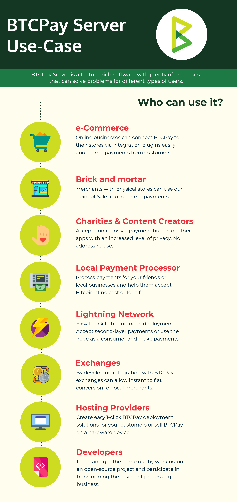

# BTCPay Server Use Cases

Built with the community in mind, BTCPay Server is a feature-rich software with plenty of use-cases that can solve problems for different types of users.

The software usage is by no means limited to the groups of users mentioned in this document.

## Merchants

By choosing BTCPay Server to process payments, merchants are:

* Saving money (no fees, no subscriptions)
* Cutting out the middle-man (Payments go directly to their wallet)
* Enhancing privacy for their customers (no address re-use, no information leaks to third parties)
* Saving time (easy integration and installation)
* Protecting themselves from interference in their business (self-sovereignty)

### Online Store

Merchants running an e-commerce business can easily [deploy BTCPay Server](https://docs.btcpayserver.org/deployment) and connect it to their store via [integration plugins](https://docs.btcpayserver.org/integrations/) in just a few clicks.

BTCPay Server checkout is no different to any other payment gateway. The customer gets an invoice. They pay it by scanning a QR code or by copy-pasting the amount and the address. When their payment is confirmed, the merchant is notified via the e-commerce software, and can ship the item.

Take a look at [our demo online store](https://store.btcpayserver.org/).

### Physical Store

For brick and mortar stores, BTCPay Server has a [web-based Point of Sale](Apps.md#point-of-sale-app). Similarly to the online store, the customer is presented with an invoice that he can pay on the spot. The POS app can be run on any web-connected device.

Take a look at [our demo POS app](https://mainnet.demo.btcpayserver.org/apps/3utBTfSKkW4gK7aQMd2hW5Bh9Fpa/pos).

## Self-sovereign individuals

Privacy-minded individuals can use BTCPay Server internal wallet for their everyday crypocurrency transactions without providing a private key. For self-hosted servers, the [internal wallet](Wallet.md) relies on a full node, significantly enhances the privacy. [Hardware wallet integration](Vault.md) allows the usage of a hardware wallet with a [full node](https://en.bitcoin.it/wiki/Full_node) and avoids leaks to a third-party server.

## Freelancers & Bill Pay

Freelancer can request for payment by sharing a [Payment Request](PaymentRequests.md). Content and appearance of the payment request is customizable. With or without expiry, customers can pay the request at any time. BTCPay Server automatically updates the exchange rate when the customer pays the payment request when it's convenient for them. 

Merchants or freelancers can use payment requests for bill pay services. Payment requests can even be used to quickly request money from friends. 

## Lightning Network payments

BTCPay Server offers a very easy way to get started with receiving or sending payments on the Lightning Network. You can use and experiment with this innovative second-layer solution build on top of Bitcoin by [following this guide](LightningNetwork.md). Both merchants and customers can use BTCPay to receive or make payments off-chain with instant confirmations and neglectable network fees.

## Charities and Content Creators (Donations)

Charities, non-profits, content creators, and other organizations that want to accept cryptocurrency donations in a more private way than the traditional single bitcoin address method can utilize the [Pay Button](WhatsNext.md#creating-the-pay-button), [POS app](WhatsNext.md#creating-the-point-of-sale-app), and [Crowdfunding app](Apps.md#crowdfunding-app) for a better user experience.

Benefits of using BTCPay for accepting donations:

* Saving money (no fees, no subscriptions)
* Cutting out the middle-man (Payments go directly to their wallet)
* Enhancing privacy for them and their donors (no address re-use, no IP leaks to third parties)

It is particularly important to mention that BTCPay Sever prevents address reuse, as many people has been reusing address for donations in the past. Here is why you SHOULD NOT reuse Bitcoin address:

* Privacy: reusing the same address for donations not only makes it incredibly easy to link it to your identity, it also compromises the privacy of your donors and every person that interacts with you
* Security: by compromising your privacy, address reuse increases your attack surface, as people that want to steal from you or harm you would have A LOT of information about you and your donors
* High fees: fees for a Bitcoin transaction are calculated according to the "size" of a transaction (which has nothing to do with the amount being sent). By reusing addresses, you are building huge transactions involving many inputs, that will cost you a lot in fees when you want to move them

You can read more about address reuse on the [Bitcoin Wiki](https://en.bitcoin.it/wiki/Address_reuse).

## Local Payment Processor

Admin running a BTCPay Server instance, can enable registration for other users and become a [third-party payment processor](ThirdPartyHosting.md) for family members, friends or their local community.

This means that admin allows other people to register and use their instance, while the payments remain non-custodial.

Take a look at the list of [third-party hosts](ThirdPartyHosting.md).

## Cryptocurrency Exchanges

The [number of merchants](https://directory.btcpayserver.org) using BTCPay Server grows each day, and cryptocurrency exchanges could benefit from it by developing integration with BTCPay and allow instant conversion of cryptocurrency payments into local fiat currencies.

Being an open-sourced project, BTCPay Server doesn't have the power to impose anything on exchanges, meaning that any of them could build on top of it, regardless of their size or the country they operate.

## Hosting Providers

Hosting providers can (and some already did) create easy 1-click BTCPay deployment solutions for their customers. With the growing interest in BTCPay Server, hosting companies can tap into this source of new customers and make money by hosting easily-deployable BTCPay instances for merchants.

## Developers

BTCPay Server community is amiable and open-minded. Developers can not only learn a lot and get their name out by working on an open-source project, but also participate in transforming the payment processing business.

---

These are some of the many ways in which you can use BTCPay. Unleash your creativity and feel free to build your own solutions to solve problems.
