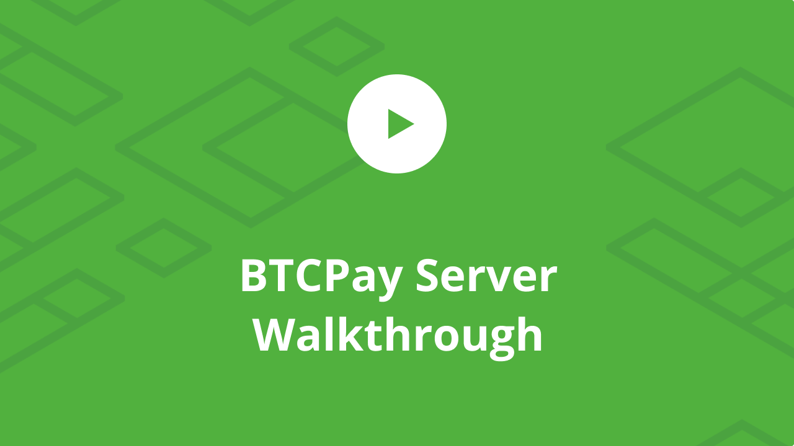
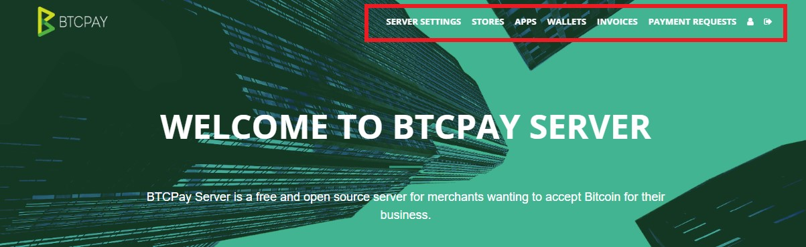

# BTCPay Server Walkthrough

In this article, we will walk you through the BTCPay user interface and show you how to navigate through different options.

Watch video below for an interactive overview of the features.

After you created the account on the BTCPay Server instance hosted by yourself or a third-party, you'll see a variety of options in the navigation menu on top.

* Server settings
* Stores
* Apps
* Wallets
* Invoices
* Payment requests
* My settings

## Server settings

Server settings is something only a server admin can access. If you're using someone else's server, you won't see Server Settings. Inside the settings, you can perform tasks such as controlling users, rates, updating the server, etc. For more information, check [Server Settings FAQ](FAQ/FAQ-ServerSettings.md)

- Users - Add, remove or manage users of your BTCPay Server.
- Rates - Set the source for cryptocurrency to fiat rates used by the server.
- Email server - If you want users to verify e-mail address when registering set up the SMTP settings.
- Policies - Enable or disable user registration, e-mail verification, search engine indexing, display apps on website root.
- Services - GRPC, REST and RTL used for connecting your LN node, SSH keys and uploaded file storage setup.
- Theme - Customize the front-end appearance of your BTCPay Server.
- Maintenance - Update your BTCPay to latest version and clean your BTCPay by deleting unused docker images.
- Logs - Displays most recent logs of the BTCPay Server.
- Files - After enabling this feature in Services, upload external files and access them via url. 

## Stores

Inside BTCPay you can create and manage an unlimited number of stores. Each store has its own wallet, can create apps (Point of Sale or Payment Buttons and Crowdfunds) or be paired with external e-commerce software through one of the [integrations](https://docs.btcpayserver.org/integrations/) available. Admin does not have control over the private keys of the other user's stores. For more information, check [Stores FAQ](/FAQ/FAQ-Stores.md)

- General settings - Configure individual store settings, set up derivation scheme for your wallet and adjust the number of confirmations or invoice expiration time, etc. Server admins can enable Lightning Network payments.
- Rates - Set the source for cryptocurrency to fiat [exchange rates for your store](/FAQ/FAQ-Stores.md#how-to-change-the-exchange-rate-provider-for-invoices).
- Checkout experience - [Customize the appearance](/FAQ/FAQ-ServerSettings.md#how-to-modify-the-checkout-page) of the checkout page, choose default coin, etc.
- Access Tokens - Tokens for [pairing the store to an integration](WhatsNext.md#connecting-your-btcpay-store-to-your-e-commerce-platform)
- Users - Enable other users with a registered BTCPay account to access your store as either guest or owner.
- Pay Button - [Create a payment button](WhatsNext.md#creating-the-pay-button) you can easily embed into your website.

## Apps

Each store has access to different apps. Applications built on top of BTCPay extend the [use case](UseCase.md) of the software and cater to different type of users. Here you can create a new app and connect it to the store and customize it. A good example is the Point of Sale app which you can use to receive payments in physical stores or even donations.

For more information, check [Apps](Apps.md) or [Apps FAQ](/FAQ/FAQ-Apps.md)

## Wallets

Each store gets an internal wallet upon adding a derivation scheme. Internal BTCPay wallet shows all of your payments and should be used as a reference if some payments are not shown in your software or hardware wallet due to some wallets [not supporting larger gap limit](FAQ.md#i-do-not-see-the-funds-in-my-softwarehardware-wallet). In Wallets, you can see the total balance of your store. The funds from the wallet can only be spent, if the user signs a transaction with a compatible hardware wallet.

Three elements of the internal BTCPay Wallet are: 
* Transaction - Shows your entire transaction history.
* Send - Used for sending funds out of your wallet (has to be signed and confirmed on a compatible hardware wallet).
* Rescan - Enables you to import old wallets into BTCPay more easily and solves the gap limit issue most external wallets have.

For more information, check [Wallet](Wallet.md) or [Wallet FAQ](/FAQ/FAQ-Wallet.md)

## Invoices

All of the invoices for your user account will be displayed here. You can filter the invoices by the status, order, item, store or date. You can also create invoices manually. Invoices are sorted by date from new to old. You can open an individual invoice for more information. Use the export button to save a file (.json or .csv) detailing all invoices.

## Payment Requests

Each store can have an unlimited number of payment requests which are displayed here. Payment requests are dynamic invoices that can be shared by url and paid at any time using current BTC exchange rates. Here you can edit and view your payment requests. You can see invoice details for your payment requests and even clone previously created payment requests. 

For more information, check [Payment Requests](PaymentRequests.md)

## My Settings

My Settings are user settings. Modify your e-mail address, password or set up two-factor authentication. The U2F feature allows users to further enhance the security of their accounts by physically confirming authentication with a U2F compatible device.
