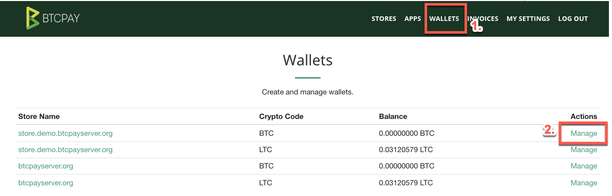
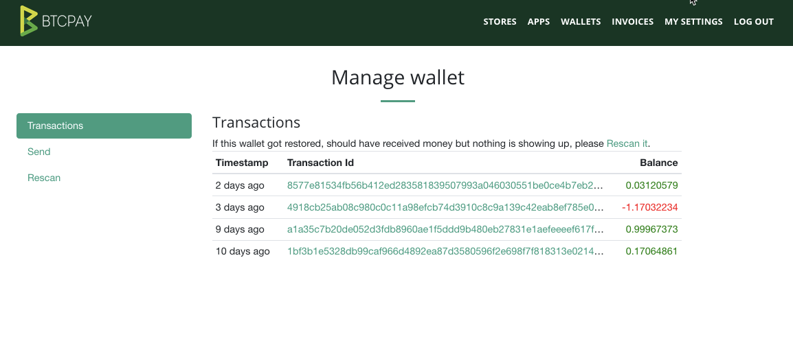
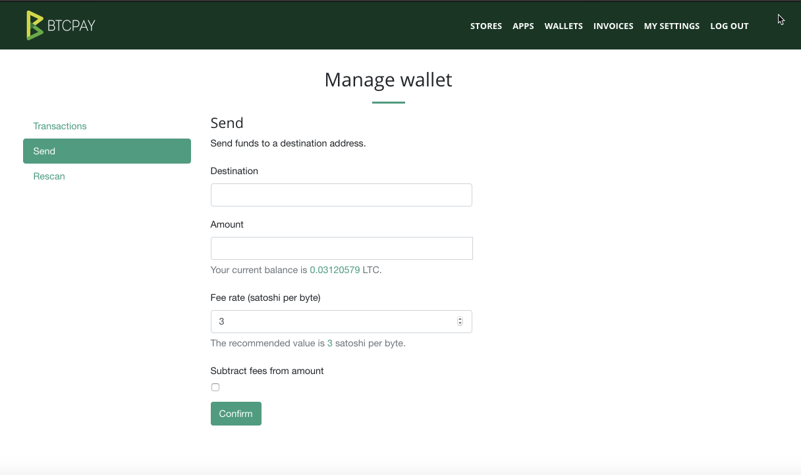
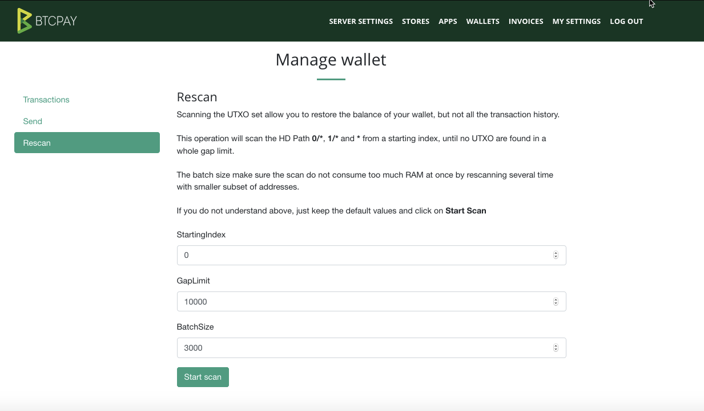
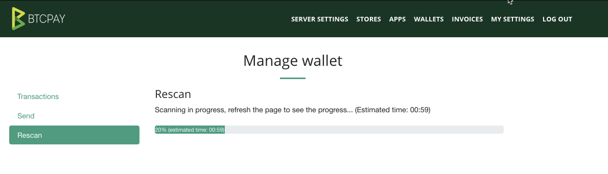

# BTCPay Server Wallet
This document explains the features of the internal BTCPay wallet. For frequently asked questions - check the [Wallets FAQ](FAQ-Wallet.md)

Note: A [private key](https://en.bitcoin.it/wiki/Private_key) (xprv) is **never** required for BTCPay to work. The software needs a public key (xpub) which is a watch-only wallet token. The xpubkey allows BTCPay to generate a new address each time a new invoice is created. It enables users to observe the wallet balance and transactions without having to share their private key.

If you're using a [third-party host](ThirdPartyHosting.md) and are asked to provide a private key, it's certainly a scam. Never share your private key with anyone. It's called private for a reason. 

BTCPay has an **internal**, full node reliant wallet that can be accessed by clicking "Wallets" from the top menu. The reliance on the user's own full node makes the wallet more private and secure compared to any [SPV](https://en.bitcoin.it/wiki/Thin_Client_Security#Simplified_Payment_Verification_.28SPV.29) wallet.

The internal wallet does not generate a private key. Users have to create their own private key and enter xpubkey derived from xpriv into Store Settings > Derivation scheme to activate the internal wallet. 

The public key can be easily added from external wallet like Electrum by pasting it into derivation scheme field or automatically with a hardware wallet like Ledger Nano S. For more information on how to add a derivation scheme to BTCPay, see the [Getting Started Guide](GettingStarted.md)

Each store and cryptocurrency have a separate wallet displayed on the Wallets page.  To access a particular wallet, select "Manage."

### Wallet overview

The wallet is minimal and easy to use. It contains several functions:
1. Transactions
2. Send 
3. Re-scan

#### Transactions
An overview of your incoming (green), outgoing (red) and unconfirmed (greyed out) transactions displayed together with timestamp and balances, sorted by date. Users can click on the tx ID to preview the transaction on the block explorer.

#### Send
Users who own a compatible hardware wallet can use the send function to send the funds from the wallet. Quite simply, to send the funds, the user is required to sign and confirm the transaction on the hardware wallet physically.

#### Re-scan
The Rescan relies on Bitcoin Core 0.17.0's scantxoutset to scan the current state of the blockchain (called UTXO Set) for coins belonging to the derivation scheme being used. 

Wallet re-scan solves two critical problems for BTCPay users:
1. [Gap limit](FAQ/FAQ-Wallet.md#missing-payments-in-my-software-or-hardware-wallet)
2. Importing previously used wallet

**Gap limit**: Most of the wallets have the gap limit set to 20. This means that if a merchant receives 21 or more consecutive unpaid invoices, those wallets show the incorrect balance and some transactions may not be visible.

**Wallet import**: When users add a derivation scheme of a wallet that had transactions in the past (used wallet), BTCPay won't be able to show the balance and transactions from the past.

Re-scan is a feature that solves both of these problems. Once the scan is complete, BTCPay Server will show the correct balance, along with the past transactions of the wallet. Wallet re-scan requires access to the full node which means that this function is only available for server owners.

Users who use a third party host should use a newly generated xpub key and also use an external wallet like Electrum which allows them to increase the gap limit.
