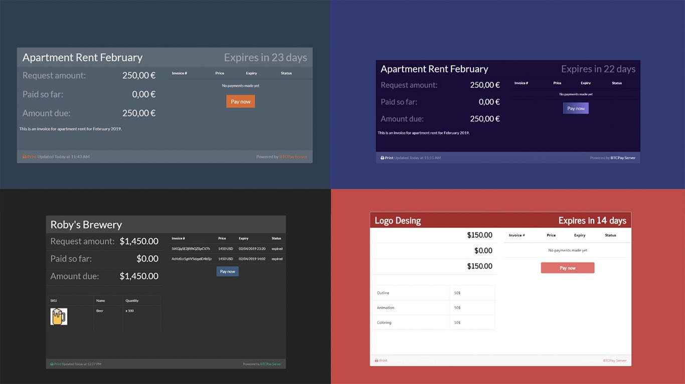

After you've connected your wallet to your BTCPay, you can explore various built in tools in the software. See the full list of Use Cases [here](usecase.md).

## Creating the Point of Sale App

BTCPay has a PoS app which you can use to receive payments from your customers directly or to receive donations. To create the POS app, you need to have a store created in BTCPay. View PoS instructions [here](apps.md#point-of-sale-app).

## Creating the Crowdfund App

Create a crowdfunding campaign using BTCPay. Unlike traditional crowdfunding platforms, the creator of the campaign is the owner of the platform. Funds go directly to the creator’s wallet without any fees. View Crowdfund instructions [here](apps.md#crowdfunding-app).

## Creating the Payment Request

Create custom invoices which can be shared with others, by sending a link to your payment request. Users can pay the request at any time. BTCPay automatically updates the BTC exchange rate at the time of payment. View Payment Request instructions [here](paymentrequests.md).

## Creating the Pay Button

Pay buttons are great when you have a fixed amount for a product or a donation. You can easily embed the button into HTML. When the customer or a visitor clicks on the button, BTCPay displays a checkout page and an invoice for them. View Pay Button instructions [here](apps.md#payment-button).

## Connecting your BTCPay store to your e-commerce platform

Depending on the CMS you're using, you can easily connect BTCPay to your online store. Currently, BTCPay offers following integrations :

* [Drupal](Drupal.md)
* [WooCommerce](WooCommerce.md)
* [Magneto](https://github.com/btcpayserver/magento-plugin)
* [PrestaShop](https://github.com/btcpayserver/prestashop-plugin)
* [Custom integration](CustomIntegration.md)

## Join The BTCPay Community
BTCPay Server is an open-source project, not a company. We rely on a network of diverse contributors and users to provide support for numerous use-cases. Join us in improving, learning, and building BTCPay.

If you have questions, try searching our [FAQ Section](./FAQ/readme.md) or join the [BTCPay Community](community.md) and share questions and ideas for improvement. 

If you are a developer take a look at the [Local Developement](localdevelopment.md) guide and help us with any [open issues](https://github.com/btcpayserver/btcpayserver/issues) on Github. If you would like to contribute to BTCPay in other ways, check out the [Contribution Guide](contribute.md) for ideas.
Invite people to join the community, read faq and ask questions, and invite developers and others willing to contribute.
