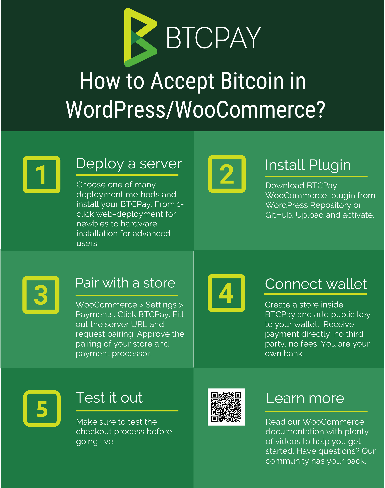

# WooCommerce integration

This document explains how to integrate BTCPay Server into your WooCommerce store. If you do not have a store yet, follow [this step by step article](https://bitcoinshirt.co/how-to-create-store-accept-bitcoin/) to create one from scratch.

You can check out the following video, or head over to [the WooCommerce plugin repository](https://github.com/btcpayserver/woocommerce-plugin).

To integrate BTCPay Server into an existing WooCommerce store, follow the steps below.

## 1. Install BTCPay Plugin

[Download the latest BTCPay plugin](https://github.com/btcpayserver/woocommerce-plugin/releases), upload it in .zip format into  your WordPress and activate it.

## 2. Deploy BTCPay Server

To launch your BTCPay server, you can self-host it, or use a third party host.

### 2.1 Self-hosted BTCPay

There are various ways to [launch a self-hosted BTCPay](https://github.com/btcpayserver/btcpayserver-doc#deployment). If you do not have technical knowledge, use the [web-wizard method](https://launchbtcpay.lunanode.com) and follow the video below.

For the self-hosted solutions, you'll have to wait for your node to sync fully before proceeding to step 3.

### 2.2 Third-party host

For those who want to test BTCPay out, or are okay with the limitations of a third-party hosting (dependency and privacy, as well as lack of some features) can use a one of many [third-party hosts](ThirdPartyHosting.md).

The video below shows you how to connect your store to such host.

## 3. Connecting your wallet

No matter if you're using self-hosted or server hosted by a third-party, the process of configuring your wallet is the same. 

## 4. Testing the checkout

Making a small test-purchase from your own store, will give you a piece of mind. Always make sure that everything is set up correctly before going live. The final video, guides you through the steps of setting a gap limit in your Electrum wallet and testing the checkout process.

Depending on your business model and store settings, you may want to [configure your order statuses](https://nbitstack.com/t/how-to-set-up-order-statuses-in-woocommerce-and-btcpay/67).
