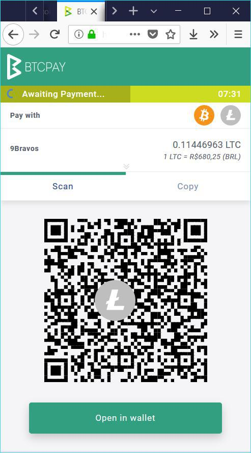

<br>
# Xadrez 
**A guide to run an open source based e-store that accepts Litecoin, Bitcoin and fiat**

Author: Ricardo Sodré Andrade ([Twitter](https://www.twitter.com/ricsodre))

*This guide is not finished yet (I expect to put images and describe everything step-by-step). At this stage you can get good ideas and directions to build your own e-store. If you consider this useful, contribute with some lites to LTC address: [LdMwrnsBoggWVcHcM7yeg242e8QqetYAzU](https://live.blockcypher.com/ltc/address/LdMwrnsBoggWVcHcM7yeg242e8QqetYAzU/)*

Short URL to this guide: [http://xadrez.yndexa.com](http://xadrez.yndexa.com)

I personally run an online bookstore which uses Xadrez to give the option for customers pay with Litecoin and Bitcoin: [9Bravos](https://www.9bravos.com.br/loja). At same time that e-store let me validate what I've documented here. The store is in Brazilian Portuguese.

# Table of contents
1. [Introduction](#introduction)
2. [Components](#components)
    1. [Wordpress](#wordpress)
    2. [WooCommerce plugin](#woocommerce-plugin)
    3. [BTCpay Server](#btcpay-server)
    4. ["Wordpress-Woocommerce-BTCpay" plugin](#wordpress-woocommerce-btcpay-plugin)
    5. [Fiat2LTC-WooCommerce plugin](#fiat2ltc-woocommerce)
    6. [Electrum](#electrum) (desktop and mobile wallet)
    7. [Electrum-LTC](#electrum-ltc) (desktop wallet)
    8. [Samourai Wallet](#samourai-wallet) (mobile wallet)
    9. [Loafwallet](#loafwallet) (mobile wallet)

## Introduction <a name="introduction"></a>

This tutorial expect to give directions and tools to anyone who want to setup an ecommerce store that accepts Litecoin (LTC) and Bitcoin (BTC). Old payment methods like credit card and stuff can be enabled too. All components in this solution are open source software and can be obtained at their websites.

This setup is called Xadrez just to be easier to anyone who want to refer the proposal presented here. Xadrez is Chess in portuguese language and we will change the pieces (the components) on the board until we reach a very nice full featured setup for a stable and definitive ecommerce store (the Checkmate). 

The e-commerce store setup need to use stable software, be easy to configure by merchants with no more than basic tech skills and be able to show products, handle carts, inventory, customer accounts, generate reports and others expected capabilities. All the Litecoin and Bitcoin received need to go directly to the merchant's (preferable mobile) wallets.

I personally run an online bookstore which uses Xadrez to give the option for customers pay with Litecoin and Bitcoin: [9Bravos](https://www.9bravos.com.br/loja). At same time that e-store let me validate what I've documented here. The store is in Brazilian Portuguese.

## Components <a name="components"></a>

Currently setup of Xadrez is formed by the components listed and described below.

### [Wordpress](https://www.wordpress.org)

*"WordPress started in 2003 with a single bit of code to enhance the typography of everyday writing and with fewer users than you can count on your fingers and toes. Since then it has grown to be the largest self-hosted blogging tool in the world, used on millions of sites and seen by tens of millions of people every day."*

Wordpress is a popular Content Management System (CMS) used to run portals, websites, blogs and many different kinds of websites. We will use it to run the store. A plugin (Woocommerce) will convert this content management system into a full featured ecommerce store as described below.

The minimum infrastructure to setup this can be purchased at [Digital Ocean](https://m.do.co/c/ec2caf98348a). You can create your Droplet for Wordpress using an ```One-click apps``` image called ```Wordpress 4.9.1 on 16.04``` or higher on the plan described as ```1 GB, 1 vCPU, 25 GB, 1 TB``` - that will costs $5/mo.

### [WooCommerce plugin](https://woocommerce.com)

*WooCommerce is an open-source, completely customizable eCommerce platform for entrepreneurs worldwide. Go beyond the confines of traditional eCommerce solutions, and be limited only by your own imagination.*

This is the plugin mentioned above. WooCommerce is widely used and offer a bunch of good quality addons to improve your store.

### [BTCpay Server](https://github.com/btcpayserver/btcpayserver)


*BTCPay Server is a free and open source server for merchants wanting to accept Bitcoin for their business. The API is compatible with Bitpay service to allow seamless migration.*

BTCpay Server will will turn the merchant into a self sovereign one. The merchant (or some merchants who trust themselves) will run a payment gateway and link the store (Wordpress + WooCommerce) to it using a Woocommerce addon plugin from BTCpayServer project. 

The minimum infrastructure to setup this can be purchased at [Digital Ocean](https://m.do.co/c/ec2caf98348a). You can create your Droplet for BTCpay Server (check about BTCpay below) using an ```One-click apps``` image called ```Docker 17.12.0~ce on 16.04``` on the plan described as ```2 GB, 1 vCPU, 50 GB, 2 TB``` - that will costs $10/mo.

You will need to prune the ```bitcoind``` including a new line with argument ```prune=2000M``` at BITCOIN_EXTRA_ARGS in ```docker-compose.btc-ltc.yml``` file. Do not prune ```litecoind```.

You can read a lot of additional information about BTCpay Server at [The Merchants Guide to accepting Bitcoin directly with no intermediates through BTCPay](https://www.reddit.com/r/Bitcoin/comments/81h1oy/the_merchants_guide_to_accepting_bitcoin_directly/).

You should follow [the BTCPay Server Twitter account](https://www.twitter.com/btcpayServer) too.

### ["Wordpress-Woocommerce-BTCpay" plugin](https://github.com/btcpayserver/woocommerce-plugin)

*Add the ability to accept Bitcoin and Litecoin in WooCommerce via BTCpay Server.*

This plugin will link BTCpay Server and Wordpress+WooCommerce.

### [Fiat2LTC-WooCommerce](https://github.com/Fiat2LTC/Fiat2LTC-WooCommerce)

*This is a plugin for WooCommerce/Wordpress to display live Litecoin (and Bitcoin/Ethereum) prices in your shop.*

This handy plugin will help your customers to know the price in fiat (USD, EUR, BRL...) and BTC or LTC (ETH too but Xadrez do not support this crypto).

You can check our test e-store 9Bravos how it works. You can put a widget anywhere to let people change between Bitcoin or Litecoin or put the price switcher below every price of each product. 

Fiat2LTC-WooCommerce will let you show prices in BTC/LTC format or bits/lites format.

Don't forget to disable ETH in ```Fiat2LTC Price Settings``` at Wordpress Dashboard.

### [Electrum](https://www.electrum.org)

*Electrum is a lightweight Bitcoin wallet.*

At this moment **Electrum is the best choice of Bitcoin wallet for Xadrez** and fulfill all the needs of store manager and the best choice. The addresses generated at invoices will use the [Segwit native Bech32 format](https://twitter.com/SatoshiLite/status/969704406177296385).

You need to create a new Segwit wallet or just use any you already have and copy the Master Public Key from the menu ```Wallet``` > ```Information``` and paste it at BTCpay Server at ```Stores``` > ```Settings``` (if you already added a store) > ```Add or modify a derivation scheme```.

Another change is the gap limit of wallet. The standard gap limit is low but to reach the best peace of mind level we will change it to a higher number like 200. You will need to observe this number because it counts how many unpaid invoices inbetween occurs - if you do not want to pay attention on this details and want to be very sure will not be a problem, set it as 2000.

Go to menu ```View``` and be sure the last submenu is ```Hide console``` if it isn't click at ```Show console```. Open the ```Console tab``` and use the following commands at prompt: ```wallet.change_gap_limit(200)``` and press enter at your keyboard, ```wallet.storage.write()``` and press enter again.

### [Electrum-LTC](https://electrum-ltc.org/)

*Electrum-LTC is a simple, but powerful Litecoin wallet. A twelve-word security passphrase (or “seed”) leaves intruders stranded and your peace of mind intact.*

Electurm-LTC is a fork of Electrum and handle with Litecoin. At this moment **Electrum is the best choice of Litecoin wallet for Xadrez**. The addresses generated at invoices will use the [Segwit native Bech32 format](https://twitter.com/SatoshiLite/status/969704406177296385).

You need to create a Segwit wallet or just use any you already have  and copy the Master Public Key from the menu ```Wallet``` > ```Information``` and paste it at BTCpay Server at ```Stores``` > ```Settings``` (if you already added a store) > ```Add or modify a derivation scheme```.

Another change is the gap limit of wallet. The standard gap limit is low but to reach the best peace of mind level we will change it to a higher number like 200. You will need to observe this number because it counts how many unpaid invoices inbetween occurs - if you do not want to pay attention on this details and want to be very sure will not be a problem, set it as 2000.

Go to menu ```View``` and be sure the last submenu is ```Hide console``` if it isn't click at ```Show console```. Open the ```Console tab``` and use the following commands at prompt: ```wallet.change_gap_limit(200)``` and press enter at your keyboard, ```wallet.storage.write()``` and press enter again.

### [Samourai Wallet](https://samouraiwallet.com/)

*A modern bitcoin wallet hand forged to keep your transactions private, your identity masked, and your funds secure.*

**Samourai Wallet is not recommended yet to used as the merchant's BTC wallet**

Samourai currently provide the Derivation Scheme necessary to inform BTCpay Server but we still has a issue that not let us to use it. The fixed ```gap limit``` of Samourai Wallet is limited to 20 addresses (we recommend a number between 200 to 2000).

Until Samourai Wallet feature the option to change the ```gap limit``` to any number, we do not recommend this wallet for Xadrez setup. 

### [Loafwallet](https://www.loafwallet.org)

*Loafwallet is the best standalone Litecoin wallet built for iOS and Android. It is available to download for free on the Apple App Store and Play Store!*

**Loafwallet is not recommended yet to used as the merchant's LTC wallet**

Loafwallet will be the best choice for accept LTC in Xadrez setup as soon it archive some requirements as listed below:
  - Be fully compatible with Segwit - it do not scan Bech32 and generated addresses are non-segwit
  - Let the users get the Derivation Scheme
  - Has an option to set the ```gap limit```
