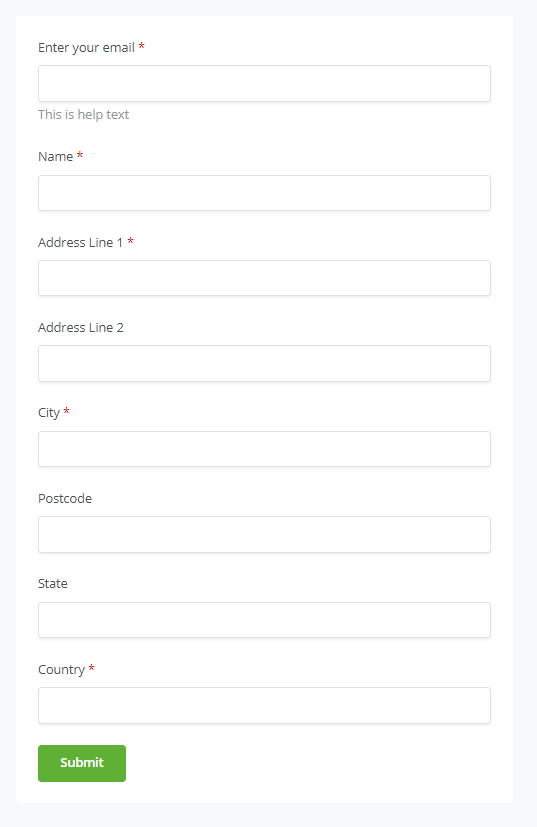

# Forms

BTCPay Server's Forms feature enables you to request that your customer complete a form before proceeding with a payment.

These forms are fully customizable to suit your requirements.

Example of form definition:

```json
{
  "fields": [
    {
      "name": "buyerEmail",
      "constant": false,
      "type": "email",
      "value": null,
      "required": true,
      "label": "Enter your email",
      "helpText": "This is help text",
      "fields": []
    },
    {
      "name": "buyerName",
      "constant": false,
      "type": "text",
      "value": null,
      "required": true,
      "label": "Name",
      "helpText": null,
      "fields": []
    },
    {
      "name": "buyerAddress1",
      "constant": false,
      "type": "text",
      "value": null,
      "required": true,
      "label": "Address Line 1",
      "helpText": null,
      "validationErrors": [],
      "fields": []
    },
    {
      "name": "buyerAddress2",
      "constant": false,
      "type": "text",
      "value": null,
      "required": false,
      "label": "Address Line 2",
      "helpText": null,
      "fields": []
    },
    {
      "name": "buyerCity",
      "constant": false,
      "type": "text",
      "value": null,
      "required": true,
      "label": "City",
      "helpText": null,
      "fields": []
    },
    {
      "name": "buyerZip",
      "constant": false,
      "type": "text",
      "value": null,
      "required": false,
      "label": "Postcode",
      "helpText": null,
      "fields": []
    },
    {
      "name": "buyerState",
      "constant": false,
      "type": "text",
      "value": null,
      "required": false,
      "label": "State",
      "helpText": null,
      "fields": []
    },
    {
      "name": "buyerCountry",
      "constant": false,
      "type": "text",
      "value": null,
      "required": true,
      "label": "Country",
      "helpText": null,
      "fields": []
    }
  ]
}
```

Output:



In a field definition, only the following fields can be set:

| Field                   | Description                                                                                                                                                                                                                                                                                                                                                                                                                                                        |
| ----------------------- | ------------------------------------------------------------------------------------------------------------------------------------------------------------------------------------------------------------------------------------------------------------------------------------------------------------------------------------------------------------------------------------------------------------------------------------------------------------------ |
| `.fields.constant`      | If `true`, the `.value` must be set in the form definition, and the user will not be able to change the field's value. ( example: the form definition's version)                                                                                                                                                                                                                                                                                                   |
| `.fields.type`          | The HTML input type `text`, `checkbox`, `password`, `hidden`, `color`, `date`, `datetime-local`, `month`, `week`, `time`, `email`, `number`, `url`, `tel`                                                                                                                                                                                                                                                          |
| `.fields.options`       | If `.fields.type` is `select`, the list of selectable values                                                                                                                                                                                                                                                                                                                                                                                                       |
| `.fields.options.text`  | The text displayed for this option                                                                                                                                                                                                                                                                                                                                                                                                                                 |
| `.fields.options.value` | The value of the field if this option is selected                                                                                                                                                                                                                                                                                                                                                                                                                  |
| `.fields.type=fieldset` | Create a HTML `fieldset` around the children `.fields.fields` (see below)                                                                                                                                                                                                                                                                                                                                                                                          |
| `.fields.name`          | The JSON property name of the field as it will appear in the invoice's metadata                                                                                                                                                                                                                                                                                                                                                                                    |
| `.fields.value`         | The default value of the field                                                                                                                                                                                                                                                                                                                                                                                                                                     |
| `.fields.required`      | if `true`, the field will be required                                                                                                                                                                                                                                                                                                                                                                                                                              |
| `.fields.label`         | The label of the field (can contain HTML for formatting and links)                                                                                                                                                                                                                                                                                                                                                                                                 |
| `.fields.helpText`      | Additional text to provide an explanation for the field (can contain HTML for formatting and links)                                                                                                                                                                                                                                                                                                                                                                |
| `.fields.fields`        | If `.fields.type` is `fieldset`, you can organize your fields in a hierarchy, allowing child fields to be nested within the invoice's metadata. This structure can help you better organize and manage the collected information, making it easier to access and interpret. For example, if you have a form that collects customer information, you can group the fields under a parent field called customer. Within this parent field, you might have child fields like name, email, and address. |
| `.fields.valuemap`      | If `.fields.type` is `mirror`, you can specify an object, where the key is the value to match and and the value is the mapped result. `{ "hello": "world"}`, means that if the copied value is `hello`, it will be saved as `world`.

The values of the fields are stored in the [metadata of the invoice](/Development/InvoiceMetadata/).

## Well-known field names

The field name represents the JSON property name that stores the user-provided value in the invoice's metadata.

Some well-known names can be interpreted and modify the invoice's settings.

| Field name         | Description            |
| ------------------ | ---------------------- |
| `invoice_amount`   | The invoice's amount   |
| `invoice_currency` | The invoice's currency |
| Starts with `invoice_amount_adjustment` | As long its value is computed to be a number, it will adjust the invoice amount accordingly. |
| Starts with `invoice_amount_multiply_adjustment` | Adjusts the generated invoice amount by multiplying with this value. |

## Mirror fields

A `Mirror` field is defined by the type `mirror`. Its value is set to the name of another field, and upon form submission, that field's value will be copied to the mirror field.
The mirror type also has value mapping capabilities so that the referenced field's value can be transformed as it is copied over to the mirror field.

For example, you could have a select field with a list of countries, and then create an `invoice_amount_adjustment` field, where you adjust the price of the invoice based on the country selected.
Or you can generate percentage-based promo codes based on the `invoice_amount_multiply_adjustment` field.

Here's an example of how three promo codes with different discounts can be implemented:

- `huge` = 50% discount
- `medium` = 10% discount
- `tiny` = 1% discount

```json
{
  "fields": [
    {
      "name": "promo",
      "type": "text",
      "label": "Promo Code"
    },
    {
      "name": "invoice_amount_multiply_adjustment_promo",
      "type": "mirror",
      "value": "promo",
      "label": "Promo Codes",
      "valuemap": {
        "tiny": "0.99",
        "medium": "0.90",
        "huge": "0.5"
      }
    }
  ]
}
```

## Pre-filling form values

You can pre-fill the fields of an invoice automatically by adding query strings to the form's URL, such as `?your_field=value`.

Here are some use cases for this feature:

- `Assisting user input`: Pre-fill fields with known customer information to make it easier for them to complete the form. For example, if you already know a customer's email address, you can pre-fill the email field to save them time.
- `Personalization`: Customize the form based on customer preferences or segmentation. For instance, if you have different customer tiers, you can pre-fill the form with relevant data, such as their membership level or specific offers.
- `Tracking`: Track the source of customer visits by using hidden fields and pre-filled values. For example, you can create different links with pre-filled `utm_media` values for each marketing channel (e.g., Twitter, Facebook, email). This helps you analyze the effectiveness of your marketing efforts.

- `A/B testing`: Pre-fill fields with different values to test different versions of a form, enabling you to optimize the user experience and conversion rates.
