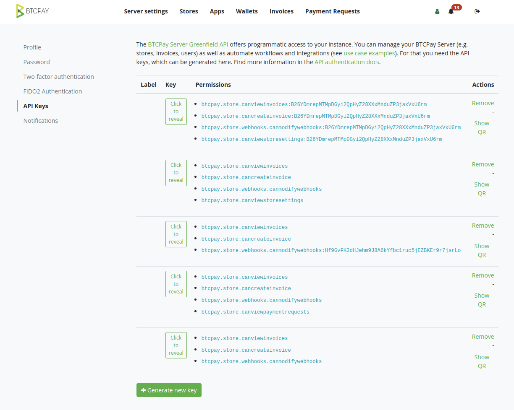

# API Keys

An API key is needed to automate your installation. It allows other software to talk to your BTCPay Server instance and have the required permissions.

API keys can be found under My Account > API Keys

You can create new API keys that have access to the entire installation (if you're an administrator) or with access to select stores.

Once an API key is created, you cannot change the permissions or you'll need to create a new key.
