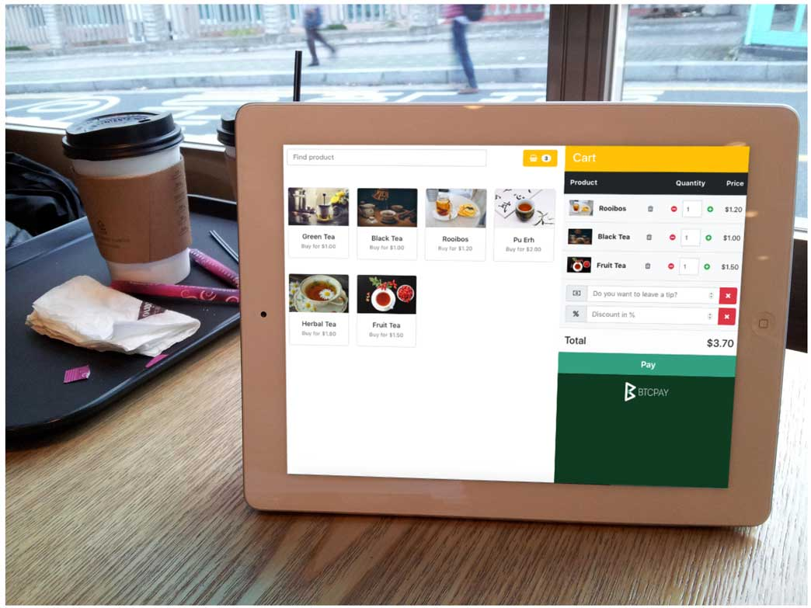

# BTCPay Server Apps

The primary purpose of BTCPay Server is to remove dependencies on trusted third-parties. The Apps are built in applications that obsolete central-authorities and allow users an easy way to extend the [use case](./UseCase.md) of the software. Users can self-host all sorts of customizable applications that work out of the box.

To create an app, go to Apps > Create a new app. Apps are store-dependent, which means that each app needs to be connected to a store.

## Point of Sale App

The **web-based POS app** allows merchants to accept cryptocurrencies directly to their wallet without relying on third parties. It works on tablets and other web-enabled devices, making it suitable for in-person payments. Users can also create a home screen shortcut for quick access to the POS interface.

You can easily add new products. The POS app supports shopping carts, tipping, product inventory management, and custom payment options.

The **Point of sale app** can also be used to receive donations, tips or even as a small e-commerce shop, depending on the options or customizations applied.

To get your first **Point of Sale app** running, follow these few simple steps:

## Creating a POS App

1. Go to **Apps** and click **Create a new app**.
2. Enter a name for your app.
3. Choose **Point of Sale** as the app type.
4. Select the store to associate with the app.
5. Add products with prices, photos, and descriptions.
6. Click **Save Settings**.
7. Click **View App** to open your POS page.

You can change the appearance of your **Point of Sale app** by following the [theme customization guide](./Development/Theme.md).

## Crowdfunding App

**Crowdfunding** is an application which you can launch from BTCPay Server interface that allows you to create a **self-hosted funding campaign**, similar to Kickstarter or Indiegogo. Unlike traditional **crowdfunding platforms**, the creator of the campaign is the owner of the platform. Funds go directly to the creator’s wallet **without any fees**.

1. Go to > Apps
2. Add a name of your app
3. Choose app type > Crowdfund
4. Select the store to associate with the app.
5. Customize your Crowdfund by adding your own perks with prices, photos, and description.
6. Check the box > Allow crowdfund to be publicly visible
7. Click "Save Settings".
8. Click "View App" to view your Crowdfund (Contributors can access the crowdfund through that link).

If you would like to provide digital or physical products to the backers of your **crowdfunding campaign**, you can [integrate WooCommerce store into it](./FAQ/Apps.md#how-to-integrate-woocommerce-store-into-a-btcpay-crowdfund-app). You can also set limits on contribution perks using the inventory feature.

## Payment Button

Easily-embeddable HTML and highly-customizable **payment buttons** allow users to receive tips and donations. Online stores can also integrate payment buttons. When a site visitor clicks on the button, BTCPay displays the **invoice**.

1. In your left menu bar, under the "PLUGINS" section, select "Pay Button".
2. Allow anyone to create invoices.
3. Customize your button.
4. Copy the generated form and embed it on your website.

