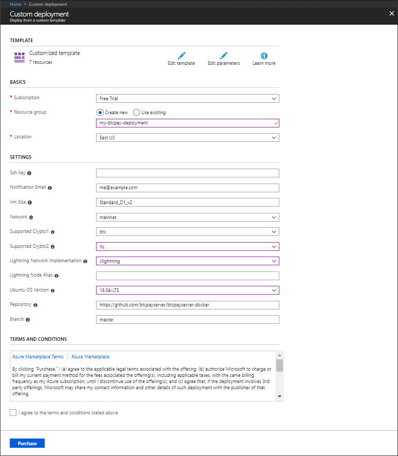

# Azure Deployment

This setup is similar to the [Docker Deployment](https://github.com/btcpayserver/btcpayserver-docker/blob/master/README.md), except that the `docker-compose` is hosted by **Microsoft Azure**.

## One-click setup

Start by clicking the following button:

You can log into [Azure](https://azure.microsoft.com/en-us/account/) with your Microsoft account.

Final installation steps:

Fill in the remaining options: 
* Click 'Purchase' to confirm
* (Wait for Azure deployment)
* Type `ip` into the search bar and select the first option, `BTCPayServerPublicIP`
* Copy the hostname for your Azure deployment, under `DNS name`: 
* Visit it (all major browsers supported)
* Click 'Register' and create an account - This will be your **admin** account!
* At your domain registrar, point your domain at this hostname (read more: [DNS configuration](./ChangeDomain.md#setting-up-your-dns-record))
* Then, visit `https://EXAMPLE.eastus.cloudapp.azure.com/server/maintenance`
* Enter your domain name and click 'Confirm'
* (Wait 1-5 minutes)
* **Done!** Visit `https://EXAMPLE.MYSITE.com/stores` to create your store and begin invoicing.

For advanced users, you can connect via SSH with the information on `https://EXAMPLE.MYSITE.com/server/services/ssh`, and:

* Run `docker ps` and `docker logs xxx` to view running processes
* Run `btcpay-down.sh` and `btcpay-up.sh` to stop and start the BTCPayServer

Approximate Cost (unpruned, Bitcoin-only, after Azure $200 free trial): **60 USD per month**

After all your nodes have synced and you've confirmed everything works, follow [this guide](./AzurePennyPinching.md) to fine-tune for savings; costs should drop to **30 or 40 USD per month**.

Learn more: [btcpayserver/btcpayserver-azure](https://github.com/btcpayserver/btcpayserver-azure)
