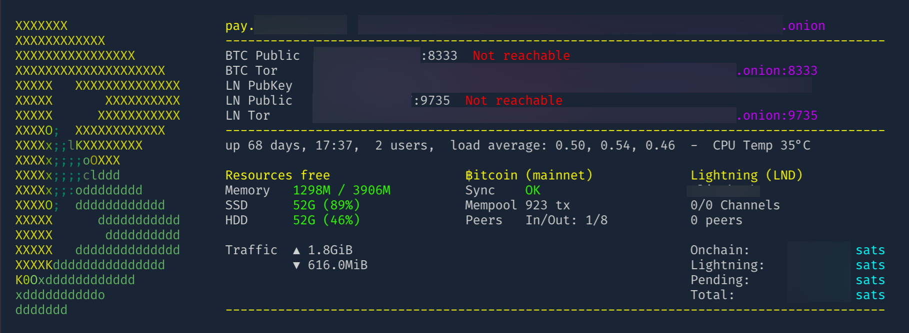

# Shell Status Script

In case you are using the SSH connection to your BTCPay Server instance frequently, you might enjoy this gimmick:
The shell status script gives you a quick overview about your server, its addresses, chain state and lightning channels.



You can find and copy the script below.
Add it as a custom shell script and set it up as a welcome script, so that it appears on SSH login:

```sh
# create, paste and adapt shell script from below
sudo nano /usr/local/bin/btcpay-status

# make it executable
sudo chmod +x /usr/local/bin/btcpay-status

# check if it works
sudo btcpay-status

# if so, you can also set it up as a welcome script
sudo ln -s /usr/local/bin/btcpay-status /etc/update-motd.d/btcpay-status
```

You might need to install the dependeny `jq`, which is a prerequisite:

```sh
sudo apt install jq
```

Here is the full script, which you can adapt it to fit your needs.

```sh
#!/bin/sh
# by dennisreimann, but most of this is adapted from Stadicus:
# https://stadicus.github.io/RaspiBolt/raspibolt_61_system-overview.html

# source the environment so that we can use the variables
. $BTCPAY_BASE_DIRECTORY/.env

# set colors
color_red='\e[0;31m'
color_green='\e[0;32m'
color_yell='\e[0;33m'
color_blue='\e[0;34m'
color_cyan='\e[0;36m'
color_gray='\e[0;37m'
color_purple='\e[0;35m'

# set datadir
# docker exec btcpayserver_bitcoind cat /data/bitcoin.conf 2>/dev/null | grep ^port= | awk -F"=" '{print $2}'
lnd_dir="/home/bitcoin/.lnd"

pay_tor=$(docker exec tor cat /var/lib/tor/hidden_services/BTCPayServer/hostname)
btc_tor=$(docker exec tor cat /var/lib/tor/hidden_services/BTC-P2P/hostname)

# Set to mount point of blockchain volume. This is used to calculate USB HDD usage %
ext_hdd="/mnt/ssd"

# Set to network device name (usually eth0 for ethernet or wlan0 for wireless on raspberry pi)
network_name="eth0"

# get uptime & load
load=$(w | grep "load average:" | cut -c11-)

# get CPU temp
cpu=$(cat /sys/class/thermal/thermal_zone0/temp)
temp=$((cpu/1000))

# get memory
ram_avail=$(free -m | grep Mem | awk '{ print $7 }')
ram=$(printf "%sM / %sM" "${ram_avail}" "$(free -m | grep Mem | awk '{ print $2 }')")

if [ ${ram_avail} -lt 100 ]; then
  color_ram="${color_red}\e[7m"
else
  color_ram=${color_green}
fi

# get storage
sd_free_ratio=$(printf "%.0f" "$(df | grep "/$" | awk '{ print $4/$2*100 }')") 2>/dev/null
sd=$(printf "%s (%s%%)" "$(df -h | grep '/$' | awk '{ print $4 }')" "${sd_free_ratio}")
if [ ${sd_free_ratio} -lt 10 ]; then
  color_sd="${color_red}"
else
  color_sd=${color_green}
fi

hdd_free_ratio=$(printf "%.0f" "$(df | grep "${ext_hdd}$" | awk '{ print $4/$2*100 }')") 2>/dev/null
hdd=$(printf "%s (%s%%)" "$(df -h | grep "${ext_hdd}$" | awk '{ print $4 }')" "${hdd_free_ratio}")
if [ ${hdd_free_ratio} -lt 10 ]; then
  color_hdd="${color_red}\e[7m"
else
  color_hdd=${color_green}
fi

# Bitcoin blockchain
blockchaininfo=$(bitcoin-cli.sh getblockchaininfo | jq -c '.' 2>/dev/null)
chain=$(echo $blockchaininfo | jq -r '.chain')
if [ -n "$chain" ]; then
  # get sync status
  block_chain=$(bitcoin-cli.sh getblockcount)
  block_verified=$(echo $blockchaininfo | jq -r '.blocks')
  block_diff=$(echo $block_chain $block_verified | awk '{print $1 - $2}')

  progress="$(echo $blockchaininfo | jq -r '.verificationprogress')"
  sync_percentage=$(printf "%.2f%%" "$(echo $progress | awk '{print 100 * $1}')")

  if [ ${block_diff} -eq 0 ]; then # fully synced
    sync="OK"
    sync_color="${color_green}"
  elif [ ${block_diff} -eq 1 ]; then # fully synced
    sync="1 block behind"
    sync_color="${color_green}"
  elif [ ${block_diff} -le 10 ]; then # <= 2 blocks behind
    sync="${block_diff} blocks behind"
    sync_color="${color_amber}"
  else
    sync="${sync_percentage} progress"
    sync_color="${color_red}"
  fi

  # get mem pool transactions
  mempool="$(bitcoin-cli.sh getmempoolinfo | jq -r '.size')"

  # get connection info
  networkInfo=$(bitcoin-cli.sh getnetworkinfo | jq -c '.' 2>/dev/null)
  connections="$(echo ${networkInfo} | jq .connections)"
  inbound="$(bitcoin-cli.sh getpeerinfo | jq '.[] | select(.inbound == true)' | jq -s 'length')"
  outbound="$(bitcoin-cli.sh getpeerinfo | jq '.[] | select(.inbound == false)' | jq -s 'length')"
else
  sync="${color_red}NOT RUNNING"
  sync_color="${color_red}"
fi

# get LND info
bitcoin-lncli.sh getinfo 2>&1 | grep "Please unlock" >/dev/null
wallet_unlocked=$?
if [ "$wallet_unlocked" -eq 0 ] ; then
  alias_color="${color_red}"
  ln_alias="Wallet Locked"
else
  alias_color="${color_grey}"
  ln_getinfo=$(bitcoin-lncli.sh getinfo | jq -c '.' 2>/dev/null)
  ln_alias="$(echo $ln_getinfo | jq -r '.alias')" 2>/dev/null
  ln_walletbalance="$(bitcoin-lncli.sh walletbalance | jq -r '.confirmed_balance')" 2>/dev/null
  ln_channelbalance="$(bitcoin-lncli.sh channelbalance | jq -r '.balance')" 2>/dev/null
  ln_peers="$(echo $ln_getinfo | jq -r '.num_peers')" 2>/dev/null
  ln_channels_online="$(echo $ln_getinfo | jq -r '.num_active_channels')" 2>/dev/null
  ln_channels_total="$(bitcoin-lncli.sh listchannels | jq '.[] | length')" 2>/dev/null
  ln_pubkey="$(echo $ln_getinfo | jq -r '.identity_pubkey')" 2>/dev/null
  ln_public="$(echo $ln_getinfo | jq -r '.uris[0]' | tr "@" " " |  awk '{ print $2 }')" 2>/dev/null
  ln_tor="$(echo $ln_getinfo | jq -r '.uris[1]' | tr "@" " " |  awk '{ print $2 }')" 2>/dev/null

  ln_pendingchannels=$(bitcoin-lncli.sh pendingchannels | jq -c '.')
  ln_pendingopen=$(echo $ln_pendingchannels | jq '.pending_open_channels[].channel.local_balance|tonumber ' | awk '{sum+=$0} END{print sum}')
  if [ -z $ln_pendingopen ]; then
    ln_pendingopen=0
  fi

  ln_pendingforce=$(echo $ln_pendingchannels | jq '.pending_force_closing_channels[].channel.local_balance|tonumber ' | awk '{sum+=$0} END{print sum}')
  if [ -z $ln_pendingforce ]; then
    ln_pendingforce=0
  fi

  ln_waitingclose=$(echo $ln_pendingchannels | jq '.waiting_close_channels[].channel.local_balance|tonumber ' | awk '{sum+=$0} END{print sum}')
  if [ -z $ln_waitingclose ]; then
    ln_waitingclose=0
  fi

  ln_pendinglocal=$(expr $ln_pendingopen + $ln_pendingforce + $ln_pendingclose + $ln_waitingclose)
fi

sum_balance=0
if [ ! -z "$ln_channelbalance" ]; then
  sum_balance=$(expr $ln_channelbalance + $sum_balance )
fi
if [ ! -z "$ln_walletbalance" ]; then
  sum_balance=$(expr $ln_walletbalance + $sum_balance )
fi
if [ ! -z "$ln_pendinglocal" ]; then
  sum_balance=$(expr $sum_balance + $ln_pendinglocal )
fi

# get network traffic
network_rx=$(ifconfig ${network_name} | grep 'RX packets' | awk '{ print $6$7 }' | sed 's/[()]//g')
network_tx=$(ifconfig ${network_name} | grep 'TX packets' | awk '{ print $6$7 }' | sed 's/[()]//g')

# get public IP address & port
public_ip=$(curl -s https://api.ipify.org)
btc_port=8333
ln_port=9735
# btc_port=$(docker exec btcpayserver_bitcoind cat /data/bitcoin.conf 2>/dev/null | grep ^port= | awk -F"=" '{print $2}')

btc_public_check=$(timeout 1s nc -z ${public_ip} ${btc_port}; echo $?)
if [ $btc_public_check = "0" ]; then
  btc_public_status="${color_green}Yes"
else
  btc_public_status="${color_red}Not reachable"
fi

ln_public_check=$(timeout 1s nc -z ${public_ip} ${ln_port}; echo $?)
if [ $ln_public_check = "0" ]; then
  ln_public_status="${color_green}Yes"
else
  ln_public_status="${color_red}Not reachable"
fi

ln_external_ip="$(echo $ln_external | tr ":" " " | awk '{ print $1 }' )" 2>/dev/null

printf "

\e[38;5;184mXXXXXXX\e[38;5;0m               \e[0;0m      ${color_yell}$BTCPAY_HOST  ${color_purple}${pay_tor}
\e[38;5;184mXXXXXXXXXXXX\e[38;5;0m          \e[0;0m      ${color_yell}----------------------------------------------------------------------------------------
\e[38;5;184mXXXXXXXXXXXXXXXX\e[38;5;0m      \e[0;0m      ${color_gray}BTC Public  ${public_ip}:${btc_port}  ${btc_public_status}
\e[38;5;184mXXXXXXXXXXXXXXXXXXXX\e[38;5;0m  \e[0;0m      ${color_gray}BTC Tor     ${color_purple}${btc_tor}:${btc_port}
\e[38;5;184mXXXXX\e[38;5;0m   \e[38;5;184mXXXXXXXXXXXXXX\e[0;0m      ${color_gray}LN PubKey   ${ln_pubkey}
\e[38;5;184mXXXXX\e[38;5;0m       \e[38;5;184mXXXXXXXXXX\e[0;0m      ${color_gray}LN Public   ${ln_public}  ${ln_public_status}
\e[38;5;184mXXXXX\e[38;5;0m      \e[38;5;184mXXXXXXXXXXX\e[0;0m      ${color_gray}LN Tor      ${color_purple}${ln_tor}
\e[38;5;184mXXXX\e[38;5;148mO\e[38;5;29m;\e[38;5;0m  \e[38;5;184mXXXXXXXXXXXX\e[38;5;0m  \e[0;0m      ${color_yell}----------------------------------------------------------------------------------------
\e[38;5;184mXXXX\e[38;5;106mx\e[38;5;29m;;\e[38;5;65ml\e[38;5;148mK\e[38;5;184mXXXXXXXX\e[38;5;0m     \e[0;0m      ${color_gray}${load}  -  CPU Temp ${temp}°C
\e[38;5;184mXXXX\e[38;5;106mx\e[38;5;29m;;;;\e[38;5;71mo\e[38;5;142mO\e[38;5;184mXXX\e[38;5;0m        \e[0;0m
\e[38;5;184mXXXX\e[38;5;106mx\e[38;5;29m;;;;\e[38;5;65mc\e[38;5;71mlddd\e[38;5;0m        \e[0;0m      ${color_yell}%-31s %-31s %-31s
\e[38;5;184mXXXX\e[38;5;106mx\e[38;5;29m;;:\e[38;5;71modddddddd\e[38;5;0m     \e[0;0m      ${color_gray}Memory   ${color_ram}%-23s${color_gray}Sync    ${sync_color}%-21s${color_gray} ${alias_color}%s
\e[38;5;184mXXXX\e[38;5;148mO\e[38;5;29m;\e[38;5;0m  \e[38;5;71mdddddddddddd\e[38;5;0m  \e[0;0m      ${color_gray}SSD      ${color_sd}%-23s${color_gray}Mempool %-22s${color_gray}%s/%s Channels
\e[38;5;184mXXXXX\e[38;5;0m      \e[38;5;71mddddddddddd\e[0;0m      ${color_gray}HDD      ${color_hdd}%-23s${color_gray}Peers   In/Out: %-14s${color_gray}%s peers
\e[38;5;184mXXXXX\e[38;5;0m       \e[38;5;71mdddddddddd\e[0;0m      ${color_gray}
\e[38;5;184mXXXXX\e[38;5;0m   \e[38;5;71mdddddddddddddd\e[0;0m      ${color_gray}Traffic  ▲ %-50s ${color_gray}Onchain:   ${color_cyan}%10s sats
\e[38;5;184mXXXXK\e[38;5;71mddddddddddddddd\e[38;5;0m  \e[0;0m      ${color_gray}         ▼ %-50s ${color_gray}Lightning: ${color_cyan}%10s sats
\e[38;5;184mK\e[38;5;148m0\e[38;5;113mO\e[38;5;71mxdddddddddddd\e[38;5;0m      \e[0;0m      ${color_gray}           %-50s ${color_gray}Pending:   ${color_cyan}%10s sats
\e[38;5;71mxddddddddddo\e[38;5;0m          \e[0;0m      ${color_gray}           %-50s ${color_gray}Total:     ${color_cyan}%10s sats
\e[38;5;71mddddddd\e[38;5;0m               \e[0;0m      ${color_yell}----------------------------------------------------------------------------------------

" \
"Resources free" "฿itcoin (${chain}net)" "Lightning (LND)" \
"${ram}" "${sync}" "${ln_alias}" \
"${sd}" "${mempool} tx" "${ln_channels_online}" "${ln_channels_total}" \
"${hdd}" "${inbound}/${outbound}" "${ln_peers}" \
"${network_tx}" "${ln_walletbalance}" \
"${network_rx}" "${ln_channelbalance}" \
"" "$ln_pendinglocal" \
"" "$sum_balance"

echo "$(tput -T xterm sgr0)"
```
