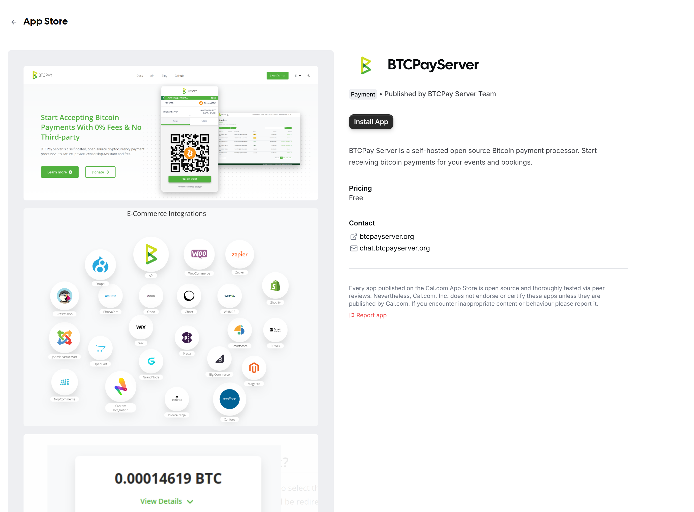
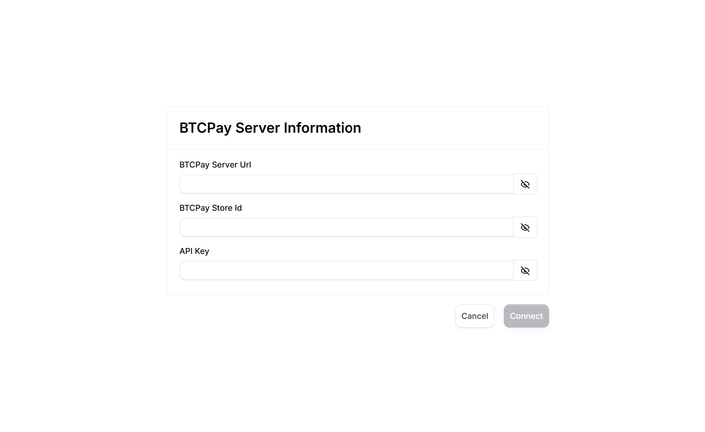
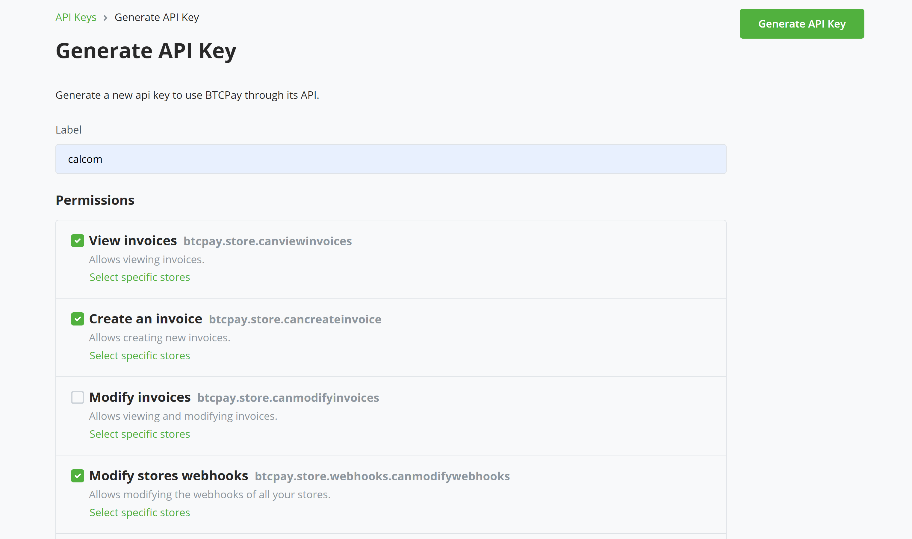
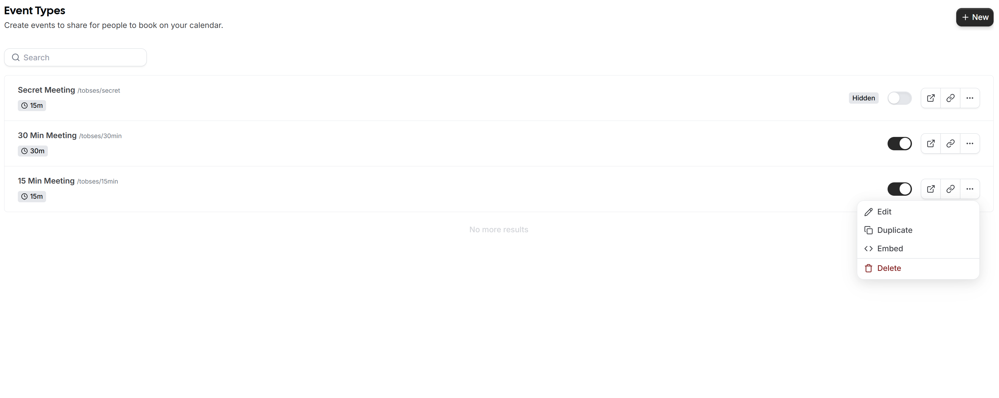
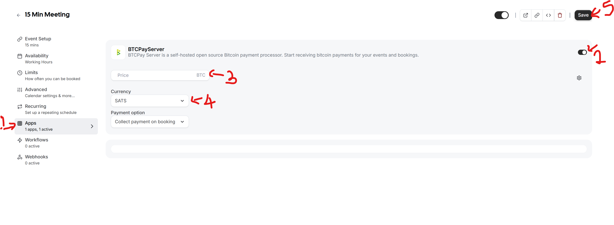
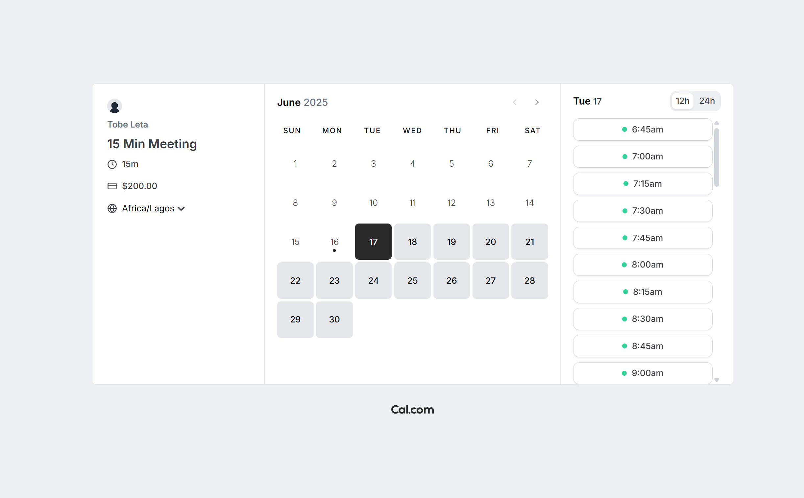
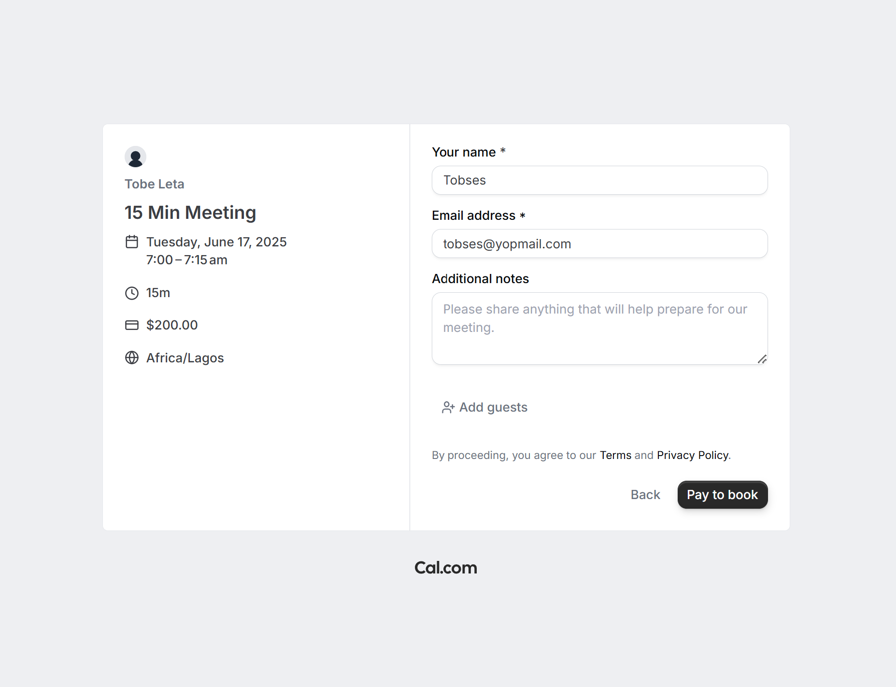
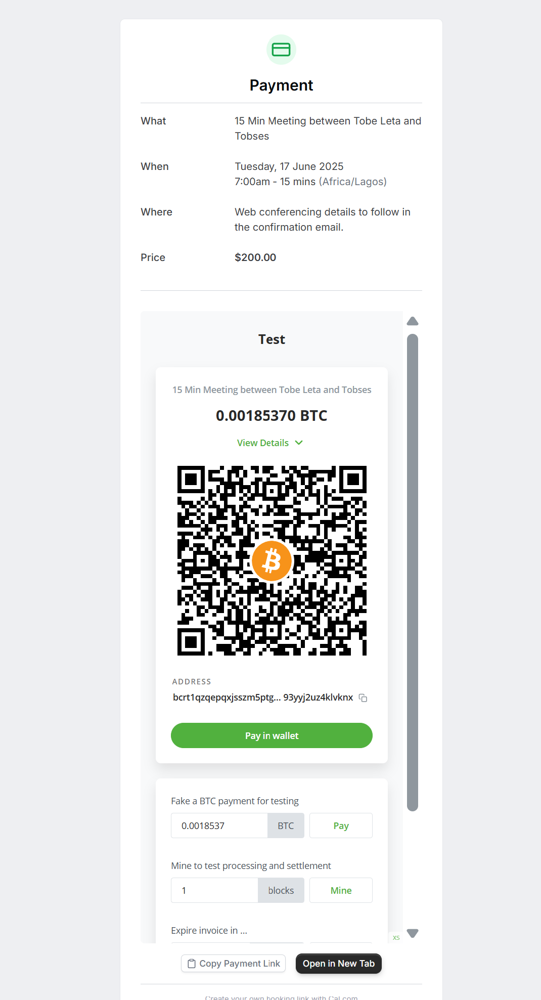
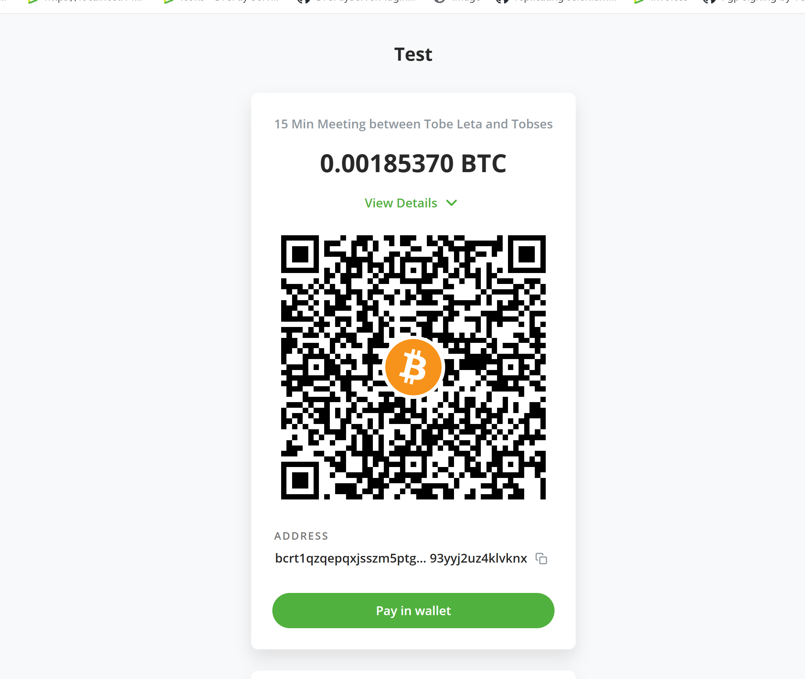

# Accept Bitcoin payment for your Cal.com bookings

You can now accept Bitcoin payment for all your [Cal.com](https://cal.com/) bookings and appointments. 
Whether you're offering consultation services or one-on-one meetings, receive Bitcoin payments directly to your wallet - no middlemen, no platform fees, and no hidden costs.

## Prerequisites:

Before diving into the setup process, ensure you have the following:

- [Cal.com account](https://cal.com/)
- BTCPay Server - [self-hosted](Deployment.md) or run by a [third-party host](/Deployment/ThirdPartyHosting.md)
- [Created BTCPay Server store](CreateStore.md) with [wallet set up](WalletSetup.md)

## Set up Cal.com with BTCPay Server

Login to your Cal.com account. Navigate to `Apps` > `App store` > `Payments apps`

Find the `BTCPayServer` app, click `Details`, and then `Install App` button

Select the application you want to connect your BTCPay Server instance to

The next step is to fill in your BTCPay credentials. Open your BTCPay Server instance on a new tab

**BTCPay Server URL**: your BTCPay instance url e.g. https://example.btcpay.com

**BTCPay Store Id**: The store you want connected to Cal.com. On your BTCPay Server instance, select the chosen store, click on `Settings` on the left navigation, then you’d see your storeId displayed.

Copy the Store Id, and fill in your Cal.com - BTCPay Server installation form

**API Key**: In your BTCPay, go to `Account` > `Manage Account` > `API Keys`

Create a new API key by clicking on `Generate Key`. Give it a name under the label field e.g. BTCPay-Calcom.

For permissions check the follow:
- View Invoice (btcpay.store.canviewinvoices)
- Create Invoice (btcpay.store.cancreateinvoice)
- Modify store webhook (btcpay.store.webhooks.canmodifywebhooks)

Once done click `Save`. Copy the API key and complete the form in Cal.com installation.

Now that you have all three fields filled, click on connect button to complete installation. Once all fields are validated,
your keys should be saved and you'd be redirected back to Cal.com page.

**Please Note** This installation process creates a webhook in your BTCPay Server.

## Demo 

In your event type page, select any booking and click Edit.

Each event in Cal.com is configured individually, so, if you want to accept Bitcoin payments for all events, you'll need to enable it manually for each one.

On the edit page, select Apps on the menu, find and enable the BTCPay Server application.

Choose your selected currency and specify an amount. Click save once done.

Copy the event link and open in a new tab. Choose your date and time, and click the `Pay to book` button.

In the next page, you'd need to pay the BTCPay Server invoice. The invoice is displayed in an iFrame, if the view is too small, there is a button
below the invoice page to open in a new tab, click on it and complete your payment. 

Once your payment is complete, you're redirected to a new page stating that your meeting is scheduled.

Congratulations... Now you can accept Bitcoin payments for your bookings.

## Support and community

Feel free to join our support channel over at [Mattermost](https://chat.btcpayserver.org/) or [Telegram](https://t.me/btcpayserver) if you need help or have any further questions.
