# Deploy BTCPay with Configurator

BTCPay Server can be configured and even deployed to a target server via the BTCPay Configurator user interface. This tool can make it simple for different types of users to deploy a BTCPay Server. 

One example of a user who may find this tool helpful is a third-party host. When configurator is enabled on an admin BTCPay Server instance, users may visit the server's configurator url to deploy their own BTCPay Server instance when they are ready to stop using their third party host's server.

Another use case is for server admins who are deploying BTCPay Server's on behalf of clients or other users as part of a consulting business. Admins can easily export a docker deployment script from their interface option selections or deploy the configuration to a VPS or on premise server via SSH.

This deployment method assumes you already have an existing BTCPay Server [deployed](./Deployment.md) with the `opt-add-configurator` [environment variable added](./FAQ/FAQ-General.md#how-can-i-modify-or-deactivate-environment-variables) to your server and a target server where you would like to deploy a second BTCPay. On your current server, view your Configurator by navigating to: 

**Server Settings > Services > Other external services > Configurator > Click See information**

Step 1: Destination

Select an option to deploy using SSH now or generate a bash script for later deployment.

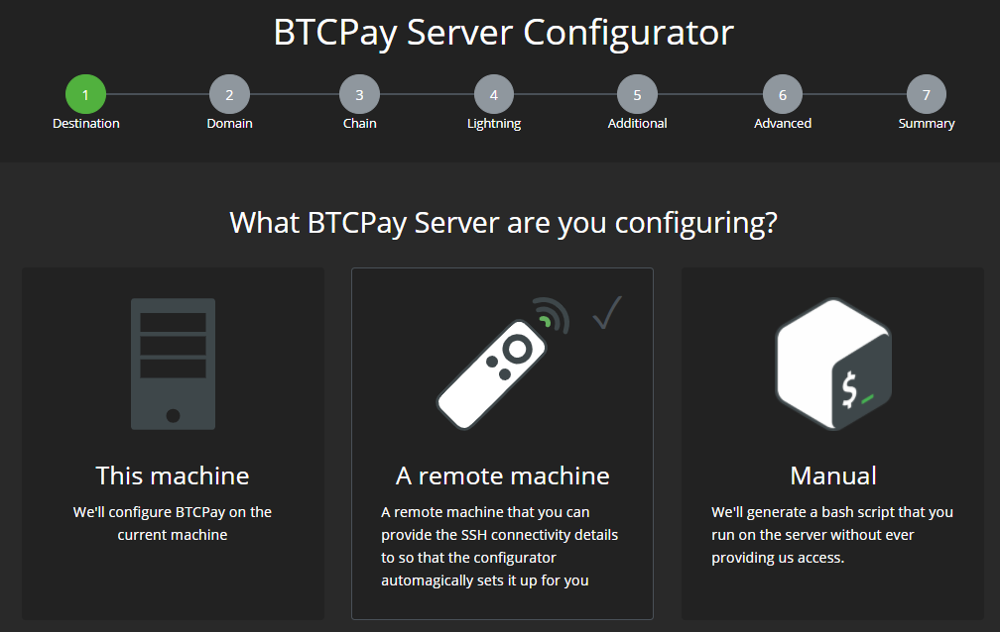

To configure and deploy a server now, provide your SSH credentials where you would like it deployed to. 

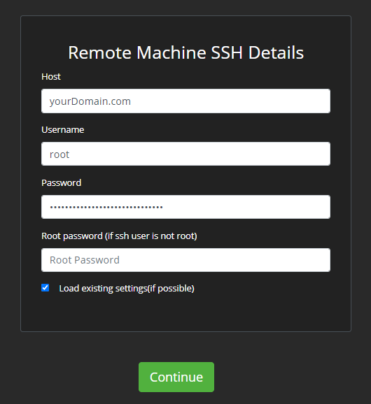

Note: The "Load Existing Settings" option will use the previous deployment's selections for faster configuration.

Step 2: Domain

Provide the domain name associated with your server IP address.

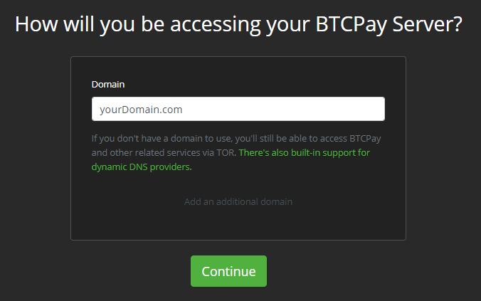

Step 3: Chain

Select the desired Bitcoin network type, Bitcoin node pruning level and add any altcoins.

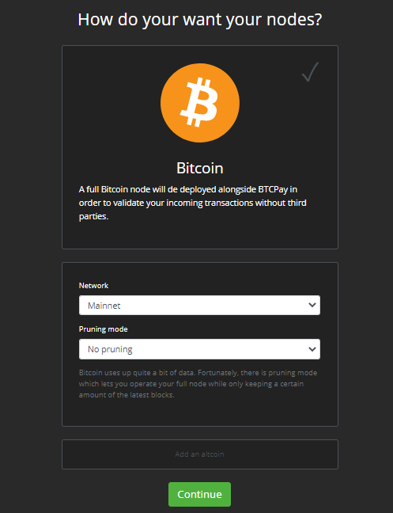

Step 4: Lightning

Select the desired Lightning network option (optional).

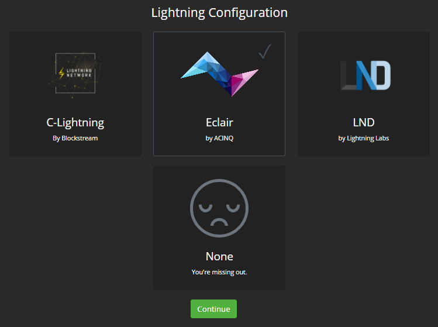

Step 5: Additional

Add any additional services to your BTCPay Server deployment (optional).

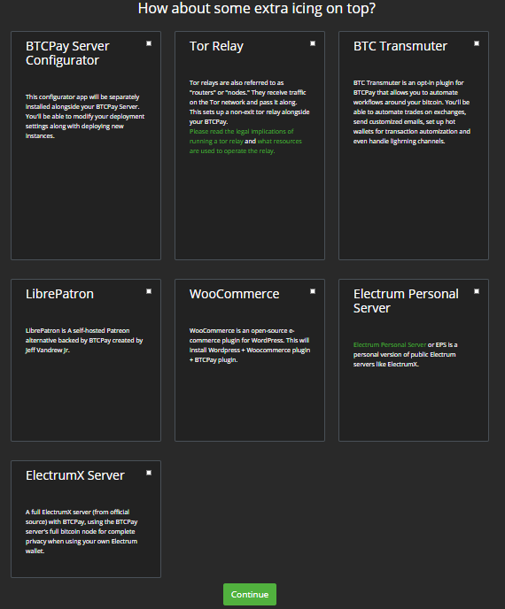

Step 6: Advanced

Provide any additional advanced settings (optional).

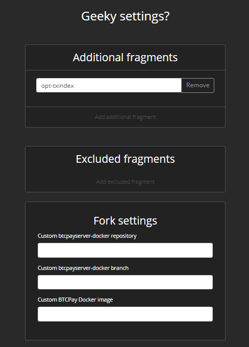

Step 7: Summary

Verify your configuration settings look correct before deploying the server.

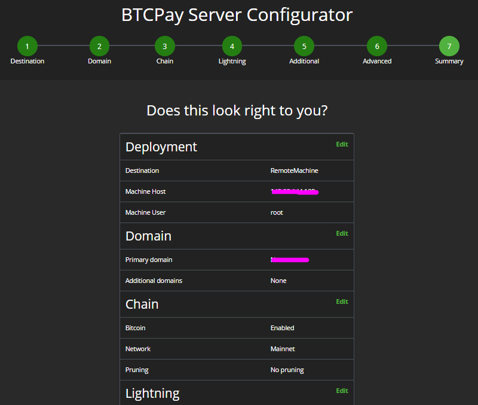

During Deployment:

Configurator will SSH into the target server and do the following actions completely automated on your behalf:

- Install Docker
- Install Docker-Compose
- Install Git
- Setup BTCPay settings
- Make sure it starts at reboot via upstart or systemd
- Add BTCPay utilities in /user/bin
- Start BTCPay

The deployment progress will be displayed in your Configurator.

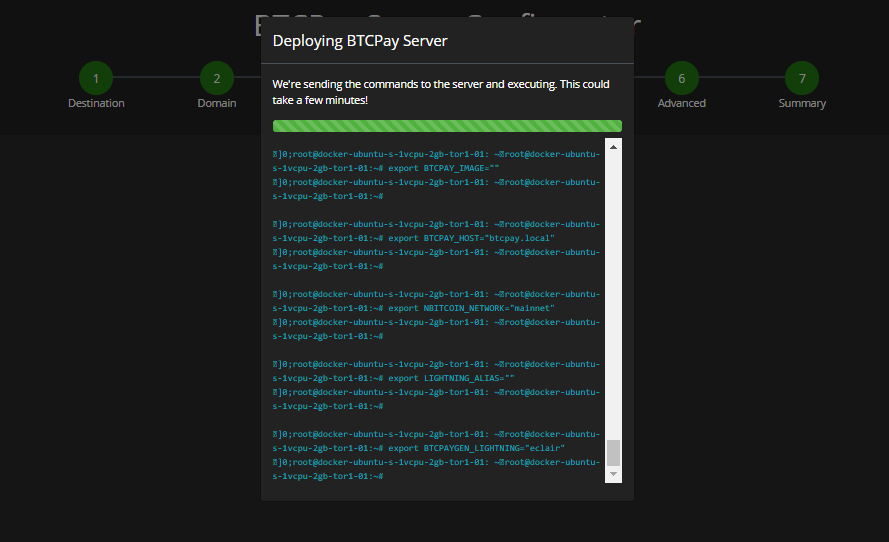

Upon deployment completion, Configurator will display the domain of the newly configured BTCPay Server.

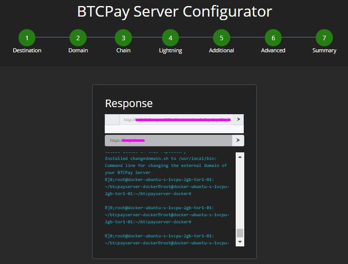

The list of executed commands that were used to deploy the server configuration are also displayed.

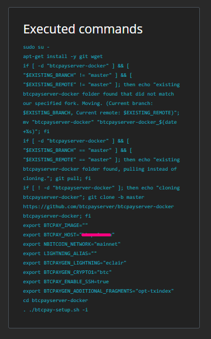

## Export Manual Configuration

If you want to deploy the configuration to your target server at a later time, you can instead export a bash script of your settings. Later you can paste the configuration into your server terminal. 

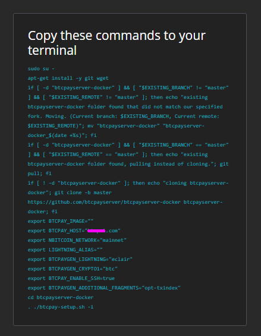

## Privacy & Security Concerns

If you are using someone else's Configurator to deploy your BTCPay Server, such as a [trusted Third-Party](#ThirdParty.md), their server will retain:

- previous deployment's deployment IP/domain and ssh password
- previous deployment's configuration settings

Users are advised to change their SSH password after Configurator deployment is completed.

To mitigate these privacy and security concerns, the [exported manual script](#export-manual-configuration) can be used at a later time, without providing your domain. Be sure to include it when you paste the commands into your termainal. 

