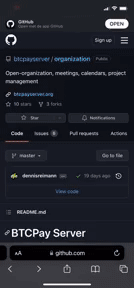

# Open office hours

We welcome everyone for our Open office hours. 
Here we talk through the work ahead, upcoming and previous releases, bug fixes, Design decissions and the nitty gritty on Documents and Marketing. 
Interest in joinen? DO IT! You don't have to participate, you're welcome to just listen and enjoy the banter. 
Follow the steps below to add the BTCPay Server `Open office hours` calendar to your own. 

## Upcoming calls

| Topic        | Direct link                                                                                        |
|--------------|----------------------------------------------------------------------------------------------------|
| Development  | [Link](https://github.com/btcpayserver/organization/issues?q=is%3Aissue+is%3Aopen+%27Dev%27)       |
| Design       | [Link](https://github.com/btcpayserver/organization/issues?q=is%3Aissue+is%3Aopen+%27Design%27+)   |
| Documentation| [Link](https://github.com/btcpayserver/organization/issues?q=is%3Aissue+is%3Aopen+%27Marketing%27) |

## BTCPay Server open office hours calendar

Our calendar (an .iCal file) includes upcoming calls. Qualified issues are automatically added to the calendar, which you can then subscribe to via your favorite calendar tool.

* Copy this URL: https://raw.githubusercontent.com/btcpayserver/organization/calendar/events.ical
* In Apple Calendar (desktop), use File -> New calendar subscriptions
* In Google Calendar (web), click the small + icon next to Other calendars in the sidebar and select From URL
* Paste the URL and save. New events (if there are any scheduled) should show up right away
* In Thunderbird (desktop), New Calendar > On my network > iCalendar (ICS) and paste the calendar link in the location field.
* Calendar tools regularly reload subscribed calendars for updates. How often this happens varies by tool.

How to add the Raw link to agenda on IOS. 

## Submitting a call to the calendar.

Calls are scheduled via Github issues. 
You can find all upcoming calls with their designated tags [Here](https://github.com/btcpayserver/organization/issues)

There are two requirements for an issue to be included:

* The issue needs to include a UTCTime meta property following this format: UTCTime: 2020-10-14 9:00 UTC -7
* A maintainer needs to add the `Call` label to the issue (this prevents spam)
* The calendar auto-updates whenever a new issue is created or an existing issue is edited
