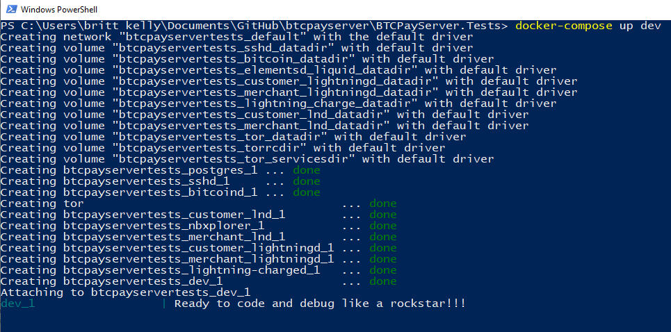
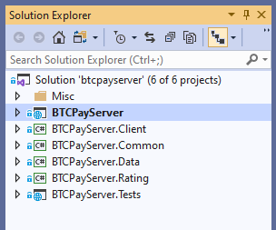
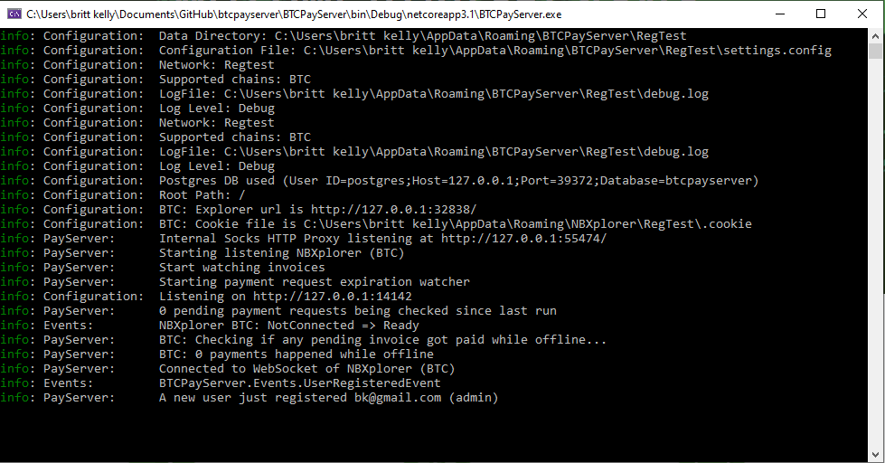
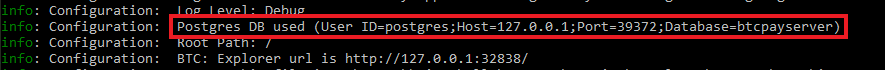
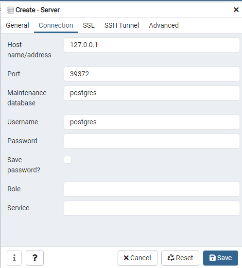
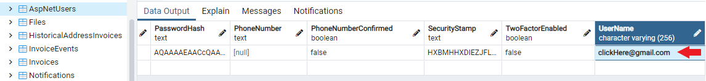

# Setup Developer Environment 

Table of contents:
- [Developer Resources](#developer-resources)
- [Windows Setup Software](#windows-setup-software)
- [Git Setup](#git-setup)
  - [Fork BTCPay Server Repository](#fork-btcpay-server-repository)
  - [Clone BTCPay Server Repository](#clone-btcpay-server-repository)
  - [Create a Development Feature Branch](#create-a-development-feature-branch)
- [Local BTCPay Setup](#local-btcpay-setup)
  - [Visual Studio Setup](#visual-studio-setup)
  - [Bitcoin Regtest Network Setup](#bitcoin-regtest-network-setup)
  - [Build Local BTCPay Server in Debug Mode](#build-local-btcpay-server-in-debug-mode)
  - [Build Local BTCPay Server in Browser Mode](#build-local-btcpay-server-in-browser-mode)
  - [Visual Studio Code Changes In Your Local BTCPay Server](#visual-studio-code-changes-in-your-local-btcpay-server)
- [Git Maintenance](#git-maintenance)
  - [Sync Forked BTCPay Server Repository](#sync-forked-btcpay-server-repository)
  - [Commit Code To Make Pull Request](#commit-code-to-make-pull-request)
  - [Create a Branch of a Pull Request](#create-a-branch-of-a-pull-request)
  - [Delete Local Branch](#delete-local-branch)
- [Working with Docker Containers](#working-with-docker-containers)
- [Greenfield API Development](#greenfield-api-development)
- [Working with the Database](#working-with-the-database)
- [Questions](#questions)

This guide will help you set up your developer environment to prepare you for later contributions to the BTCPay Server repositories. A variety of beginner tools are used in the guide below to help you get started with development. Once you understand the general setup process, feel free to use any tools that you like. 

If you are looking for how to make a simple code change such as fixing a typo or copy change, check out the simplified [WriteSoftware](../ContributeWrite/WriteSoftware.md) tutorial instead. If you are an advanced developer with a local environment already set up for development, you can skip ahead to the [LocalDevelopment](../../LocalDev.md) documentation.

## Developer Resources

- [Github Guides](https://guides.github.com/)
- [BTCPay Commands and Concepts](../../LocalDev.md)
- [Environment Setup Videos (Linux, Mac, Windows)](../../LocalDev.md#videos)

## Windows Setup Software

 Software to install to follow this guide:
 1. [Visual Studio Community Edition](https://visualstudio.microsoft.com/downloads/)
 1. [.NET Core SDK 3.1+](https://dotnet.microsoft.com/download)
 1. [Docker Desktop](https://www.docker.com/products/docker-desktop)
 1. PowerShell (included in Windows OS)
 1. [GitBash](https://gitforwindows.org/)
 1. [GitHub Desktop](https://desktop.github.com/)
 1. [www.Github.com account](https://github.com/) (sign up)

Note: _This guide assumes installations in default locations. Take note if you have a different file directory structure._

## Git Setup

### Fork BTCPay Server Repository

- Open a web browser and login to your www.Github.com account.
- Navigate to the [BTCPay Server Repository](https://github.com/btcpayserver/btcpayserver) and press the `Fork` button to create your own copy of the BTCPay Server repository on Github.
- Next open Github Desktop and login so that Github Desktop knows about your www.Github.com account and connects to it. 

### Clone BTCPay Server Repository

- In GitHub Desktop, use the `Add` button and see the option clone repository. 
- If you are using your www.Github.com credentials in GitHub Desktop, you will see your BTCPay Server repository that you just forked on www.Github.com. Select it and take note of the local path shown below. (by default it will be something like `C:\Users\SatoshisComputer\Documents\GitHub\btcpayserver` for clarity, lets call it our: _clone local path_) then press clone. 
- Now you will see the BTCPay Server repository has been cloned in your GitHub Desktop and you will be on the _master branch_.

### Create a Development Feature Branch

- Next we will practice working with our BTCPay Server repository that we just cloned to our computer using Github Desktop.
- When developing, you may want to work on different features at once. To do that, we typically want to create multiple feature branches instead of making all changes to the master branch.
- We're using GitBash and some Git commands, so open GitBash. (If you prefer to only use GitHub desktop instead of GitBash, you can create branches there instead.)
- Once you have a GitBash terminal open, we need to change directory to our clone of BTCPay Server repository.
- To do this, navigate to our _clone local path_ with the change directory command: `$ cd Documents/Github/btcpayserver`
- You can see your clone of BTCPay Server is on the branch called `master`
- Make a copy of your master branch to do some development on it, with the command: `$ git branch OurNewDevelopmentBranch`
- Let's view all the branches we have now, with the command: `$ git branch` you can see we have master and OurNewDevelopmentBranch
- In Git, we now have a copy of our forked BTCPay Server repository (our clone). When we want to switch between branches (copies of our clone), we need to tell Git which branch our development code changes should be assigned to. We do this by checking out our branch, with the command: `$ git checkout OurNewDevelopmentBranch`
- Now you are now on OurNewDevelopmentBranch in GitBash.
- Open your GitHub Desktop and you can see you are no longer on master and you are now on `OurNewDevelopmentBranch`
- In the top menu in Github Desktop click: `Repository > Show In Explorer` to see the location of the files.

## Local BTCPay Setup

### Bitcoin Regtest Network Setup

- For the next step make sure that you have Docker-Compose installed (included with Docker Desktop). Open a PowerShell terminal and navigate to your _clone local path_ and into the BTCPayServer.Tests directory with the command: `$ cd Documents/Github/btcpayserver/BTCPayServer.Tests`
- The BTCPay Server.Tests project contains the docker files needed to run our docker commands that will start all the project dependencies and create a local Regtest network.
- In Powershell, start the docker services with the command: `docker-compose up dev`(you must be in the BTCPay Server.Tests to run this command).
- In your PowerShell terminal you will first see the necessary docker images being pulled, then containers being built. If the build is successful the containers will all show as done. 



### Build Local BTCPay Server in Browser Mode

If you don't want to do any coding and you simply want to create a local BTCPay Server for testing features in the interface, you can start a local BTCPay from the command line. 

After building your [regtest network](#bitcoin-regtest-network-setup), navigate to your `btcpayserver\BTCPayServer` directory and run the following command:

```
dotnet run --launch-profile Bitcoin
```

Open a new browser and visit: http://127.0.0.1:14142

### Visual Studio Setup

- Open a file explorer to the BTCPay Server repository folder. Without opening any of the folders shown, look for the `btcpayserver.sln` item and right click it to `Open with > Visual Studio`. You may need to choose Open with > Choose another app ... and look for Visual Studio if you have never opened this kind of file before. 
- To get your Visual Studio set up choose `View > Solution Explorer` from the top menu. In this solution explorer you will see all the BTCPay Server files and folders. 
- The top project is BTCPay Server, make sure it's in bold. If it isn't, right click it and choose Set as StartUp Project.
- Your Visual Studio is now set up and ready.



### Build Local BTCPay Server in Debug Mode

- Back in Visual Studio, click: `Build > Build Solution`
- In the output window, a successful build will look something like this: `========== Build: 6 succeeded, 0 failed, 0 up-to-date, 0 skipped ==========`
- Next press `Debug > Start Debugging`
- First a Visual Studio debug console will open which shows information about the status of your local BTCPay Server. 
- Next a local BTCPay Server will be created in a web browser, showing on the home page that it's in `REGTEST` mode.
- You now will have three windows to view: BTCPay Server browser session, our Visual Studio debug console and our BTCPay Server.Tests powershell terminal. 
- Register a new user in your BTCPay Server and see the registration event is shown in your Visual Studio debug console. 




### Visual Studio Code Changes In Your Local BTCPay Server

- Make changes to code in Visual Studio (Ex: modify the `Welcome to your BTCPay` text in the `~\BTCPayServer\Views\Account\Login.cshtml` file)
- Refresh the page to see your text changes on the home page.
- Some code changes require re-start of Debugging for changes to take effect.
- Add breakpoints in Visual Studio and see those breakpoints get hit when you try to use a feature in your local BTCPay Server instance.

## Git Maintenance

### Sync Forked BTCPay Server Repository

- With many contributors adding code changes to the Master BTCPay Server Repository, sometimes your forked copy can fall behind, unless you merge new changes into your fork.
- If you go to your Fork of BTCPay Server on www.Github.com you will see a message saying that your branch is behind by some commits. Example: `This branch is 32 commits behind btcpayserver:master`.
- To update, you can use GitBash or simply use Github Desktop by clicking through the synchronization prompts.
- Open a GitBash terminal and update your BTCPay Server repository with the following commands.
- First always navigate to your _clone local path_ with the command: `$ cd Documents/Github/btcpayserver` and make sure you are on `master` branch.

```bash
$ git fetch upstream
$ git merge upstream/master
$ git commit -m <SomeCommitMessage>

Message prompt: ...your branch is ahead of origin master by "X" commits... use git push to publish...

$ git add .
$ git push origin master 
```

### Commit Code To Make Pull Request

- After you have made some code changes on a feature branch (Example: A feature branch called `Fix/BugBranch`) and you want to make a Pull Request to the BTCPay Server Repository. Open a GitBash terminal and navigate to your _clone local path_ with the command: `$ cd Documents/Github/btcpayserver` and make sure you are on the **correct branch** that you want to commit and use git status to check the files changed are the ones you want to commit.

```bash
$ git status 
$ git add .
$ git commit

Text Editor appears to add your commit message...
Example Commit Message: Fix bug for update button

Accept Changes: Ctrl + x
Save Changes: Shift + y
Close Editor with: Enter

$ git push origin Fix/BugBranch
```
See your new branch has been created on you www.Github.com BTCPay Server Fork, review changes and create Pull Request.  

### Create a Branch of a Pull Request

A great way to contribute without having to be an advanced developer is by testing other contributor's pull requests. Manual testing is a great way to help other's and ensure that BTCPay Server code changes are working properly. Here is an example of how to make a branch of someone else's pull request, using this previous PoS Pull Request https://github.com/btcpayserver/btcpayserver/pull/454. Open a GitBash terminal and navigate to your _clone local path_ with the command: `$ cd Documents/Github/btcpayserver` and use `git status` to check you don't have any other staged commits (git status is clear).

```bash
$ git status
$ git fetch upstream pull/454/head:pos-new-design
$ git branch (to your new testing branch called pos-new-design)
```

Note: Be sure to change the /454/ pull request number to the number of the one you would like to test. You can typically leave /head: as is, and add the name of the pull request branch after it.

### Delete Local Branch

If you delete a branch on your forked BTCPay repository on Github.com, your local copy on your machine will still remain, unless you delete it:

```bash
$ git checkout master
$ git branch -D <branch name>
```
Note: You can't delete a branch if you have it checked out, so checkout another branch like `master` first, as shown in the example above.

## Working with Docker Containers

If you want to use Docker Commands when developing locally, you can run the following commands in the `BTCPayServer.Tests` directory. 

- Show running containers `docker ps`
- Show logs for a container `docker ps logs <container>`
- Start Docker containers `docker-compose up dev`
- Stop Docker containers `docker-compose down`
- Destroy Docker containers `docker-compoose down --v`

## Greenfield API Development

The BTCPay Greenfield API is [currently being developed](../../FAQ/FAQ-General.md#how-can-i-use-the-btcpay-server-api). You can find a [usage example here](../../GreenFieldExample.md). The official Greenfield [API reference documentation](https://docs.btcpayserver.org/API/Greenfield/v1/) is available for developers who want to develop with the BTCPay REST API. 

Developers who would like to contribute to the Greenfield API should follow the [developer guidelines](https://github.com/btcpayserver/btcpayserver/blob/master/docs/greenfield-development.md) used by the BTCPay project for additions or modifications. If you feel these guidelines are not clear, consider discussing your ideas in the community chat (development channel) or [open a github issue](https://github.com/btcpayserver/btcpayserver/issues/new/choose) to discuss endpoint implementation ideas.

## Working with the Database

BTCPay uses a PostgreSQL database by default. During development you can easily connect to it. This is helpful if you want to view how data is saved, modify records or use it to find issues during development. You can use the free tool [PgAdmin4(https://www.pgadmin.org/download/) to do this. 

Start your BTCPay in your local environment and view your debug console to find your database connection details:



Next, open your PgAdmin and select: `Servers > Create > Server...` to connect to your server. Provide a name for your server and provide your host connection details from your Visual Studio debug console:



Save to connect to your development btcpayserver database. In the btcpayserver database look for: 
`Schemas > public > Tables` to see the tables which contain the BTCPay Server data. 

As an example, you can see all the users registered to your development BTCPay by viewing the rows of the `AspNetUsers` table. Try changing the username of a registered user in the database, then `Save Changes` and `Refresh (F5)`. Now log into your BTCPay using the new username and original password.



## Questions

If you have questions about the BTCPay Server local development setup, you can join the [community chat](https://chat.btcpayserver.org/). If you have questions about any of the other tools or commands, etc. it's likely you can find answers to your questions by doing a search on the internet or on [StackOverflow](https://stackoverflow.com/). 
