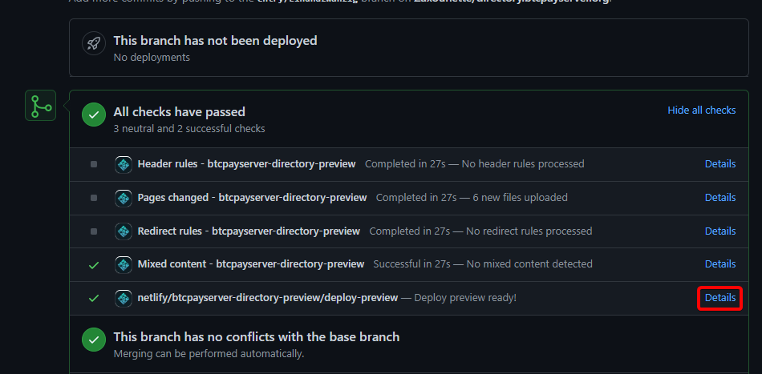

# Contribute to Documentation

Helping us keeping the present [Documentation](https://github.com/btcpayserver/btcpayserver-doc) up-to-date is an important contribution because BTCPay Server evolves at each release.

Beginners can view the following video on how to contribute to the BTCPay Server documentation:

The main documentation repository to fork/clone is the following: [BTCPay Server Documentation](https://github.com/btcpayserver/btcpayserver-doc)

If your Pull Request adds information in the [Documentation](https://github.com/btcpayserver/btcpayserver-doc/), [Website](https://github.com/btcpayserver/btcpayserver.org/) or [Directory](https://github.com/btcpayserver/directory.btcpayserver.org/) repositories, you can preview the changes directly in your web browser once your Pull Request is posted.

Simply click the `details` button as shown in the screenshot below. Then locate the file or section that you edited and verify that everything appears as you intended.

:::tip 
It's a good idea to use relative URL's instead of absolute URL's when editing links that redirect to pages that are part of the documentation already.
This helps the contributors setting up documentation locally.
[More info](https://v1.vuepress.vuejs.org/guide/markdown.html#internal-links/).
:::

