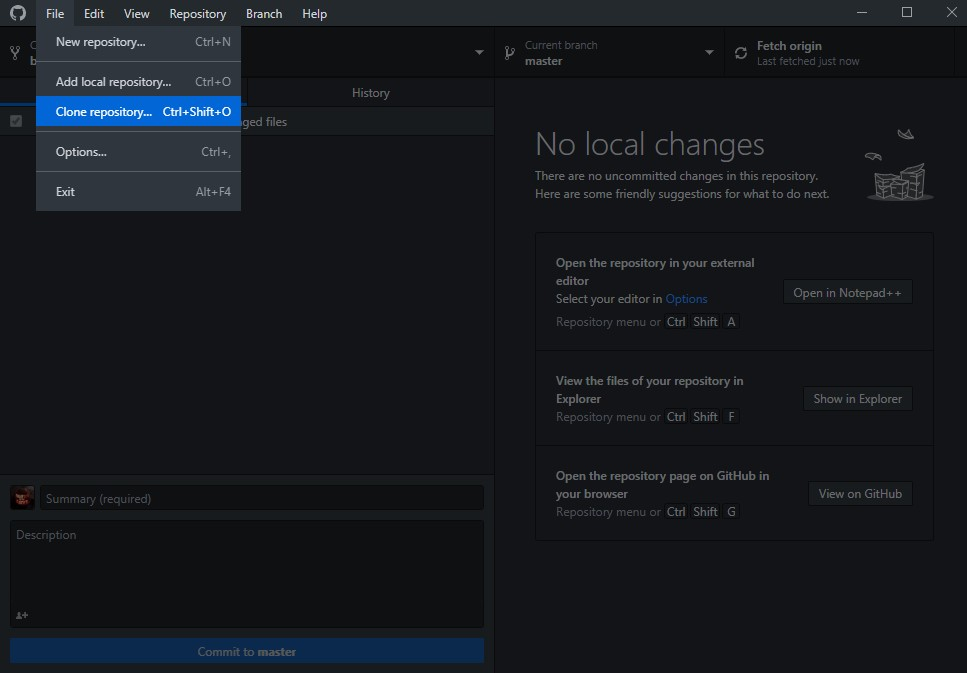
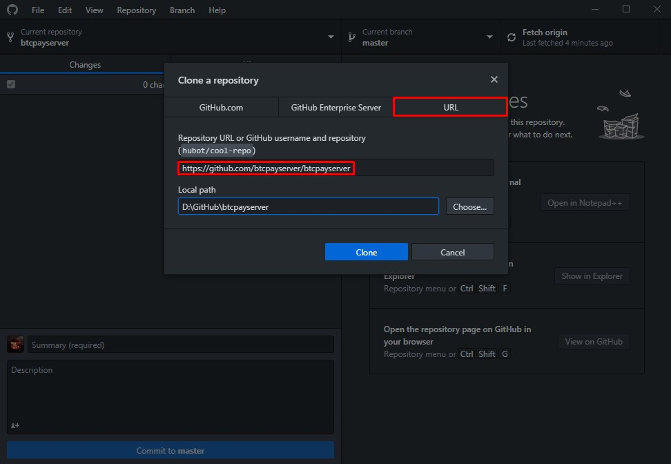
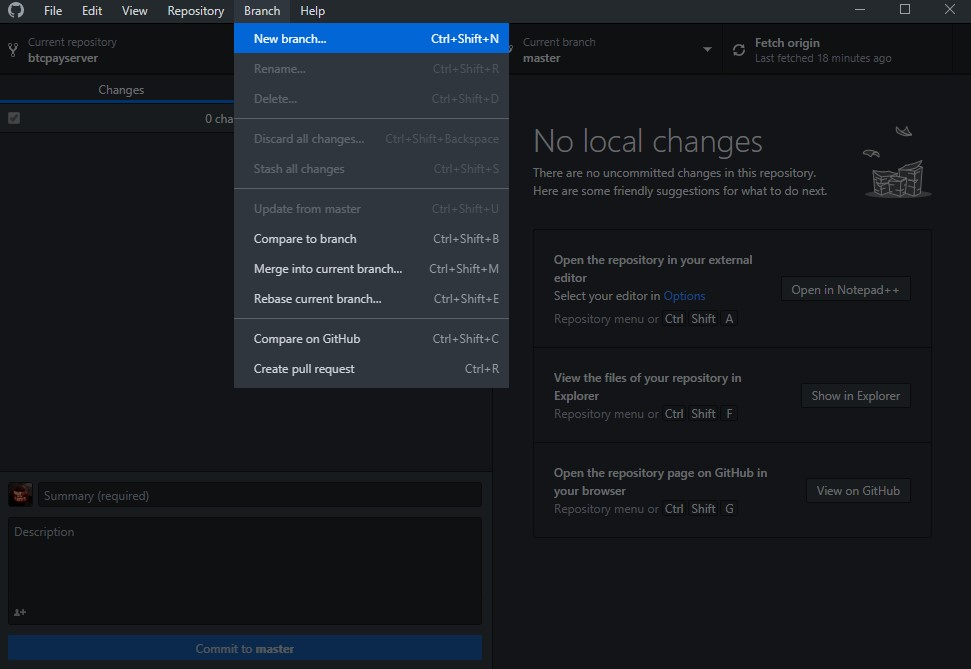
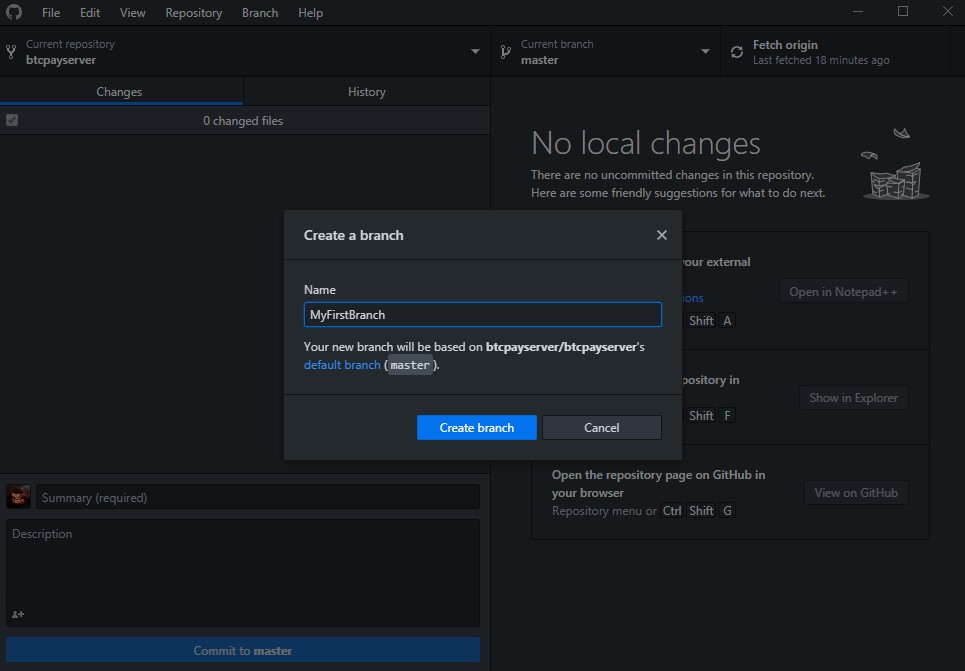
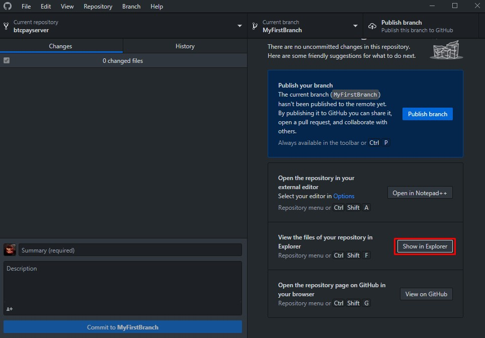
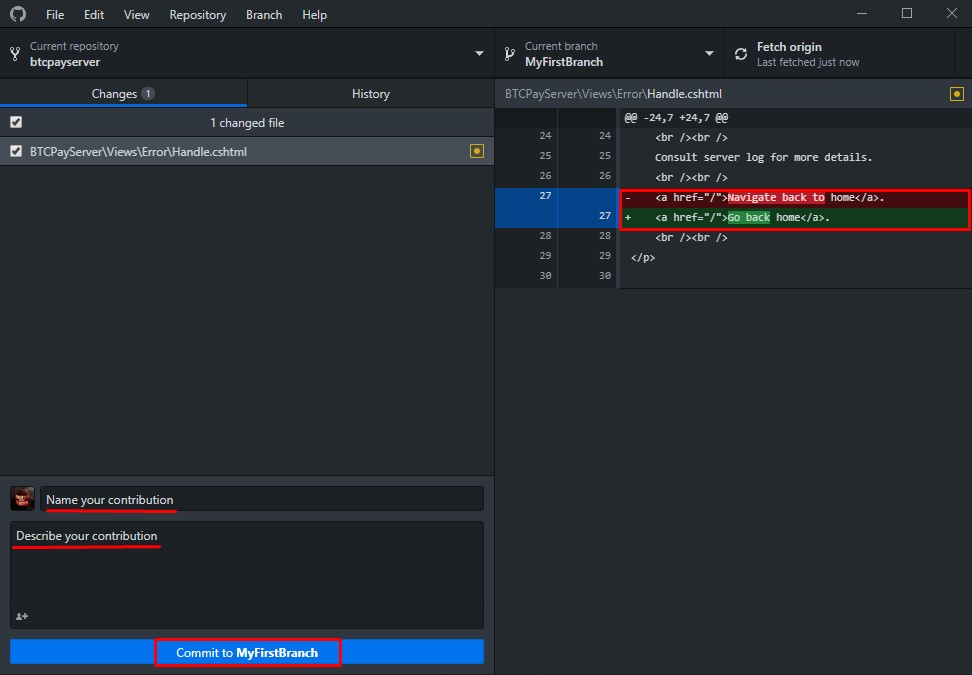
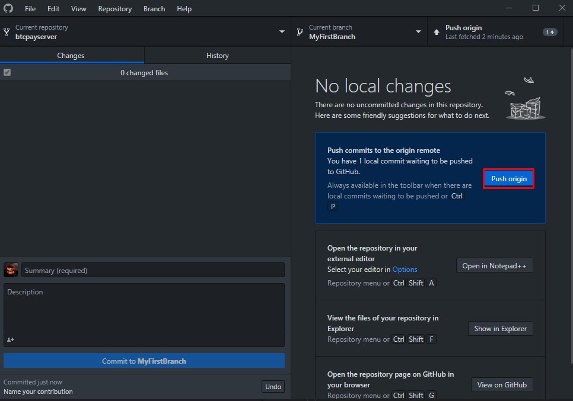
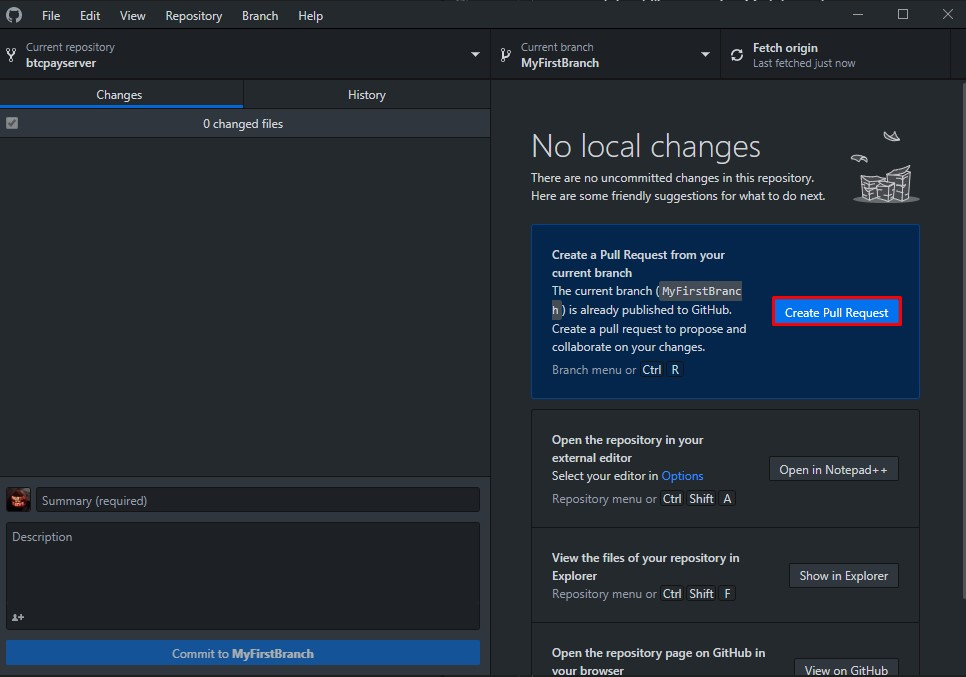
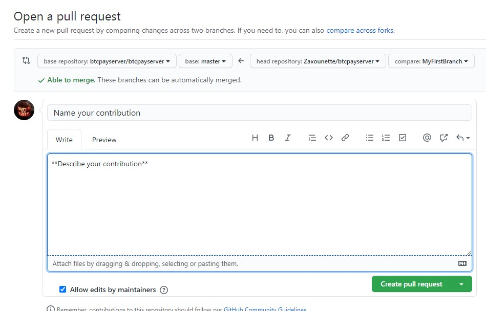

# Contribute to the Software Stack

::: tip
If you have trouble finding a string or contributing to the software stack, ask the [community](../../Community.md)
:::

::: tip
If your textual change is significant [open an issue on GitHub](https://github.com/btcpayserver/btcpayserver/issues/new/choose) and explain what you'd like to change and why.
:::

## **Step 1**

Fork/Clone the main repository ([BTCPay Server](https://github.com/btcpayserver/btcpayserver/)) using Github and publish it.

## **Step 2**

Create a branch and name it (for example what file you're working on).

## **Step 3**

Now open your branch in your file explorer.

You're all set! 
Open the file you wish to edit and work on it.
Once finished, save it.

## **Step 4**

Once your changes are saved, return to Github Desktop.
See your changes on the right hand side.

Name your contribution and describe it.
Click the `Commit` button in the bottom left.

## **Step 5**

Next, create a `Pull Request` by clicking the `Create Pull Request` button on the right to open a browser page.

Then describe what your `Pull Request` changes, give it a title, and click `Create Pull Request`.

Once your pull request is submitted, it has to be reviewed by the maintainers and contributors. If it gets accepted - congratulations, you've made your first contribution.
