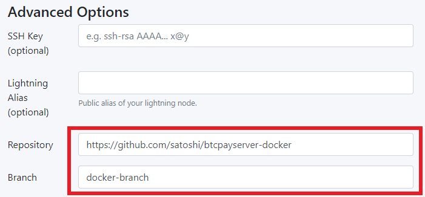

# Testing BTCPay Server

Testing the software is a great way to contribute to the project. There are many different ways that someone can _test_ the software. Users who manually test (QA) the software and features to provide user experience, feedback or bugs to the project developers and designers is always appreciated.

Since the software is open source, anyone can test and audit the code. Some merchants or other technical users may want verify new or existing features by testing the software themselves. Developers working on the code can also benefit from understanding how to manually test certain actions in BTCPay.

This guide will show you how to manually test some common BTCPay features and assumes you already have your [Local Development Environment](./DevCode.md) set up. Once you understand the basic testing actions, most other features can be manually tested in a similar way.

[[toc]]

## Setup Regtest Network and Local BTCPay Server

First, be sure you have completed the following:

- Option 1: Test the latest code - [Pull master](./DevCode.md#sync-forked-btcpayserver-repository)
- Option 2: Test a new feature - [Pull request](./DevCode.md#create-a-branch-of-a-pull-request)
- Created a local [Regtest Network](./DevCode.md#bitcoin-regtest-network-setup)
- Built your solution and started [Browser mode](./DevCode.md#build-local-btcpayserver-in-browser-mode) or [Debug mode](./DevCode.md#build-local-btcpayserver-in-debug-mode)

## Using local Docker Images for Live Testing

You can use any open pull request or feature branch to test new feature in a live environment using local docker images, in case you don't want to use Docker Hub.

Step 1:

Log into your BTCPay instance:
```bash
ssh user@your-btcpay-server.tld
```

Step 2:

Clone the BTCPay Server branch you want to test. Can be your own or from another contributor. Replace MYREMOTE and FEATUREBRANCH accordingly:
```bash
# Clone the repository next to your btcpayserver-docker directory or somewhere else, does not really matter.
git clone git@github.com:MYREMOTE/btcpayserver.git btcpayserver-images
cd btcpayserver-images
# Checkout the branch you want to test
git checkout FEATUREBRANCH
```

Step 3:

Find out the currently deployed tag and build the docker image locally with the same tag.

:::tip
If you use the current deployed tag of BTCPay Server, as described below, you avoid the additional step of changing the tag in the docker-compose file. Because local builds always override remote builds. That said, you can build a custom tag and then change the docker compose file accordingly and run BTCPay setup again.
:::

First, find the current tag of your BTCPay Server instance:
```bash
docker ps | grep generated_btcpayserver | awk '{print $2}'
# output: btcpayserver/btcpayserver:1.13.1
```

Secondly, build the docker image overwriting the current tag, in our case `btcpayserver/btcpayserver:1.13.1`:
```bash
docker build -t btcpayserver/btcpayserver:1.13.1 .
```

Step 4:

Switch to your btcpayserver-docker direcory and run btcpay-up.sh:
```bash
cd $BTCPAY_BASE_DIRECTORY/btcpayserver-docker
./btcpay-up.sh
```

Done, you are now running your custom BTCPay Server image.

## Using Docker Images for Mainnet Testing

Some features are not suitable for testing using a localhost development environment. Integration type features often require mainnet or testnet payments in order to be sufficiently tested. This will show you how to deploy a custom docker image containing an unreleased feature for testing on a live server.

Step 1:

[Fork, clone and create a branch](./DevCode.md#git-setup) of the [BTCPay Server repository](https://github.com/btcpayserver/btcpayserver) and name your branch: `btcpay-branch`. Make a modification, such as changing [this line](https://github.com/btcpayserver/btcpayserver/blob/master/BTCPayServer/Views/UIHome/Home.cshtml#L31) on your new branch.

Step 2:

[Fork, clone and create a branch](./DevCode.md#git-setup) of the [BTCPay Server Docker repository](https://github.com/btcpayserver/btcpayserver-docker) and name your branch: `docker-branch`.

Step 3:

Create a Docker Hub account, Docker repository, download Docker Desktop and Login to your account by following [these steps](https://docs.docker.com/docker-hub/).

Step 4:

Since BTCPay Server requires a blockchain sync, it's easiest to use an already deployed & synced server. This server should be deployed referencing your own `docker-branch` created in step 2. See this example using the [LunaNode launcher](https://launchbtcpay.lunanode.com/):



:::warning
Note the image above shows you must specify your GitHub repository url and branch name of your forked and cloned btcpayserver-docker repository you created in step 2.
:::

Step 5:

Inside the root directory of your `btcpay-branch` there are Dockerfiles prefixed by the following: amd64, arm32v7, arm64v8. We need to build and push a custom image using the Dockerfile for the OS being used.

Replace `<dockerUser>` with your Dockerhub username. Replace the tag `1.13.1` with your own custom version tag or use `latest` tag in the following commands:

```docker
#build image
docker build -t <dockerUser>/btcpayserver:1.13.1 --file ./amd64.Dockerfile .

#push image
docker push <dockerUser>/btcpayserver:1.13.1
```

Step 6:

Check that your image appears in your Docker Hub repository and the version tag matches the one you have supplied in the push command above.

Step 7:

Locate the [btcpayserver.yml docker-fragment](https://github.com/btcpayserver/btcpayserver-docker/tree/master/docker-compose-generator/docker-fragments) in your local `docker-branch` created in step 2. Replace the btcpayserver image's referenced repository to be your Docker image. Replace `<dockerUser>` with your Dockerhub username and tag version (example: 1.13.1) with the one you have supplied in your step 5 above.

```yaml
image: ${BTCPAY_IMAGE:-<dockerUser>/btcpayserver:1.0.0.1$<BTCPAY_BUILD_CONFIGURATION>?}
```

Step 8:

Push your local `docker-branch` changes to your BTCPayServer Docker repository on GitHub.

Step 9:

[Update your server](../../FAQ/ServerSettings.md#how-to-update-btcpay-server).

Now you can test your feature as if it was already released!

## Create Invoice

Creating an invoice and sending payment is an important feature in BTCPay and in order to manually test this, you must first:

- Create a Store
- Setup a Wallet

:::tip
Use the hot wallet for fastest wallet setup during testing. Import from ... > a new/existing seed > check Is hot wallet > Generate
:::

- Create an invoice for your store

## Pay Invoice

Open a new Powershell terminal and navigate to your `BTCPayServer.Tests` directory where our Docker-Compose commands are run for the project. Copy the amount and address for payment from your invoice. Add them into the following command:

`.\docker-bitcoin-cli.ps1 sendtoaddress "bcrt1qym96l8gztggldraywdumgmfw27u8p8h5w7h9kc" 0.00097449` then press `Enter`.

Notice that your invoice has now been paid in your local BTCPay Server.


To pay other types of payments see [this guide](https://github.com/btcpayserver/btcpayserver/blob/master/BTCPayServer.Tests/README.md).

## Testers FAQ

### Start Debugging gives Error: No connection could be made because the target machine actively refused it. 127.0.0.1:39372

If you see this error, it means you did not set up your Regtest Network using the `docker-compose up dev` command in the `BTCPayServer.Tests` directory. This command will set up all the dependencies you need for services used by BTCPay in the local development environment. You must run it before you try to start debugging.

### Regtest payments are not showing as confirmed?

If you make a [test payment](#pay-invoice) and it's stuck as unconfirmed, you should mine some blocks to add confirmations to your transaction.

```powershell
.\docker-bitcoin-generate.ps1 3
```

If you are missing things like test payment notifications or other expected events, this may be the reason.

### Which branch should be tested for major releases?

Testing master branch is acceptable because it will include the release changes. However, other commits which are not yet released may also be in master. It is always good to find issues before the release so master (or a specific PR) is the ideal branch to test.

You can check the [latest release](https://github.com/btcpayserver/btcpayserver/releases) to see the changes which are available for current deployments as well as the unreleased commits.

### Can I mark an invoice as paid?

No, you can't mark an invoice as paid. If you need completed payment status for development, either [pay the invoice](#pay-invoice) or create the invoice for $0 which will be automatically paid upon creation.
