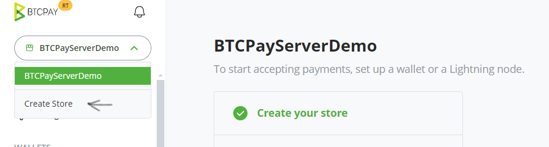

# (2) Create a store

## Creating a Store in BTCPay Server

BTCPay Server allows you to create an unlimited number of stores. Each store needs to be [connected to a wallet](./WalletSetup.md), can have apps (Point of Sale, Payment Buttons and Crowdfunding) attached to it, or be paired with external e-commerce software through one of many available integrations.

To **create a store**, make sure you're logged in into your account, 

- Navigate to **Stores** in the upper navigation menu.
- Click on the **Create Store** button.
- Enter your store name in the text field, and select your default currency and its corresponding provider.
- Click the `Create` button, and you have sucessfully created a new store. 

To create more stores on your instance, you can follow the same guide as described above. 
 

## Customizing your BTCPay Store Settings

Store > Settings provides basic control over the individual store settings. Modify the confirmations, invoice expiry and more. For more information, check [Stores FAQ](./FAQ/Stores.md).

**_Proceed to the next step - [Connecting a Wallet](./WalletSetup.md)._**
