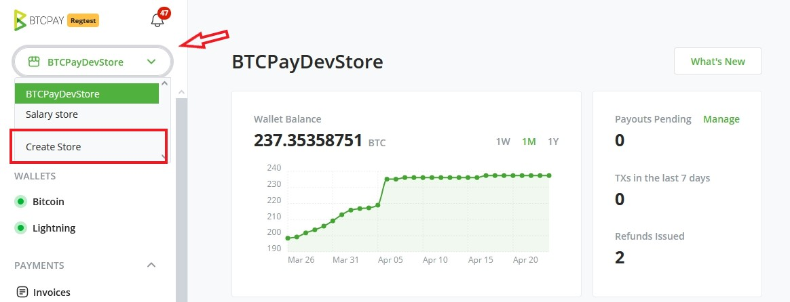

# (2) Create a store

## Creating a Store in BTCPay Server

Inside BTCPay Server, an unlimited number of stores can be created. Each store needs to be [connected to a wallet](./WalletSetup.md), can have apps (Point of Sale, Payment Buttons and Crowdfunding) attached to it, or be paired with external e-commerce software through one of many available integrations.

To **create a store**, make sure you're logged in into your account, and go to > **Stores** in the upper navigation menu. Click on the **create a new store** button. Enter the store name into the text field and click `Create`.

## Customizing your BTCPay Store Settings

Store > Settings provides basic control over the individual store settings. Modify the confirmations, invoice expiry and more. For more information, check [Stores FAQ](./FAQ/FAQ-Stores.md).

***Proceed to the next step - [Connecting a Wallet](./WalletSetup.md).***
