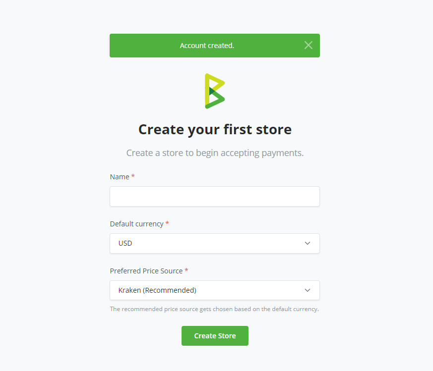
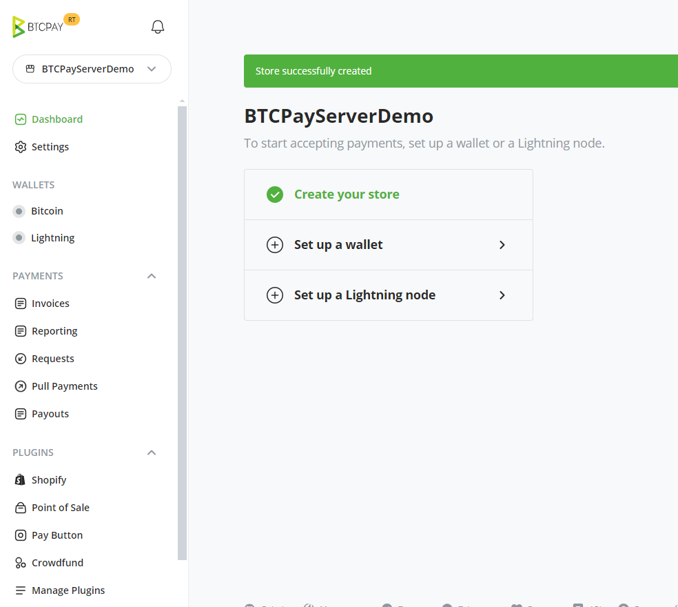
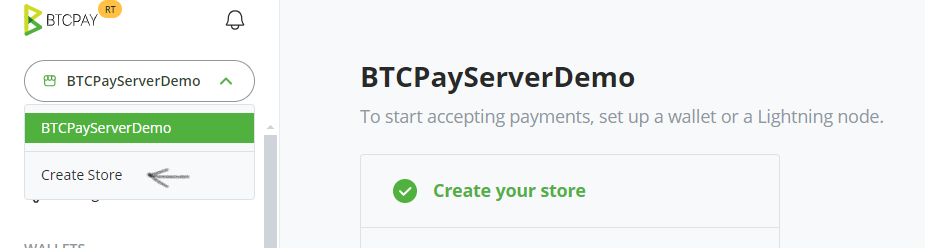

# (2) Create a store

## Creating a Store in BTCPay Server

After [registering your account](./RegisterAccount.md), the next step is to create a store. BTCPay Server allows you to create an unlimited number of stores. Each store needs to be [connected to a wallet](./WalletSetup.md), can have apps (Point of Sale, Payment Buttons and Crowdfunding) attached to it, or be paired with external e-commerce software through one of many available integrations.

### Creating Your First Store

When you first register an account, you'll be automatically redirected to the store creation page. You'll need to:

1. Enter your **store name** in the text field
2. Select your **default currency**
3. Choose a **currency rate provider**
4. Click the `Create` button

Congratulations! You have successfully created your first store.

### Creating Additional Stores

To create more stores on your instance:

- Navigate to **Stores** in the upper navigation menu
- Click on the **Create Store** button
- Enter your store name, select your default currency and its corresponding provider
- Click the `Create` button

## Customizing your BTCPay Store Settings

Store > Settings provides basic control over the individual store settings. Modify the confirmations, invoice expiry and more. For more information, check [Stores FAQ](./FAQ/Stores.md).

**_Proceed to the next step - [Connecting a Wallet](./WalletSetup.md)._**
