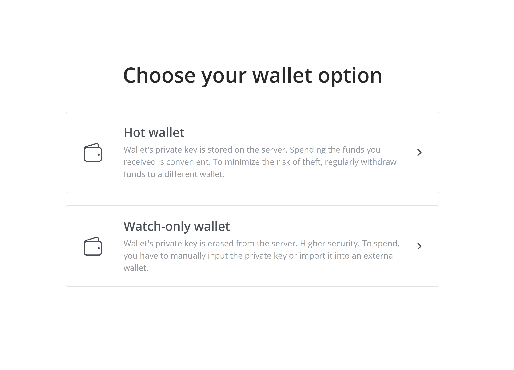
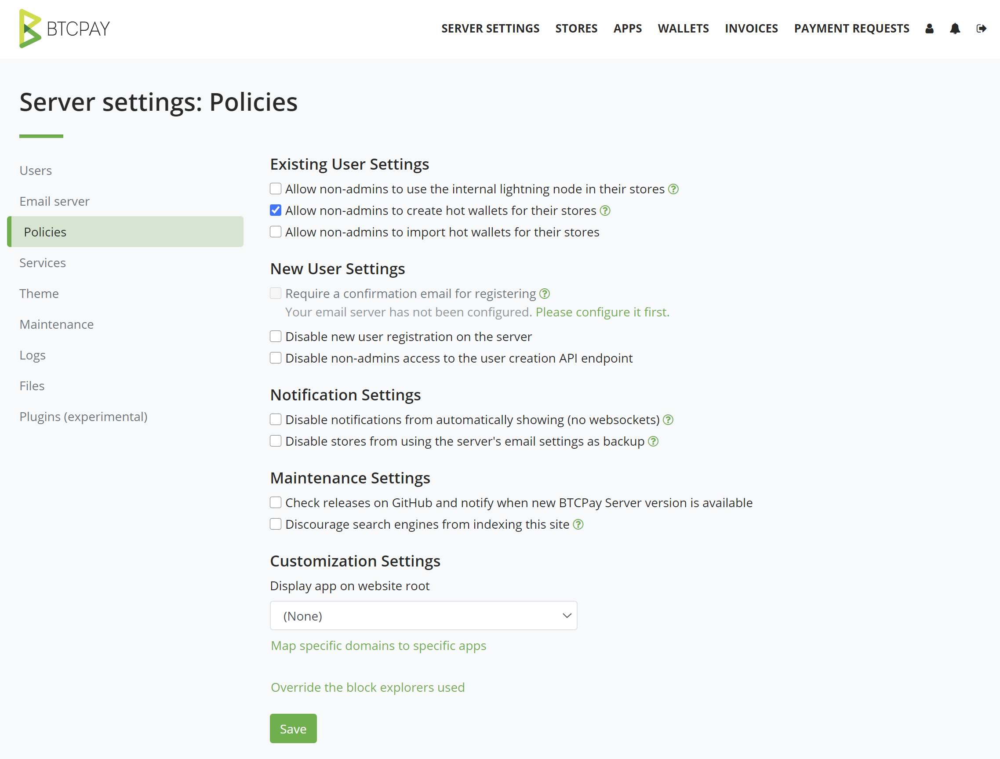
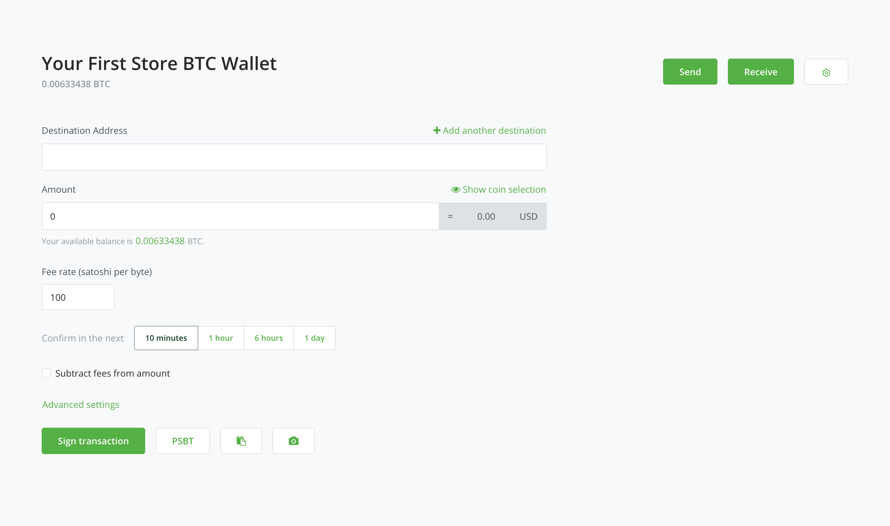

## Create a new wallet

- [Hot Wallet](#hot-wallet)
- [Watch-only wallet](#watch-only-wallet)

### Hot Wallet

If you do not have an existing wallet, you can generate a new one within your BTCPay Server. Whether you have an existing wallet or not, the quickest way to get a wallet connected to your store is to create a new wallet. You can always replace it with an alternative wallet after receiving a few small payments to your server, if you just want to get your store ready quickly. 

This type of wallet is also necessary to use features such as [Payjoin](./Payjoin.md) and [Liquid](https://github.com/btcpayserver/btcpayserver/issues/1282).

#### Requirements to create wallets

If are using a [third-party host](./ThirdPartyHosting.md), this option needs to be explicitly enabled by the server admin. Generating a new wallet in an environment you are not sure is trustworthy, is discouraged.

By default, you need to be a server admin to use the create wallet feature. This is because server admins are able to extract the private key easily. If for some reason (such as allowing individuals that trust you enough with their store), you can enable the hot wallet for non-admins from Server Settings > Policies > "Allow non-admins to create hot wallets for their stores".

Understand that anyone with access to your recovery seed can also access and steal all your funds (current AND future funds!), since a private key is derived from a recovery seed. Securely back up your seed by writing it down and keep it in a safe place. Do not photograph it or store it in a digital format. Do not rely solely on your server for storing your recovery seed, always keep a backup copy. 

:::warning
When a new wallet is generated, BTCPay Server will show you a twelve word recovery seed. After the initial display, the recovery seed is wiped from the server, unless a the hot wallet option is enabled.
:::

#### Spending funds with BTCPay Hot Wallet

Once you’ve received funds to your wallet and you decide to spend them, you can sign the transaction automatically, all inside BTCPay Server.

1. In BTCPay Server, go to > Wallets > Manage > Send
2. Fill in the Destination address and the Amount
3. Select Sign the hot wallet
4. Review the transaction
5. Broadcast the transaction

#### Security Implications

Storing private keys on a public server comes with risks. This is similar to the risks of running and using the [Lightning Network](./LightningNetwork.md) (except that you can recover funds with a backup).
**Please, ALWAYS be sure to back up any seed that is generated by this feature and to never leave money you cannot afford to lose spendable by those private keys**.

#### Reducing risk

As mentioned above, the create wallet functionality includes risk of funds being stolen in the case of the server or account being compromised. To mitigate this risk, we advise you to:

* Enable two factor or U2F authentication
* Occasionally move funds to your cold storage either manually or by configuring [BTC Transmuter](https://github.com/btcpayserver/btcTransmuter/blob/master/README.md) with automatic payment forwarding.

:::danger
Do not give anyone else access to your server's SSH keys or server account credentials when using a hot wallet. Anyone with access to your account can spend the funds from your hot wallet. If you need to allow account access to employees, developers, etc. use an [existing wallet](ConnectWallet.md#connect-an-existing-wallet) instead.
:::

### Watch-only wallet

Similar to the hot wallet, the watch-only wallet can get your store connected to a wallet instantly. In contrast, this option does not store the private keys on the server. As a result the wallet becomes "watch-only" for any received funds. 

In order to spend the funds you would need to manually provide your seed words each time. Alternatively you can spend funds in another external wallet where you have imported your BTCPay Server produced seed words. Be sure to consider the [gap limit issue](./FAQ/FAQ-Wallet.md#missing-payments-in-my-software-or-hardware-wallet) if you're using an external wallet with your watch-only wallet.