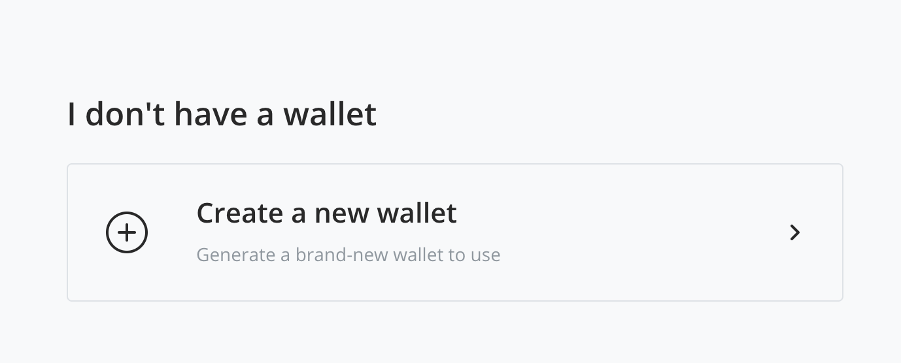
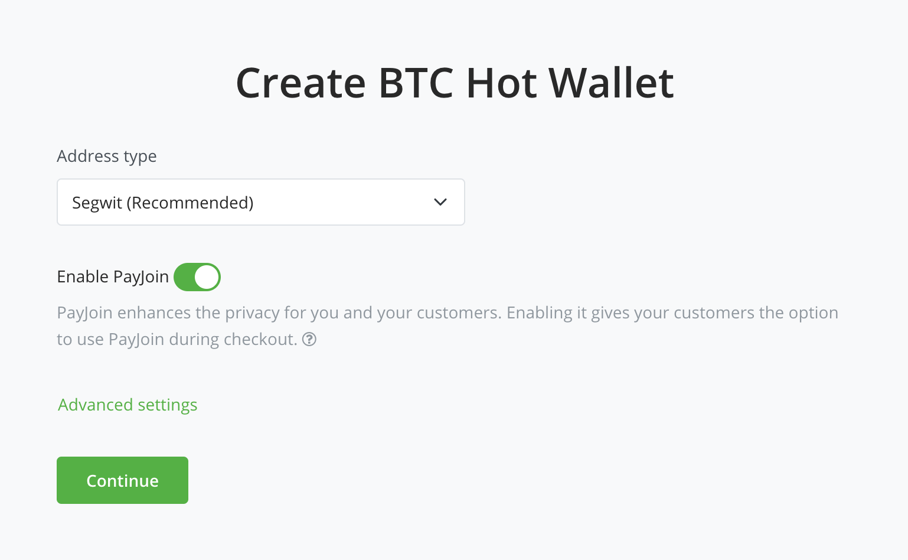
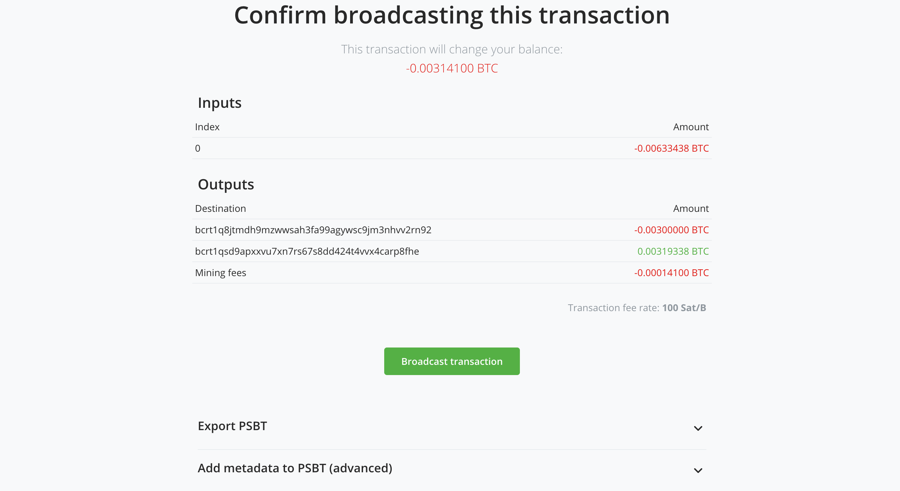

# Create a new wallet

- [Hot Wallet](#hot-wallet)
- [Watch-only wallet](#watch-only-wallet)

### Hot Wallet

If you do not have an existing wallet, you can generate a new one within your BTCPay Server. Whether you have an existing wallet or not, the quickest way to get a wallet connected to your store is to create a new wallet. You can always replace it with an alternative wallet after receiving a few small payments to your server, if you just want to get your store ready quickly.

This type of wallet is also necessary to use features such as [Payjoin](./Payjoin.md) and [Liquid](https://github.com/btcpayserver/btcpayserver/issues/1282).

After creating a store, you'll be able to attach a wallet by first navigating to the sidebar or slide-out menu and clicking/tapping the **Bitcoin** button under the **Wallets** header. Alternatively, you can find the option to **Set up a wallet** on the Dashboard.

You'll focus on the **I don't have a wallet** section for a hot wallet and click the **Create a new wallet** button.

There will be two options on the proceeding page, and in this case, we'll select the **Hot wallet** button.

For most people, the default options, including **Address Type** (Segwit), should work well for most applications, and it's recommended not to change it unless you're sure of what you're doing. The **Payjoin** feature is optional, and you can learn more about it at the link [above](#hot-wallet).

#### Advanced Settings

- Optional [BIP39](https://github.com/bitcoin/bips/blob/master/bip-0039.mediawiki#from-mnemonic-to-seed) passphrase

  - You can add a passphrase for your hot wallet's mnemonic for an additional layer of security.

- Import keys to RPC

  - This is for more advanced applications of BTCPay Server. Importing your keys to RPC will allow users to leverage [bitcoind Wallet RPCs](https://developer.bitcoin.org/reference/rpc/index.html#wallet-rpcs) on the imported wallet.

#### Recovery Seed

The final step in creating a hot wallet is to document your recovery seed. It's crucial to understand that anyone with access to your recovery seed can access and steal all your funds, both current and future, because a private key is derived from the recovery seed. Securely back up your seed by writing it down and keep it in a safe place. Do not photograph it or store it in a digital format. Do not rely solely on your server for storing your recovery seed, always keep a backup copy. 

After you've done so, tick the checkbox that says _I have written down my recovery phrase and stored it in a secure location_ and click the **Done** button.

#### Requirements to create wallets

If are using a [third-party host](/Deployment/ThirdPartyHosting.md), this option must be explicitly enabled by the server admin. Generating a new wallet in an environment you are not sure is trustworthy, is discouraged.

By default, only server admins can use the create wallet feature. This is because server admins are able to extract the private key easily. However, if you want other trusted individuals to create and manage their stores, you can enable the hot wallet feature for non-admins. To do this, go to Server Settings > Policies > "Allow non-admins to create hot wallets for their stores".

:::warning
When a new wallet is generated, BTCPay Server will show you a twelve word recovery seed. After the initial display, the recovery seed is wiped from the server, unless a the hot wallet option is enabled.
:::

#### Spending funds with BTCPay Hot Wallet

Once you've received funds to your wallet and decide to spend them, you can automatically sign the transaction inside BTCPay Server.

1. In BTCPay Server, go to > Wallets > Bitcoin > Send
2. Fill in the Destination address and the Amount
3. Adjust the transaction settings, including fee rate, confirmation time preference, and if you'd like transaction fees to be subtracted from the amount you're sending
4. Sign the transaction
5. Review the transaction
6. Broadcast the transaction

#### Security Implications

Storing private keys on a public server comes with risks. This is similar to the risks of running and using the [Lightning Network](./LightningNetwork.md) (except that you can recover funds with a backup).
**Please, ALWAYS be sure to back up any seed that is generated by this feature and to never leave money you cannot afford to lose spendable by those private keys**.

#### Reducing risk

As mentioned above, the create wallet functionality includes the risk of funds being stolen if the server or account is compromised. To mitigate this risk, we advise you to:

- Enable two factor or U2F authentication
- Occasionally move funds to your cold storage either manually or by configuring [BTC Transmuter](https://github.com/btcpayserver/btcTransmuter/blob/master/README.md) with automatic payment forwarding.

:::danger
Do not give anyone else access to your server's SSH keys or server account credentials when using a hot wallet. Anyone with access to your account can spend the funds from your hot wallet. If you need to allow account access to employees, developers, etc. use an [existing wallet](ConnectWallet.md#connect-an-existing-wallet) instead.
:::

### Watch-only wallet

Like the hot wallet, the watch-only wallet can instantly get your store connected to a wallet. In contrast, this option does not store the private keys on the server. As a result, the wallet becomes "watch-only" for any received funds.

There are several routes you can take to spend funds with this type of wallet including importing the seed words into a hardware wallet to sign your transactions using the [BTCPay Server Vault application](https://docs.btcpayserver.org/Vault/), [PSBT](https://docs.btcpayserver.org/Wallet/#psbt), or the least recommended manually providing your seed words every time.

Alternatively, you can spend funds in another external wallet where you have imported your BTCPay Server-produced seed words. If you import your seed words into an external wallet, you can also use a PSBT to spend the funds, assuming the wallet supports it. This option will be available on the wallet's send page. Be sure to consider the [gap limit issue](./FAQ/Wallet.md#missing-payments-in-my-software-or-hardware-wallet) if you're using an external wallet with your watch-only wallet.
