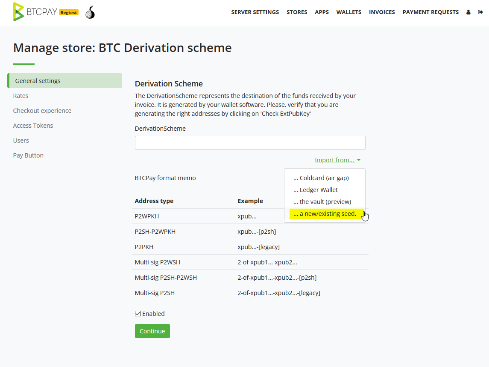
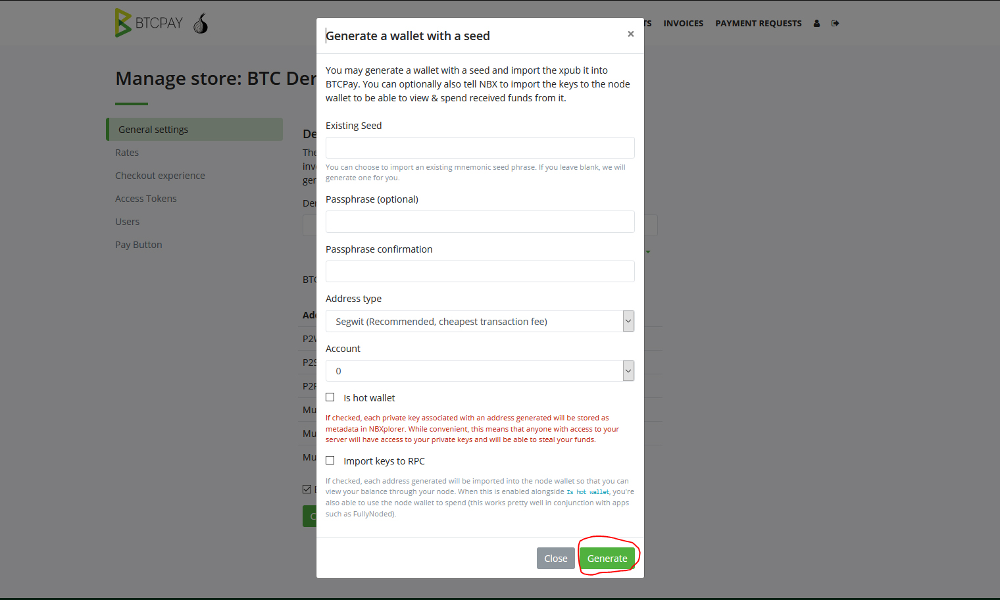
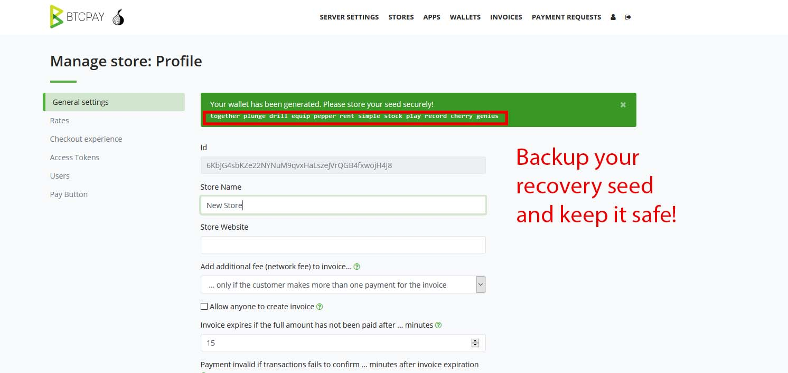

Besides using an [existing wallet](https://docs.btcpayserver.org/WalletSetup/#use-an-existing-wallet) you can create a brand-new wallet within your BTCPay Server.

If you are using a [third-party host](ThirdPartyHosting.md), this option needs to be explicitly enabled by the server admin. Generating a new wallet in an environment you are not sure is trustworthy, is discouraged.

## How to create a new wallet

1. Go to your BTCPay Server’s Store > General Settings > Derivation Scheme > Import from a new/existing seed.
2. Press Generate

Feel free to select the address format that you prefer. **Do not enable** a hot wallet, unless you've read the [Hot wallet documentation](HotWallet.md) and have the use-case for this advanced feature.

If you did not provide an existing seed, a seed will be generated and shown to you. The public key will automatically be imported in the store and configured to an appropriate format. 
If you provided an existing seed, a list of preview addresses will be shown. Validate that they are the same as the one on your wallet and Save.

:::danger
Anyone with access to your recovery seed can also access and steal all your funds. Securely back up your seed by writing it down and keep it in a safe place. Do not photograph it or store it in a digital format. When creating a wallet, the recovery seed will be shown only once and **wiped from the server**. If you loose your recovery seed, you'll lose the access to all of your funds.
:::
