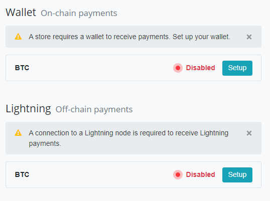

# How to create a new wallet

Besides using an [existing wallet](./WalletSetup.md#use-an-existing-wallet) you can create a brand-new **wallet within your BTCPay Server**.

:::warning
If you are using a [third-party host](./ThirdPartyHosting.md), this option needs to be explicitly enabled by the server admin. **Do not enable** hot wallets, unless you've read the [Hot wallet documentation](./HotWallet.md) and have the use-case for this advanced feature.
:::

1. Go to your BTCPay Server’s Store > Settings > Wallet > Click Setup

2. Click Create a new wallet > Hot Wallet

3. Select the wallet's address type and write down the generated seed words displayed for you.

:::danger
Generating a new wallet in an environment you are not sure is trustworthy, is discouraged. Anyone with access to your recovery seed can also access and steal all your funds. Securely back up your seed by writing it down and keep it in a safe place. Do not photograph it or store it in a digital format. When creating a wallet, the recovery seed will be shown only once and **wiped from the server**. If you loose your recovery seed, you'll lose the access to all of your funds.
:::
