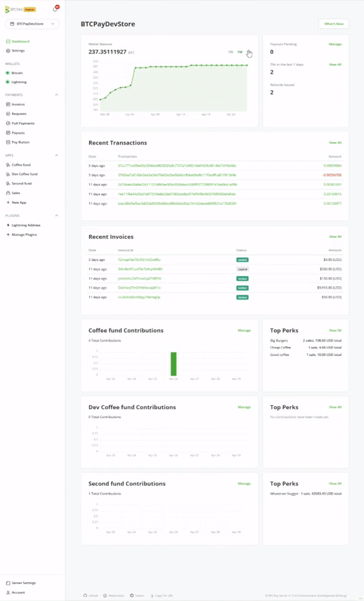
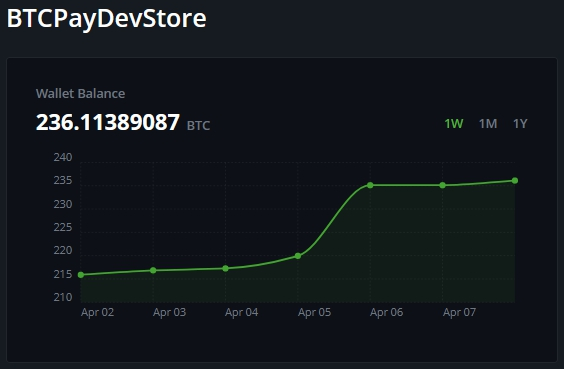
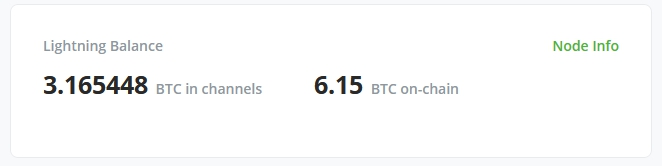
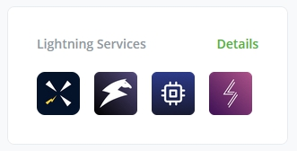
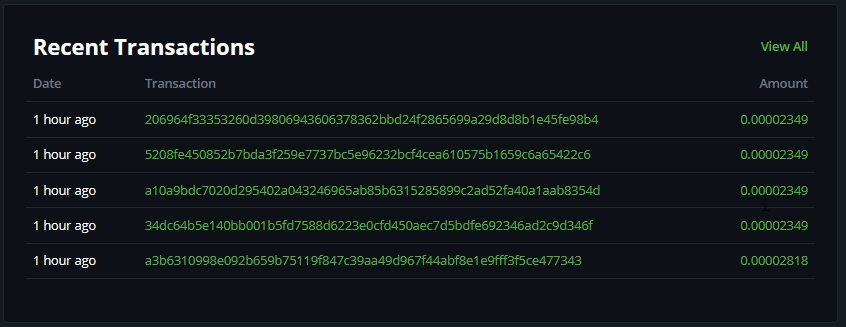
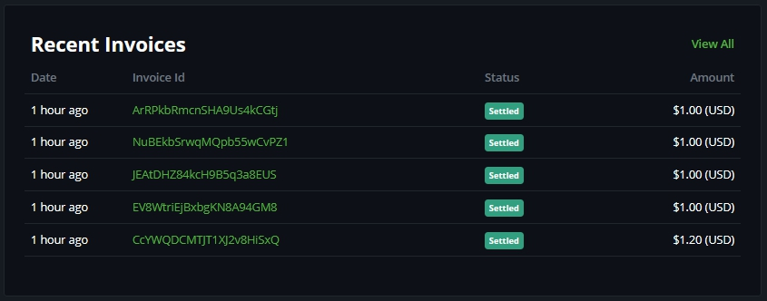

# Dashboard

BTCPay Server version 1.5.0 introduced a new dashboard concept that features several tiles that will help with the initial setup, better understand the store's data and manage refunds and payouts with ease.

## Dashboard tiles

In the main dashboard view, you'll find a couple of tiles that we think could help you quickly overview your store's performance.

### Wallet Balance

The current store's [wallet](Wallet.md) balance, showing a graph by week, month, or year.

### Transaction activity

Quickly manage pending payouts, view recent transactions, and overview outstanding [refunds](Refund.md)

### Lightning Balance

This will show the available balances for your Lightning node.
Please note that the on-chain balance refers to the wallet of your store's Lightning node, not the store's general on-chain wallet.

The `Node Info` will show you a quick overview of your node, it's online status and the address to connect to for peers.
For more information on `Lightning Network` check our [Lightning Network page](./LightningNetwork.md).

### Lightning Services

In this tile, you will find quick buttons to `Lightning Network` services like:

- Core Lightning (REST)
- Ride The Lightning
- ThunderHub
- Lightning Terminal

### Recent Transactions

Showcasing the five most recent transactions that arrived to your on-chain wallet.

### Recent invoices

The five most recent invoices are shown with their corresponding status and value allowing you to quickly access and manage a particular [invoice](/Invoices.md).

### Current active crowdfund

This tile shows the current active crowdfunds, including their top-ranked items/perks. When more than one crowdfunding app is active crowdfund is, the tiles will show below the initial one. That's an easy way to manage your active crowdfund campaigns and see all the perks and how they're performing.

:::warning
This page is subject to change as the software progresses. Features will be updated by release.
:::
