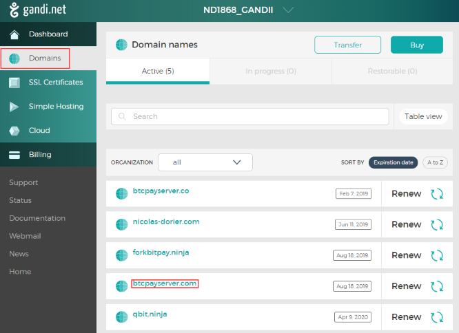
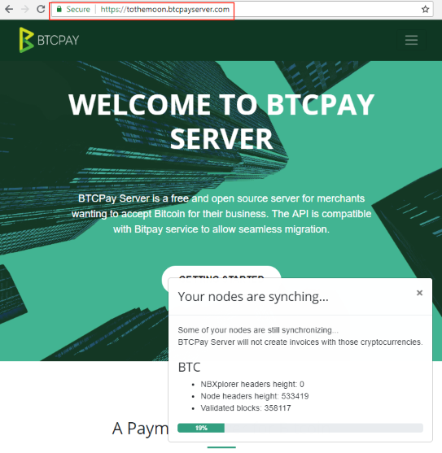

# How to change the domain name of your BTCPay Server

This article assumes you used either [Azure](https://github.com/btcpayserver/btcpayserver-azure) deployment or [BTCPay Docker](https://github.com/btcpayserver/btcpayserver-docker) deployment.

Let's assume I used Azure. After initially deploying, I get an **invalid certificate** (this is normal during setup):


To get a **valid certificate**, I need to change my server address from `https://myawesomedemobtcpay.westeurope.cloudapp.azure.com/` to `https://tothemoon.btcpayserver.com/`.

## Setting up your DNS record

First, I bought my domain name `btcpayserver.com` from a registar. (I use [gandi.net](https://gandi.net/) because they are awesome.)

Once I got the domain name, I can access it in the `Domains` menu:



So I click on my new domain `btcpayserver.com`, then go to the `DNS Records` menu, then I click `Add`:


Here I want to make sure `tothemoon.btcpayserver.com` will resolve to the same IP address as `myawesomedemobtcpay.westeurope.cloudapp.azure.com`. We call this a `CNAME record`.

So I fill out:

```
Type: "CNAME",
Name: "tothemoon",
Hostname: "myawesomedemobtcpay.westeurope.cloudapp.azure.com." !! DO NOT FORGET THE '.' !!
```


Then I click 'Create'. (Note that if you want to point directly to an IP address instead, you would use a type `A` record.)

**Congratulations! Now let's set it up on the other side, the BTCPayServer host.**

## From your browser

* Visit `https://myawesomedemobtcpay.westeurope.cloudapp.azure.com/server/maintenance`
* Log in as an administrator, which is typically the first account created on the server.
* Enter new hostname `tothemoon.btcpayserver.com` and click 'Update'.


I wait a bit and go to `https://tothemoon.btcpayserver.com` - Success!



## From the command line

I connect to my server via:

```bash
ssh btcpayserver@myawesomedemobtcpay.westeurope.cloudapp.azure.com
```

I enter the `Password` I chose during the Azure Wizard setup.

```bash
sudo su -
changedomain.sh tothemoon.btcpayserver.com
```

Success!
