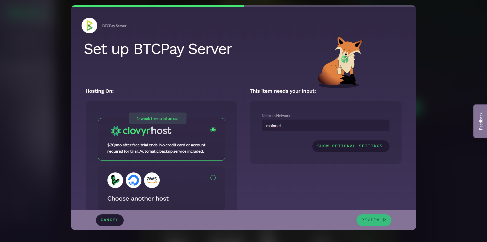
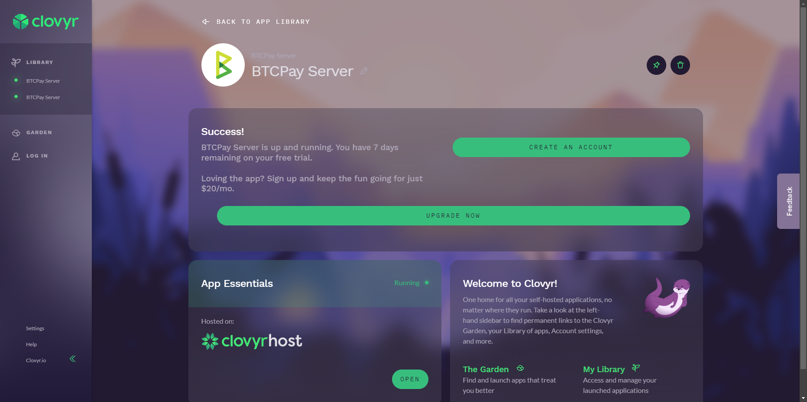
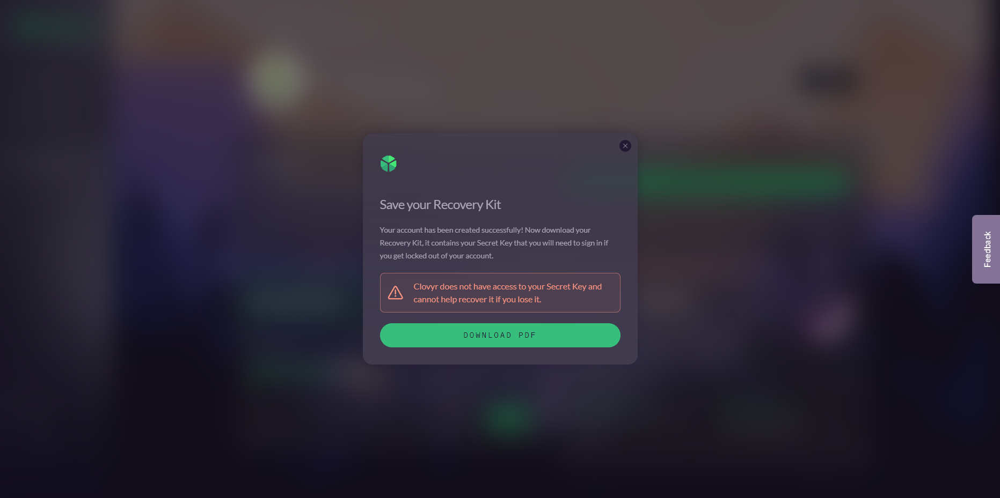
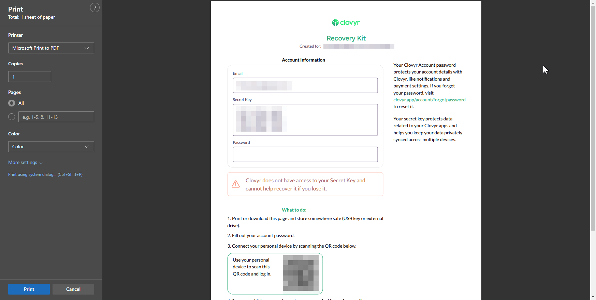

# Clovyr BTCPay Server web deployment.

In this guide, we will walk you through the initial setup of your Clovyr BTCPay Server web deployment.
Clovyr offers a quick and easy deployment of a variety of services, including BTCPay Server. They allow deploying either to their own servers, or to a variety of other VPS providers, such as Digital Ocean, AWS, and Linode.

## 1. Visit the Clovyer BTCPay Server launch page

Go to [the Clovyer BTCPay Server launch page](https://clovyr.app/apps/btcpayserver/launch)

Next, pick where you would like to host. We'll go ahead and go with the default option, their own servers.
Click Review, and then Launch.

## 2. Account creation

You should now be greeted with a success screen inside the Clovyr dashboard.

Click on Create account, and fill in your details.

It will now ask you to save a recovery kit, which allows you to restore your account if you forget or lose your password.

## 3. Accessing BTCPay Server

Once back on the Clovyr dashboard, click on the "Open" button under App Essentials, and BTCPay Server will open in a new tab.

## 4. Start your first store.

You will be prompted to create the first account on your new BTCPay Server. Make sure to have the Administrator account checked.

You are now ready to set up your first store!
To follow more on setting up your store, follow along in this [Guide](../RegisterAccount.md).

## 5. Welcome to your BTCPay Server dashboard

You are now inside your new BTCPay Server.
The bitcoin wallet is still missing. You can follow along in [this wallet setup guide](../WalletSetup.md)

:::tip
If there are questions about your node, the deployment, or updates, please reach out to the support of Clovyr, using their Feedback tab.
:::

## 6. Billing

You will have a 7 day free trial to try out the service. After that, you will be billed $20 per month and will need to configure this through the Clovyr dashboard by clicking on "Upgrade now".
