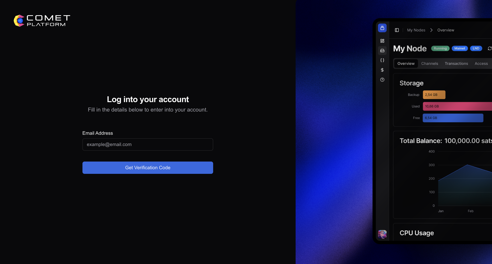
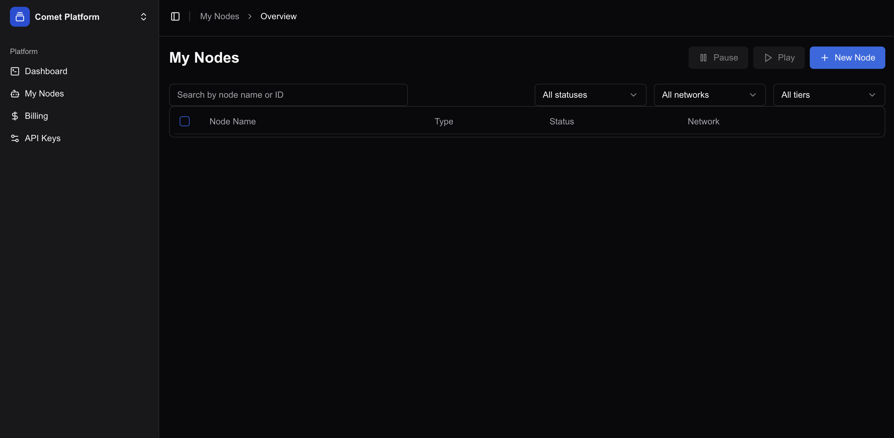
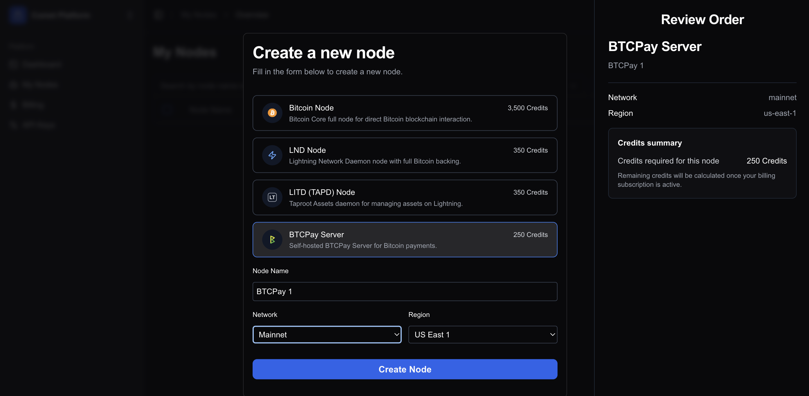
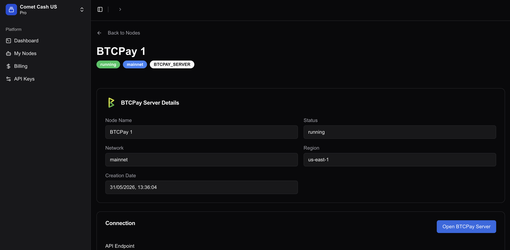
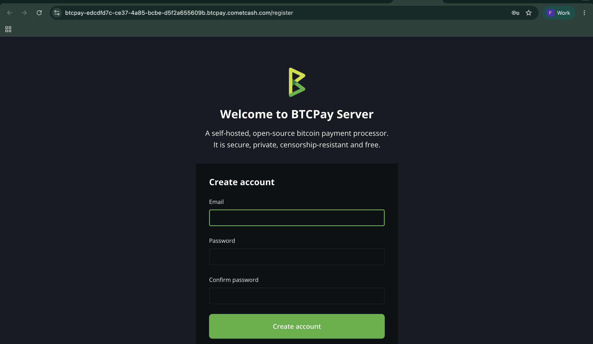

# Comet Cash BTCPay Server web deployment

This guide explains how to deploy a managed BTCPay Server instance through [Comet Cash](https://dashboard.cometcash.com/).

Comet Cash uses credits to allocate managed services. The Basic plan costs **$30 per month** and includes **1,000 credits**. Each BTCPay Server instance requires **250 credits**, so the Basic plan can run up to four BTCPay Server instances. If you also need Lightning, an LND node requires **350 credits**. For example, the Basic plan can run two BTCPay Server instances and one LND node.

## 1. Log into Comet Cash

Go to the [Comet Cash dashboard](https://dashboard.cometcash.com/), enter your email address, and click `Get Verification Code`. Use the verification code sent to your email address to finish logging in.

## 2. Activate your plan

Open the `Billing` page from the sidebar and activate the Basic plan or another plan that provides enough credits for the services you want to deploy.

## 3. Create a BTCPay Server node

Open `My Nodes` from the sidebar, then click `New Node`.

Select `BTCPay Server`, enter a node name, and choose the network and region for your instance. The order summary shows that the BTCPay Server instance requires `250 Credits`. Click `Create Node` to start the deployment.

## 4. Open your BTCPay Server instance

Wait until the node status changes to `running`. Open the node details page and click `Open BTCPay Server`.

## 5. Create your BTCPay Server account

Your new instance opens the BTCPay Server registration page. Enter your email address and password, then click `Create account`. The first account registered on the instance is the administrator account.

You are now ready to create your first store. Continue with the [BTCPay Server registration guide](../RegisterAccount.md), then follow the [wallet setup guide](../WalletSetup.md).

:::tip
For questions about the Comet Cash dashboard, billing, or your managed deployment, contact Comet Cash support.
:::
