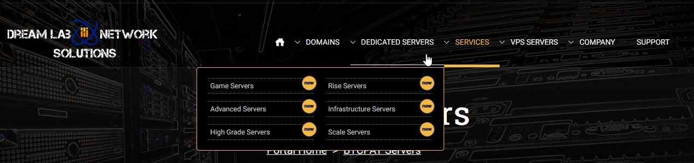

# DreamLab Network BTCPay Server web deployment. 

In this guide, we will talk you through the initial setup of your DreamLab Network BTCPay Server web deployment. 
DreamLab offers a variety of services. From domains, Dedicated game servers, VPS servers, and now BTCPay Server as a service. 
They've built multiple plans and configurations for BTCPay Server, hosted in North America, with expansion to other locations on their premise. 

## 1. Pick the server that fits your needs.

On the DreamLab website, in the top menu, go to `Services` and click on `BTCPay Servers`.

Now you are on the right page to pick a plan suited to your BTCPay Server needs. 
They offer three different plans.  

* Basic plan 
* Advanced plan 
* Shared Hosted 

They've enlisted what the difference between every plan is, so we won't list those out. 
That said, we do believe that going with the `Basic plan` should be sufficient for a starting store. 
A Shared host is not something recommended for business purposes. This plan doesn't give you your own VPS. However, you could start a server and get acquainted with the software hosted for you! 

## 2. Configure your BTCPay Server

First, off they show you the basic setup of your node. 
All the technical specs are listed. 

Choose the Billing cycle that fits you. 
You can set these by 

* Monthly 
* quarterly 
* Semi-Annually 
* Annually 

Now we really go into the configuration of your server. 

### Hostname 

This is where you set the domain name. You can leave this as-is and use the generated address or provide it with a domain of your own. 
Don't forget that if you set your domain, you need to create an A record that points to your VPS IP address. 

### Configurable Options

Next up, Configurable options. Here is where we set the BTCPay Server configuration. You get to set how and what you want your node to run.

* BTCPay Server Mainnet Pruned 6 or 3 months Bitcoin only.
* BTCPay Server Mainnet Pruned 6 or 3 months Bitcoin & Lightning (clightning)
* BTCPay Server Mainnet Pruned 6 or 3 months Bitcoin & Lightning (clightning) & BTCPay Configurator.
* BTCPay Server Testnet Pruned 6 or 3 months Bitcoin only.
* BTCPay Server Testnet Pruned 6 or 3 months Bitcoin & Lightning (clightning)
* BTCPay Server Regnet Pruned 6 or 3 months Bitcoin only.
* BTCPay Server Regnet Pruned 6 or 3 months Bitcoin & Lightning (clightning)

And the CPU is set to AMD. There are no other options as of writing. 

### Addition Information 

Here you have the option to set an operating system. 
This, as of writing, is locked to ubuntu 20.04 x86. 
And for the ISO Disk option, there's none to take. 

Click Continue to go to the payment page. 

### Review & Checkout

Now, all there is left for you is to go over the setup one more time. 
And if all is well, you might have a Promo code you can apply, and after that, it is over to the Checkout. 

On the checkout page, you get to set your account information. 
After filling up all of the requested information, note you only have to fill out the requested fields. 
Click the Bitcoin or another option if preferred to pay by fiat. 

## 3. Client Area DreamLab Network

You are now logged in to Dreamlab their `Client Area`.
And as you may notice, you have one service up. This is your new BTCPay Server.

If you scroll or look below, a tile states `Your Active Products`.
Here again, you will see your active deployment of the BTCPay Server on DreamLab Networks. 

## 4. Start your first store. 

After all the above steps are completed, the server shows in services. 
Click on services, and click on the BTCPay Basic server link underneath or go to the domain you specified. 
You will be prompted to create the first account on your new BTCPay Server. Make sure to have the Administrator account checked.

You are now ready to set up your first store! 
To follow more on setting up your store, follow along in this [Guide](../RegisterAccount.md).

## 5. Welcome to your BTCPay Server dashboard

You are now inside your new BTCPay Server. 
It shows in the dashboard that you've created a store and that Lightning Network has been set up. 
The bitcoin wallet is still missing. You can follow along in [this wallet setup guide](../WalletSetup.md)

:::tip
If there are questions about your node, the deployment, or updates, please reach out to the support of [DreamLab Network solutions](https://dreamlabnetwork.solutions)
:::

