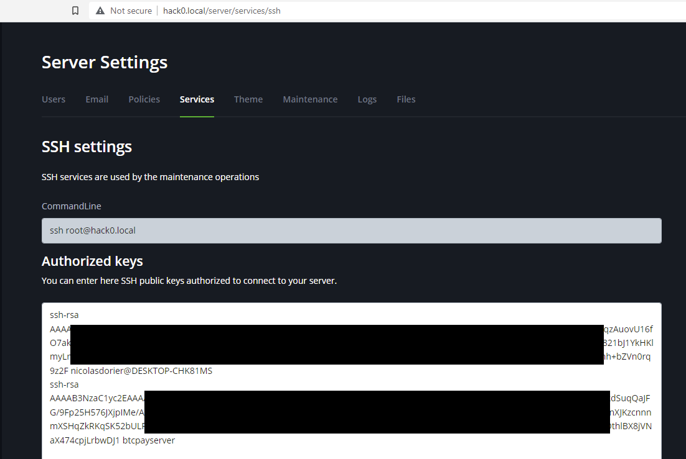

# Hack0

Hack0 is an alternative to [Raspberry Pi](/Deployment/RaspberryPi.md) deployments.
It greatly simplifies the installation steps by providing the hardware and the operating system to run your BTCPay Server with docker deployment.

This project is maintained by [DG Lab](https://www.dglab.com/en/), if you need help, come on our [support chat](https://chat.btcpayserver.org/btcpayserver/channels/hack0).

Hack0 aims at two different kind of users: `Distributors` and `End users`.

- `End users` are people ultimately running the Hack0 for their own purposes.
- `Distributors` are people who buy the different part of the hardware, assemble it together, install Hack0, and distribute a plug-and-play box for `End users`.

If you buy the different piece of hardware for your Hack0, assemble, install hack0, then use it yourself, you are both a `distributor` and a `end users` as far as this documentation is concerned.

You can watch an introduction here:

## Hardware specification (for distributors)

Here is the advised parts for running a Hack0:

- RockPro64 4GB ([Link](https://store.pine64.org/?product=rockpro64-4gb-single-board-computer)) `79.99$`
- USB adapter for EMMC Module ([Link](https://pine64.com/product/usb-adapter-for-emmc-module/)) `4.99$`
- EMMC 32GB ([Link](https://pine64.com/product/32gb-emmc-module/)) `24.95$`
- Fan For ROCKPro64 20mm Mid Profile Heatsink ([Link](https://pine64.com/product/fan-for-rockpro64-20mm-mid-profile-heatsink/)) `2.99$`
- ROCKPro64 20mm Mid Profile Heatsink ([Link](https://pine64.com/product/rockpro64-20mm-mid-profile-heatsink/)) `3.29$`
- SSD 500GB PCIe NVMe ([Link](https://www.crucial.com/ssd/p2/CT500P2SSD8)) `66.99$`
- M.2 to PCIe adapter ([Link](https://www.silverstonetek.com/en/product/info/expansion-cards/ECM25/)) `25$`

Total: `188.2$`

It is possible to replace the EMMC module and adapter by a microSD. But tests has shown that microSD aren't reliable on long term and may cease to work after 2-3 years of use.

## Factory installation (for distributors)

Once you have your hardware, you need to flash the Hack0 image.

The Hack0 is based on the armbian distribution. You can build the image yourself by following instruction [on our github page](https://github.com/dgarage/hack0-armbian/tree/btcpay/userpatches). You can also find [pre-built image](https://github.com/dgarage/hack0-armbian/tree/btcpay/userpatches#pre-built-images) ready to download to save time on this page.

Once you have the image, you can flash it on the EMMC module thanks to the USB adapter for EMMC Module.
During the first start, hack0 is in `setup mode`, the setup mode will:

> :warning: When you first boot a pre-built images, the hack0 will be in `setup mode`, which will wipe all data in the SSD drive.

During the `setup mode`, observe the two leds positioned next to the ethernet connector. You will see the red led staying on, while the white led is blinking.
Once the setup mode succeed, the red led turns off and the white led turns on without blinking. At this point, you can safely disconnect the Hack0. It is now ready to be used by `end users`.

If the setup failed, then the red led will turns on, while the white turns off.

## End user setup

As a end user, you only need to plug you hack0 with a ethernet cable to your network.
After waiting 5 minutes, you should be able to access `http://hack0.local` which will show you the registration form of your BTCPay Server instance.

In some case, `hack0.local` might not work, and you need to use a tool such as [Angry IP Scanner](https://angryip.org/) to locate the IP address of your hack0, then connect to it. If your internet router has a configuration page, you can also find the IP of your hack0 there. You can then connect to `http://<ipaddress>`.

## FAQ

### How to connect via SSH to your hack0?

You need to add your public ssh key to `http://hack0.local/server/services/ssh`. Do not remove the `btcpayserver` key that already exists.
After this, you should be able to connect via ssh with `ssh root@hack0.local` or Putty.

