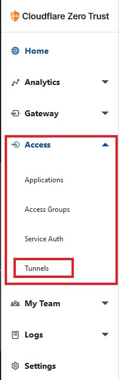
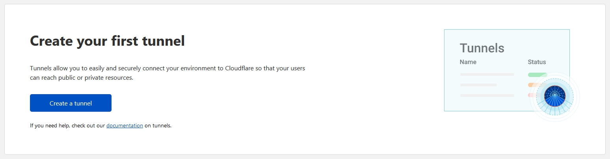
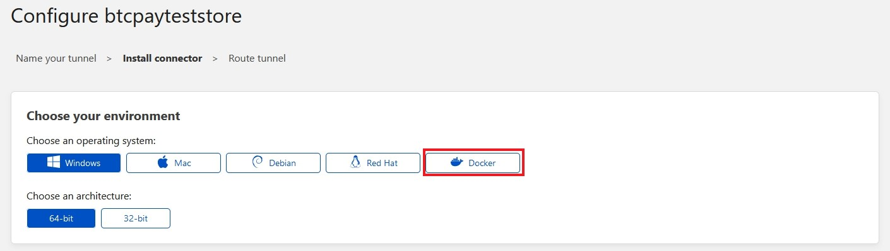
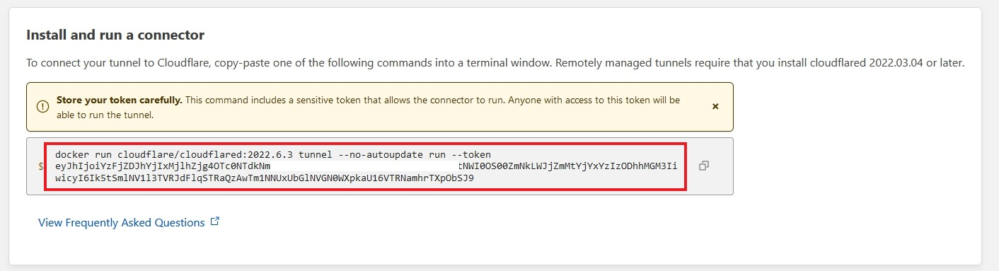
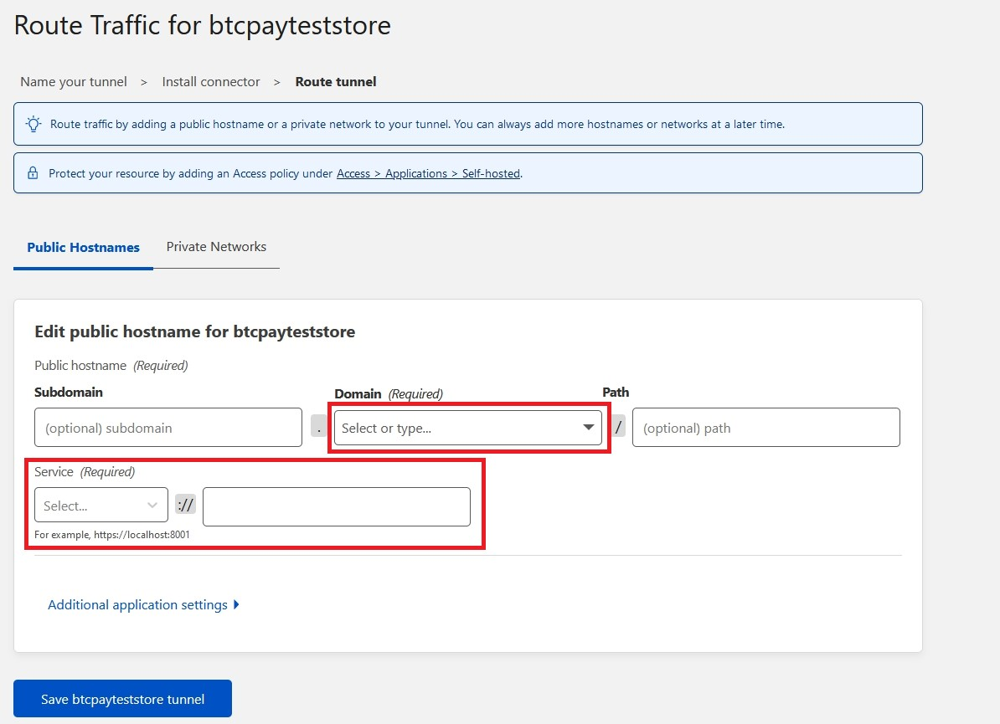

# Minimal manual setup

:::danger
#### Not recommended for production use

Manual installation is NOT recommended for production use unless you are very confident with your Operating System and Bitcoin security expertise. If you are unsure use the docker deployment or one of the other [deployment options](./README.md).

#### You must have technical literacy and be able to resolve any issues on your own. The community will not provide extensive support for this deployment.
:::

The process is basically the following:

1. Download and sync [Bitcoin Core](https://bitcoincore.org)
2. Clone and run [NBXplorer](https://github.com/dgarage/NBxplorer)
3. Clone and run [BTCPay Server](https://github.com/btcpayserver/btcpayserver)

Take a look at our video to learn more:

[](https://www.youtube.com/watch?v=Xo_vApXTZBU "BTCPay - Setup")

## Warning: Not recommended to use in production

**Manual installation** is NOT recommended in production. It should be only used for learning purpose.

Instead you should use the [docker deployment](https://github.com/btcpayserver/btcpayserver-docker).

The docker deployment will provide you easy update system and make sure that all moving parts are wired correctly without any technical knowledge. It will also setup HTTPS for you.

## Typical manual installation

This steps have been done on Ubuntu 18.04, adapt for your own install.

For Testnet specific deployment, after installing Bitcoin, .NET Core, NBXplorer and BTCPayServer, see [Commands for Running in Testnet Mode](#testnet-specific-deployments)

### 1) Install Bitcoin Core 0.19.1

```bash
BITCOIN_VERSION="0.19.1"
BITCOIN_URL="https://bitcoin.org/bin/bitcoin-core-0.19.1/bitcoin-0.19.1-x86_64-linux-gnu.tar.gz"
BITCOIN_SHA256="5fcac9416e486d4960e1a946145566350ca670f9aaba99de6542080851122e4c"

# install bitcoin binaries
cd /tmp
wget -O bitcoin.tar.gz "$BITCOIN_URL"
echo "$BITCOIN_SHA256 bitcoin.tar.gz" | sha256sum -c - && \
mkdir bin && \
sudo tar -xzvf bitcoin.tar.gz -C /usr/local/bin --strip-components=2 "bitcoin-$BITCOIN_VERSION/bin/bitcoin-cli" "bitcoin-$BITCOIN_VERSION/bin/bitcoind"
rm bitcoin.tar.gz
```

### 2) Install .NET 6.0 SDK

On my Ubuntu 20.04 (See [these instructions](https://docs.microsoft.com/en-us/dotnet/core/install/linux-ubuntu#2004-) or [here](https://dotnet.microsoft.com/en-us/download/dotnet/6.0) for different OS).

```bash
# Add Microsoft package repository
wget https://packages.microsoft.com/config/ubuntu/20.04/packages-microsoft-prod.deb -O packages-microsoft-prod.deb
sudo dpkg -i packages-microsoft-prod.deb
rm packages-microsoft-prod.deb

# Install the SDK
sudo apt-get update
sudo apt-get install -y apt-transport-https
sudo apt-get update
sudo apt-get install -y dotnet-sdk-6.0

## Check
dotnet --version
```

### 3) Install NBXplorer

```bash
cd ~
git clone https://github.com/dgarage/NBXplorer
cd NBXplorer
git checkout latest
./build.sh
```

### 4) Install BTCPayServer

```bash
cd ~
git clone https://github.com/btcpayserver/btcpayserver
cd btcpayserver
git checkout latest
./build.sh
```

### 5) Run bitcoind

```bash
bitcoind
```

### 6) Run NBXplorer

```bash
cd ~/NBXplorer
./run.sh --dbtrie
```
Note that using the `--dbtrie` backend for NBXplorer, while easier, is deprecated.
You should better use a postgresql backend as documented on [Extended Manual Deployment](./ManualDeploymentExtended.md).

### 7) Run BTCPay Server

```bash
cd ~/btcpayserver
./run.sh --port 8080 --bind 0.0.0.0
```

Now you can browse your server on port 8080.

Note that by default, BTCPay Server will use SQLite as backend, while being easier, this is deprecated.
You should better use a postgresql backend as documented on [Extended Manual Deployment](./ManualDeploymentExtended.md).

## Expose BTCPay Server to clearnet using Cloudflare Argo Tunnel 

This setup uses Cloudflare to create a tunnel to the remote machine running BTCPay Server and expose it securely to clearnet.

### Step 1 Cloudflare setup 
First, we are going to create the tunnel on Cloudflare.
You need to create an account on Cloudflare and add their DNS to [your domain](https://www.namecheap.com/support/knowledgebase/article.aspx/9607/2210/how-to-set-up-dns-records-for-your-domain-in-cloudflare-account/), in this example would be YourDomain.com. More [documentation](https://developers.cloudflare.com/cloudflare-one/faq/cloudflare-tunnels-faq/#how-can-tunnel-be-used-with-partial-dns-cname-setup) on " How tunnel can be used with Partial DNS (CNAME Setup) "

### Step 2 Setting up Argo Tunnel

After you've added the DNS and is propagated, you can start the setup of the Argo tunnel. 
Go to [Zero Trust](https://dash.teams.cloudflare.com/c1cd2ab2129af8897457d6f97c082725/onboarding) option on the left menu, go to "access", then click "tunnels".



Once in tunnels, you can create a new one and click the "create tunnel" button. 
To see docs click [here](https://developers.cloudflare.com/cloudflare-one/connections/connect-apps/install-and-setup)



Give it a name and on the next screen, "install the connector," click docker.



Copy the string after --token, and click the next button at the bottom. You will need to input this token on an ENV variable on BTCPay setup script.



On the last screen, you need to route the tunnel using your subdomain btcpay, select your domain from the list and leave the path empty. 
Then on the service part, select HTTP and then write localhost. You are going to route the subdomain traffic to http://localhost



If you are using other port than 80 for HTTP you can route traffic to http://localhost:YourPort

This is the setup used in this example:

```
export BTCPAY_HOST="btcpay.YourDomain.com"
export NBITCOIN_NETWORK="testnet"
export BTCPAYGEN_CRYPTO1="btc"
export BTCPAYGEN_REVERSEPROXY="nginx"
export BTCPAYGEN_LIGHTNING="clightning"
export BTCPAYGEN_ADDITIONAL_FRAGMENTS="cloudflared"
export BTCPAYGEN_EXCLUDE_FRAGMENTS="$BTCPAYGEN_EXCLUDE_FRAGMENTS;nginx-https"
export CLOUDFLARE_TUNNEL_TOKEN="YourTunnelTokenHere"
. btcpay-setup.sh -i
```

See that Nginx reverse proxy is disabled as Cloudflare is acting as the reverse proxy and adds Cloudflare to BTCPAYGEN_ADDITIONAL_FRAGMENTS. Also, add the tunnel token to CLOUDFLARE_TUNNEL_TOKEN.

:::tip
This solution was created in [Pull Request #667](https://github.com/btcpayserver/btcpayserver-docker/pull/667) for further technical details. 
:::

## Testnet Specific Deployments

Follow the instructions for installing Bitcoin, .NET Core, NBXplorer and BTCPayServer above.

Then when running them use:

### Run bitcoind in testnet mode

```bash
bitcoind -testnet
```

### Run NBXplorer in testnet mode

```bash
cd ~/NBXplorer
./run.sh --network=testnet
```

### Run BTCPayServer in testnet mode

```bash
cd ~/btcpayserver
./run.sh --port 8080 --bind 0.0.0.0 --network testnet
```

## Additional links

* [Extended Manual Deployment](./ManualDeploymentExtended.md)
* [How to Setup BTC and Lightning Payment Gateway with BTCPayServer on Linux [Manual Install]](https://freedomnode.com/blog/114/how-to-setup-btc-and-lightning-payment-gateway-with-btcpayserver-on-linux-manual-install) from freedomnode.com.
