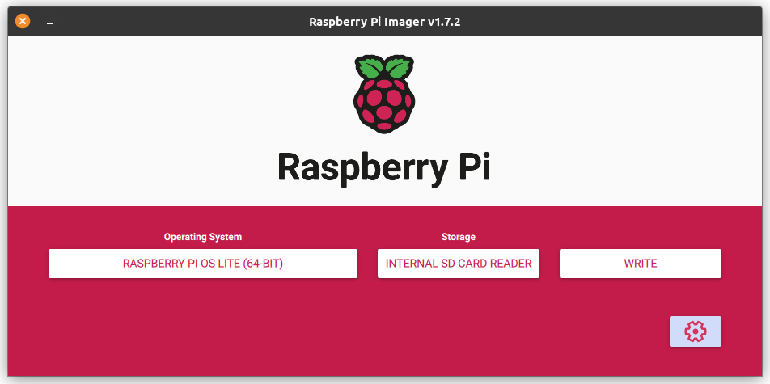

# Raspberry Pi Deployment

This document guides you step by step on **how to run BTCPay Server on a Raspberry Pi 4**.

The **Raspberry Pi 4** is currently the best low-cost single-board computer available.
You can **use a Raspberry Pi 4 to run your BTCPay Server** at home for around $150 worth of parts, described below.

Already have a Raspberry Pi 4 with the following specs?

- 4GB memory
- 1TB USB 3.0 SSD
- 16GB or greater SD card

If so, you can go straight to the [quickstart instructions](#quickstart).
Otherwise, here's what you need …

## Required Hardware

### Raspberry Pi 4

- [Raspberry Pi 4 with **4GB RAM**](https://www.canakit.com/raspberry-pi-4-4gb.html) (~$65)
- [Sandisk 16GB SD Card](https://www.amazon.com/dp/B073K14CVB/) (~$10)

Don’t settle for only 1GB or 2GB of RAM. The **4GB RAM** version is harder to find than the other versions, but you absolutely want that **4GB of RAM** for a few extra bucks, and it’s totally worth spending a few extra minutes searching on the Internet to find a vendor that has the 4GB RAM version in stock. You’ll also need an **SD card reader** if you don’t already have one.

### Data Storage options

- [Samsung SSD T7 1TB](https://www.amazon.com/dp/B0874XN4D8/) (~$100)
- [SanDisk Ultra 3D 1TB](https://www.amazon.com/dp/B071KGRXRG/) (~$100)

A 1TB SSD allows you to keep a full copy of the Bitcoin blockchain.
You can also use BTCPay Server without a full copy of the Bitcoin blockchain by using the [pruning option](/Docker/#how-i-can-prune-my-nodes).

### Power Adapter options

- [Official Raspberry Pi 4 USB-C Power Adapter 5.1V/3A for US](https://shop.pimoroni.com/products/raspberry-pi-official-usb-c-power-supply-us?variant=29391144648787) ($10)
- [Official Raspberry Pi 4 USB-C Power Adapter 5.1V/3A for EU](https://shop.pimoroni.com/products/raspberry-pi-official-usb-c-power-supply-eu?variant=29391130624083) ($10)
- [Official Raspberry Pi 4 USB-C Power Adapter 5.1V/3A for AU](https://shop.pimoroni.com/products/raspberry-pi-official-usb-c-power-supply-au?variant=29391160737875) ($10)

Don’t waste your time with random cheap power adapters from Amazon, or expect that the existing ones you have at home are going to work fine. The Raspberry Pi 4 has issues with unofficial adapters, and for only $10 it’s better to just **get an official adapter** instead of learning this the hard way.

### Case and Cooling options

- [Flirc Heatsink Case](https://www.amazon.com/dp/B07WG4DW52/) (~$15)
- [Passive cooling aluminum case](https://www.amazon.com/dp/B07VQRYTPR/) (~$15)

Of course, using a case is totally optional, but we recommend one to protect your Raspberry Pi over the long-term.
Strictly speaking, you don’t actually need a cooling solution, but you certainly **want** at least passive cooling.
Once the Raspberry PI core temperature reaches 70°C, it will throttle down the CPU.

## Quickstart

Download and open the latest [Raspberry Pi Imager](https://www.raspberrypi.com/software/).



Choose the following options:

- Operating System: Raspberry Pi OS Lite (64-bit)
  - Find it via "Raspberry Pi OS (Other)"
- Storage: Select your SD card

Open the Advanced Settings via the button in the bottom right corner.


Advanced Settings:

- Set the hostname to what you like, this guide assumes `btcpay.local`.
- Enabled SSH
- Set username and password, this guide assumes `btcpay` as username.

Other settings are optional, you do not need to configure wireless LAN.

Close the Advanced Settings and click the "Write" button.

### Setting up the Raspberry Pi

Once the image is written to the SD card, you can eject it and insert it into the Raspberry Pi.
Connect the SSD and network cable to the Raspberry Pi.
At last, connect the power cable ­— this starts the boot process.
It should boot up and get an IP address using DHCP.

Login to the Raspberry Pi using the credentials you configured in the Raspberry Pi Imager:

```bash
ssh btcpay@btcpay.local
```

Confirm the `Are you sure you want to continue connecting?` question with `yes`

If your Raspberry Pi cannot be found by the `btcpay.local` address, you will need to login to your router to find its IP address.
The IP address that my Raspberry Pi got was `192.168.1.5`.

```bash
ssh btcpay@192.168.1.5
```

Switch to the `root` user:

```bash
sudo su -
```

Afterwards, you can choose between [LND](https://github.com/lightningnetwork/lnd) and [Core Lightning](https://github.com/ElementsProject/lightning) for your Lightning node.

**Required:** Choose one of the following …

```bash
# Core Lightning
export BTCPAYGEN_LIGHTNING="clightning"

# LND
export BTCPAYGEN_LIGHTNING="lnd"
```

**Optional:** You can also configure [additional settings](/Docker/#environment-variables) …

```bash
# optional, this is just an example for runing a pruned node on a public domain
export BTCPAYGEN_ADDITIONAL_FRAGMENTS="opt-save-storage"
export BTCPAY_ADDITIONAL_HOSTS="btcpay.YourDomain.com"
```

Download and run the install script:

```bash
wget -O btcpayserver-install.sh https://raw.githubusercontent.com/btcpayserver/btcpayserver-doc/master/scripts/btcpayserver-rpi4-install.sh
chmod +x btcpayserver-install.sh
. btcpayserver-install.sh
```

After the initial setup is complete open a browser on another computer and go to `btcpay.local`.

:::tip
Your installation is done and your node should have started synching.
For a Bitcoin full node the initial block download takes approximately 40 hours after install.
:::

If you are curious, here are the details of what the installation scripts above do …

## Detailed Step by Step Instructions

These are the steps that follow after the general setup process outlined in the [quickstart instructions](#quickstart).

:::tip NOTE
The following steps require you to be the root user.

```bash
sudo su -
```

:::

### Upgrade the OS packages to latest

```bash
apt update && apt upgrade -y && apt autoremove
```

### Configuring the storage

We recommend to disable swap to prevent burning out your SD card:

```bash
dphys-swapfile swapoff
dphys-swapfile uninstall
update-rc.d dphys-swapfile remove
systemctl disable dphys-swapfile
```

Partition your SSD:

```bash
fdisk /dev/sda
# type 'p' to list existing partitions
# type 'd' to delete currently selected partitions
# type 'n' to create a new partition
# type 'w' to write the new partition table and exit fdisk
```

Format the new partition on your SSD:

```bash
mkfs.ext4 /dev/sda1
```

Configure the SSD partition to auto-mount at bootup:

```bash
mkfs.ext4 /dev/sda1
mkdir /mnt/usb
UUID="$(sudo blkid -s UUID -o value /dev/sda1)"
echo "UUID=$UUID /mnt/usb ext4 defaults,noatime,nofail 0 0" | sudo tee -a /etc/fstab
mount -a
```

While you’re editing `/etc/fstab` add a RAM filesystem for logs (optional).
This is also to prevent burning out your SD card too quickly:

```bash
echo 'none /var/log tmpfs size=10M,noatime 0 0' >> /etc/fstab
```

### Install Docker

```bash
apt install apt-transport-https ca-certificates curl gnupg lsb-release -y
curl -fsSL https://download.docker.com/linux/debian/gpg | gpg --dearmor -o /usr/share/keyrings/docker-archive-keyring.gpg
echo "deb [arch=$(dpkg --print-architecture) signed-by=/usr/share/keyrings/docker-archive-keyring.gpg] https://download.docker.com/linux/debian \
  $(lsb_release -cs) stable" | tee /etc/apt/sources.list.d/docker.list > /dev/null
apt update
apt -y install docker-ce docker-ce-cli containerd.io
```

### Create mount for Docker volumes

```bash
rm -rf /var/lib/docker
mkdir -p /var/lib/docker
mount --bind /mnt/usb /var/lib/docker
echo "/mnt/usb /var/lib/docker none bind,nobootwait 0 2" >> /etc/fstab
systemctl restart docker
```

### Configuring the firewall

Install a firewall and allow SSH, HTTP, HTTPS, Bitcoin, and Lightning:

```bash
apt install -y ufw
ufw default deny incoming
ufw default allow outgoing
```

This command allows SSH connections from internal networks only:

```bash
ufw allow from 10.0.0.0/8 to any port 22 proto tcp
ufw allow from 172.16.0.0/12 to any port 22 proto tcp
ufw allow from 192.168.0.0/16 to any port 22 proto tcp
ufw allow from 169.254.0.0/16 to any port 22 proto tcp
ufw allow from fc00::/7 to any port 22 proto tcp
ufw allow from fe80::/10 to any port 22 proto tcp
ufw allow from ff00::/8 to any port 22 proto tcp
```

These ports need to be accessible from anywhere (The default subnet is 'any' unless you specify one):

```bash
ufw allow 80/tcp
ufw allow 443/tcp
ufw allow 8333/tcp
ufw allow 9735/tcp

# Enable the firewall
ufw enable

# Verify the configuration
ufw status
```

### Setup BTCPay Server

Download BTCPay Server from GitHub:

```bash
cd # ensure we are in root home
apt install -y fail2ban git
git clone https://github.com/btcpayserver/btcpayserver-docker
cd btcpayserver-docker
```

Configure BTCPay by setting some [environment variables](https://github.com/btcpayserver/btcpayserver-docker#environment-variables):

```bash
export BTCPAY_HOST="btcpay.local"
export REVERSEPROXY_DEFAULT_HOST="$BTCPAY_HOST"
export NBITCOIN_NETWORK="mainnet"
export BTCPAYGEN_CRYPTO1="btc"
export BTCPAYGEN_LIGHTNING="clightning"
export BTCPAYGEN_REVERSEPROXY="nginx"
export BTCPAYGEN_ADDITIONAL_FRAGMENTS="opt-more-memory"
export BTCPAY_ENABLE_SSH=true
```

If you want to use multiple hostnames, add them via the optional `BTCPAY_ADDITIONAL_HOSTS` variable:

```bash
export BTCPAY_ADDITIONAL_HOSTS="btcpay.YourDomain.com"
```

In case you want to restrict access to your local network only, please note that you need to use a `.local` domain.

Run the BTCPay installation:

```bash
. ./btcpay-setup.sh -i
```

It should be up and running within a few minutes. Try opening http://btcpay.local in your web browser. If everything is correct, you will see BTCPay Server front page.

Now, you just need to wait a day or so for the Bitcoin blockchain to [sync and full verify](../FAQ/Synchronization.md). The bottom of the BTCPay Server web GUI will show a pop-up dialog box to monitor the progress.

### FastSync (optional)

Please read very carefully to understand what [FastSync](/Docker/fastsync.md) is and why it is important to verify the UTXO set yourself.

By using FastSync, you are exposing yourself to attacks if a [malicious UTXO set snapshot](https://github.com/btcpayserver/btcpayserver-docker/blob/master/contrib/FastSync/README.md#what-are-the-downsides-of-fast-sync) is sent to you.
If you have another trusted node somewhere else, you can check the validity of the UTXO set gathered by FastSync by following [these instructions](https://github.com/btcpayserver/btcpayserver-docker/blob/master/contrib/FastSync/README.md#dont-trust-verify).

```bash
# Stop BTCPay Server
cd /root/btcpayserver/btcpayserver-docker
./btcpay-down.sh

# Import FastSync UTXO set
cd contrib/FastSync
./load-utxo-set.sh
```

FastSync currently takes about 30 minutes on a high-speed internet connection.
After FastSync finishes, run the following command to restart BTCPay Server:

```bash
cd ../..
./btcpay-up.sh
```
